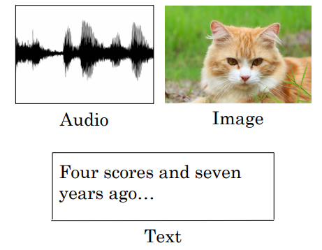
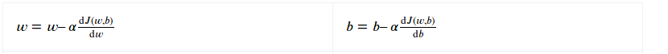
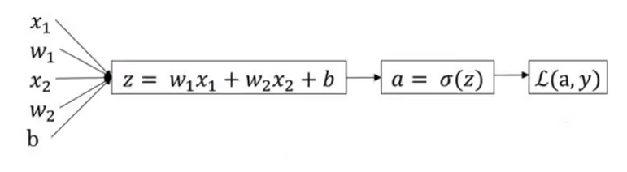
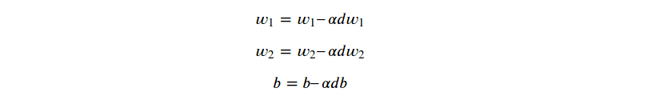
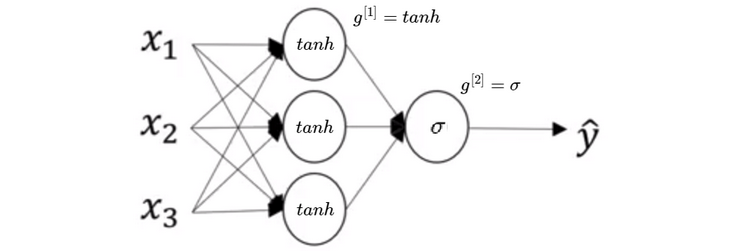
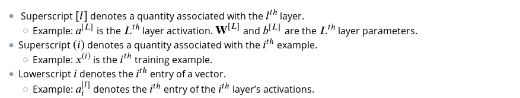
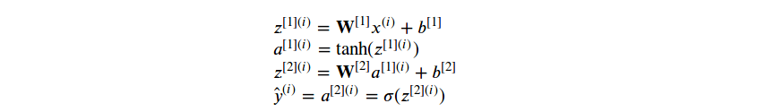
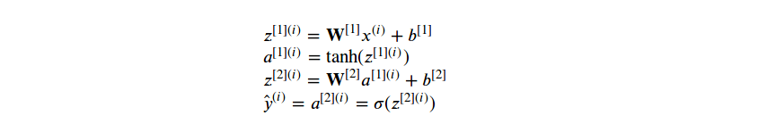

# Neural Networks and Deep Learning

* [Neural Networks and Deep Learning](#neural-networks-and-deep-learning)
    * [Introduction to deep learning](#introduction-to-deep-learning)
      * [What is a Neural Network](#what-is-a-neural-network)
      * [Supervised learning with neural networks](#supervised-learning-with-neural-networks)
      * [Scale drives machine learning progress](#scale-drives-machine-learning-progress)
   * [Neural Networks Basics](#neural-networks-basics)
      * [Binary classification](#binary-classification)
      * [Logistic regression](#logistic-regression)
      * [Logistic regression cost function](#logistic-regression-cost-function)
      * [Gradient Descent](#gradient-descent)
      * [Computation graph](#computation-graph)
      * [Derivatives with a Computation Graph](#derivatives-with-a-computation-graph)
      * [Logistic Regression Gradient Descent](#logistic-regression-gradient-descent)
      * [Gradient Descent on m Examples](#gradient-descent-on-m-examples)
      * [Vectorization](#vectorization)
      * [Vectorizing Logistic Regression](#vectorizing-logistic-regression)
      * [Broadcasting in Python](#Broadcasting-in-Python)
      * [Explanation of Logistic Regression Cost Function](#Explanation-of-Logistic-Regression-Cost-Function)
   * [Shallow neural networks](#shallow-neural-networks)
      * [Neural Networks Overview](#neural-networks-overview)
      * [Neural Network Representation](#neural-network-representation)
      * [Computing a Neural Network's Output](#computing-a-neural-networks-output)
      * [Vectorizing across multiple examples](#vectorizing-across-multiple-examples)
      * [Explanation For Vectorized Implementation](#Explanation-For-Vectorized-Implementation)
      * [Activation functions](#activation-functions)
      * [Why do you need non-linear activation functions?](#why-do-you-need-non-linear-activation-functions)
      * [Derivatives of activation functions](#derivatives-of-activation-functions)
      * [Gradient descent for Neural Networks](#gradient-descent-for-neural-networks)
      * [Backpropagation Intuition](Backpropagation-Intuition)
      * [Random Initialization](#random-initialization)
   * [Deep Neural Networks](#deep-neural-networks)
      * [Deep L-layer neural network](#deep-l-layer-neural-network)
      * [Forward Propagation in a Deep Network](#forward-propagation-in-a-deep-network)
      * [Getting your matrix dimensions right](#getting-your-matrix-dimensions-right)
      * [Why deep representations?](#why-deep-representations)
      * [Building blocks of deep neural networks](#building-blocks-of-deep-neural-networks)
      * [Forward and Backward Propagation](#forward-and-backward-propagation)
      * [Parameters vs Hyperparameters](#parameters-vs-hyperparameters)
      * [What does this have to do with the brain](#what-does-this-have-to-do-with-the-brain)

## Introduction to deep learning

### What is a Neural Network

Let’s start with the house price prediction example. Suppose that you have a dataset with six houses and we know the price and the size of these houses. We want to fit a function to predict the price of these houses with respect to its size.

<div align="center">
  
</div>

We will put a straight line through these data points. Since we know that our prices cannot be negative, we end up with a horizontal line that passes through 0.

<div align="center">
  
</div>

The blue line is the function for predicting the price of the house as a function of its size. You can think of this function as a very simple neural network.

The input to the neural network is the size of a house, denoted by 𝑥, which goes into a single neuron and then outputs the predicted price, which we denote by 𝑦.


<div align="center">
  
</div>

If this is a neural network with a single neuron, a much larger neural network is formed by taking many of the single neurons and stacking them together.

A basic Neural Network with more features is ilustrated in the following image.

<div align="center">
  
</div>

### Supervised learning with neural networks

In supervised learning, we have some input 𝑥, and we want to learn a function mapping to some output 𝑦. Just like in the house price prediction application our input were some features of a home and our goal was to estimate the price of a home 𝑦.

Here are some other fields where neural networks have been applied very effectively.


We might input an image and want to output an index from one to a thousand, trying to tell if this picture might be one of a thousand different image classes. This can be used for photo tagging.

The recent progress in speech recognition has also been very exciting. Now you can input an audio clip to a neural network and can have it output a text transcript.

Machine translation has also made huge strikes thanks to deep learning where now you can have a neural network input an English sentence and directly output a Chinese sentence.

Different types of neural networks are useful for different applications.


  - In the real estate application, we use a universally **Standard Neural Network** architecture.
  - For image applications we’ll often use **Convolutional Neural Network (CNN)**.
  - Audio is most naturally represented as a one-dimensional time series or as a one-dimensional temporal sequence. Hence, for a sequence data, we often use **Recurrent Neural Network (RNN)**.
  - Language, English and Chinese, the alphabets or the words come one at a time and language is also represented as a sequence data. **Recurrent Neural Network (RNN)** are often used for these applications.

Structured and Unstructured Data

Machine learning is applied to both Structured Data and Unstructured Data.

Structured Data means basically databases of data. In house price prediction, you might have a database or the column that tells you the size and the number of bedrooms.

In predicting whether or not a user will click on an ad, we might have information about the user, such as the age, some information about the ad, and then labels that you’re trying to predict.

<div align="center">
  
</div>

Structured data means, that each of the features, such as a size of the house, the number of bedrooms, or the age of a user, have a very well-defined meaning. In contrast, unstructured data refers to things like audio, raw audio, or images where you might want to recognize what’s in the image or text. Here, the features might be the pixel values in an image or the individual words in a piece of text.

<div align="center">
  
</div>

Neural networks, computers are now much better at interpreting unstructured data as compared to just a few years ago. This creates opportunities for many new exciting applications that use speech recognition, image recognition, natural language processing of text.

### Scale drives machine learning progress

Many of the ideas of deep learning (neural networks) have been around for decades. Why are these ideas taking off now?

If we plot the performance of traditional learning algorithms such as Support Vector Machine or Logistic Regression as a function of the amount of data. We will get the following curve. In detail, even as you accumulate more data, usually the performance of traditional learning algorithms, plateaus. This means its learning curve flattens out, and the algorithm stops improving even as you give it more data. It was as if the traditional learning algorithms didn’t know what to do with all the data we now have.

<div align="center">
  
</div>

With neural networks, it turns out that if you train a very large neural network then its performance often keeps getting better and better.

Three of the biggest drivers of recent progress have been:

  - Data availability:
    - People are now spending more time on digital devices (laptops, mobile devices). Their digital activities generate huge amounts of data that we can feed to our learning algorithms.

  - Computational scale:
    - We started just a few years ago, techniques (like GPUs/Powerful CPUs/Distributed computing) to be able to train neural networks that are big enough to take advantage of the huge datasets we now have.

  - Algorithm:
    - Creative algorithms has appeared that changed the way NN works. Using **RELU function** is so much better than using **Sigmoid function** in training a NN.

To conclude, often you have an idea for a neural network architecture and you want to implement it in code. Fast computation is important because the process of training a neural network is very iterative and can be time-consuming. Implementing our idea then lets us run an experiment which tells us how well our neural network does. Then, by looking at it, you go back to change the details of our neural network and then you go around this circle over and over, until we get the desired performance.

<div align="center">
  
</div>

## Neural Networks Basics

### Binary classification

Binary classification is the task of classifying elements of a given set into two classification.


A binary classification problem:

  - We have an input image 𝑥 and the output 𝑦 is a label to recognize the image.
  - 1 means cat is on an image, 0 means that a non-cat object is on an image.

In binary classification, our goal is to learn a classifier that can input an image represented by its feature vector 𝑥 and predict whether the corresponding label is 1 or 0. That is, whether this is a cat image or a non-cat image.

Image representation in a computer

The computer stores 3 separate matrices corresponding to the red, green and blue (RGB) color channels of the image. If the input image is 64 by 64 pixels, then we would have three 64 by 64 matrices corresponding to the red, green and blue pixel intensity values for our image. For a 64 by 64 image – the total dimension of this vector will be 64 * 64 * 3 = 12288.


Notation that we will follow is shown in the table below:


### Logistic regression

Logistic regression is a supervised learning algorithm that we can use when labels are either 0 or 1 and this is the so-called **Binary Classification Problem**. An input feature vector 𝑥 may correspond to an image that we want to recognize as either a cat picture (1) or a non-cat picture (0). That is, we want an algorithm to output the prediction which is an estimate of 𝑦:


More formally, we want 𝑦̂ to be the chance that 𝑦 is equal to 1, given the input features 𝑥. In other words, if 𝑥 is a picture, we want 𝑦 to tell us what is the chance that this is a cat picture.

The 𝑥 is an 𝑛<sup>𝑥</sup> – dimensional vector. The parameters of logistic regression are 𝑤, which is also an 𝑛<sup>𝑥</sup> – dimensional vector together with 𝑏 wich is a real number.

Given an input 𝑥 and the parameters  𝑤 and 𝑏, how do we generate the output 𝑦̂, One thing we could try, that doesn’t work, would be to have: 𝑦̂ = 𝑤<sup>𝑇</sup>𝑥 + 𝑏 which is a linear function of the input and in fact, this is what we use if we were doing Linear Regression.

However, this is not a very good algorithm for binary classification, because we want 𝑦̂ to be the chance that 𝑦 is equal to 1, so 𝑦̂ should be between 0 and 1.

It is difficult to enforce this because 𝑤<sup>𝑇</sup>𝑥 + 𝑏 can be much bigger than 1 or can even be negative which doesn’t make sense for a probability that we want to be in a range between 0 and 1. We can conclude that we need a function which will transform 𝑦̂ = 𝑤<sup>𝑇</sup>𝑥 + 𝑏 to be in a range between 0 and 1.

Let’s see one function that can help us do that. In logistic regression, the output is going to be the **Sigmoid Function**. We can see that it goes smoothly from  0 up to 1.

<div align="center">
  
</div>

  - use 𝑧 to denote the following quantity 𝑤<sup>𝑇</sup>𝑥 + 𝑏.
  - we have: 𝑦̂ = 𝜎(𝑤<sup>𝑇</sup>𝑥 + 𝑏).
  - if 𝑧 is a large positive number: 𝜎(𝑧) ≈ 1
  - if 𝑧 is a large negative number: 𝜎(𝑧) ≈ 0

When we implement logistic regression, our job is to try to learn parameters 𝑤 and 𝑏, so that 𝑦̂  becomes a good estimate of the chance of 𝑦 being equal to 1.

### Logistic regression cost function

First, to train parameters 𝑤 and 𝑏 of a logistic regression model we need to define a **cost function**.

Given a training set of 𝑚 training examples, we want to find parameters 𝑤 and 𝑏, so that 𝑦̂ is as close to 𝑦 (ground truth).

Here, we will use (𝑖) superscript to index different training examples.

Henceforth, we will use **loss (error) function** to measure how well our algorithm is doing. The loss function is applied only to a single training sample, and commonly used loss function is a **squared error**:


In logistic regression squared error loss function is not an optimal choice. It results in an optimization problem which is not convex, and the gradient descent algorithm may not work well, it may not converge optimally.

In terms of a surface, the surface is convex if, loosely speaking, it looks like a parabola. If you have a ball and let it roll along the surface, that surface is convex if that ball is guaranteed to always end up at the same point in the end. However, if the surface has bumps, then, depending on where you drop the ball from, it might get stuck somewhere else. That surface is then non-convex.


To be sure that we will get to the global optimum, we will use following loss function:


It will give us a convex optimization problem and it is therefore much easier to be optimized.

To understand why this is a good choice, let’s see these two cases:


A cost function measures how well our parameters 𝑤 and 𝑏 are doing on the entire training set :


  - Cost function 𝐽 is defined as an average of a sum of loss functions of all training examples.
  - Cost function is a function of parameters 𝑤 and 𝑏.

In cost function diagram, the horizontal axes represent our spatial parameters, 𝑤 and 𝑏. In practice, 𝑤 can be of a much higher dimension, but for the purposes of plotting, we will illustrate 𝑤 and 𝑏 as scalars.

The cost function 𝐽(𝑤,𝑏) is then some surface above these horizontal axes 𝑤 and 𝑏. So, the height of the surface represents the value of 𝐽(𝑤,𝑏) at a certain point. Our goal will be to minimize function 𝐽, and to find parameters 𝑤 and 𝑏.

### Gradient Descent

Gradient Descent is an algorithm that tries to minimize the cost function 𝐽(𝑤,𝑏) and to find optimal values for 𝑤 and 𝑏.

For the purpose of illustration we will use 𝐽(𝑤), function that we want to minimize, as a function of one variable. To make this easier to draw, we are going to ignore 𝑏 for now, just to make this a one-dimensional plot instead of a high-dimensional plot.

Gradient Descent starts at an initial parameter and begins to take values in the steepest downhill direction. Function 𝐽(𝑤,𝑏) is convex, so no matter where we initialize, we should get to the same point or roughly the same point.

After a single step, it ends up a little bit down and closer to a global otpimum because it is trying to take a step downhill in the direction of steepest descent or quickly down low as possible.

After a fixed number of iterations of Gradient Descent, hopefully, will converge to the global optimum or get close to the global optimum.

The learning rate 𝛼 controls how big step we take on each iteration of Gradient Descent.


If the derivative is positive, 𝑤 gets updated as 𝑤 minus a learning rate 𝛼 times the derivative 𝑑𝑤.

We know that the derivative is positive, so we end up subtracting from 𝑤 and taking a step to the left. Here, Gradient Descent would make your algorithm slowly decrease the parameter if you have started off with this large value of 𝑤.

Next, when the derivative is negative (left side of the convex function),  the Gradient Descent update would subtract 𝛼 times a negative number, and so we end up slowly increasing 𝑤 and we are making 𝑤 bigger and bigger with each successive iteration of Gradient Descent.

So, whether you initialize 𝑤 on the left or on the right, Gradient Descent would move you towards this global minimum.



### Computation graph

Let’s say that we’re trying to compute a function 𝐽, which is a function of three variables 𝑎, 𝑏, and 𝑐 and let’s say that function 𝐽 is 3(𝑎 + 𝑏𝑐).


Computation of this function has actually three distinct steps:

  - Compute 𝑏𝑐 and store it in the variable 𝑢, so 𝑢 = 𝑏𝑐
  - Compute 𝑣 = 𝑎 + 𝑢,
  - Output 𝐽 is 3𝑣.

Let’s summarize:


In this simple example we see that, through a left-to-right pass, you can compute the value of 𝐽.

### Derivatives with a Computation Graph

How to figure out derivative calculations of the function 𝐽.

Now we want using a computation graph to compute the derivative of 𝐽 with respect to 𝑣. Let’s get back to our picture, but with concrete parameters.


First, let’s see the final change of value 𝐽 if we change 𝑣 value a little bit:


We can get the same result if we know calculus:


We emphasize that calculation of d𝐽/d𝑣 is one step of a back propagation. The following picture depicts **forward propagation** as well as **backward propagation**:


Next, what is d𝐽/d𝑎. If we increase 𝑎 from 5 to 5.001, 𝑣 will increase to 11.001 and 𝐽 will increase to 33.003. So, the increase to 𝐽 is the three times the increase to 𝑎 so that means this derivative is equal to 3.


One way to break this down is to say that if we change 𝑎, that would change 𝑣 and through changing 𝑣 that would change 𝐽. By increasing 𝑎, how much 𝐽 changed is also determined by d𝑣/d𝑎. This is called a **chain rule** in calculus:


Now, let’s calculate derivative d𝐽/d𝑢.


Finally, we have to find the most important values: value of d𝐽/d𝑏 and d𝐽/d𝑐. Let’s calculate them:


### Logistic Regression Gradient Descent

Why do we need a computation graph? To answer this question, we have to check how the computation for our neural network is organized. There are two important principles in neural network computation:

  - Forward pass or forward propagation step
  - Backward pass or backpropagation step

During NN’s **forward propagation step** we compute the output of our neural network. In a binary classification case, our neural network output is defined by a variable and it can have any value from [0,1] interval.

In order to actually train our neural network (find parameters 𝑤 and 𝑏 as local optima of our cost function) we have to conduct a **backpropagation step**. In this way, we can compute gradients or compute derivatives. With this information, we are able to implement gradient descent algorithm for finding optimal values of 𝑤 and 𝑏. That way we can train our neural network and expect that it will do well on a classification task.

A computation graph is a systematic and easy way to represent our neural network and it is used to better understand (or compute) derivatives or neural network output.

The computation graph of a logistic regression looks like the following:



In this example, we only have two features 𝑥<sub>1</sub> and 𝑥<sub>2</sub>. In order to compute 𝑧, we will need to input 𝑤<sub>1</sub>, 𝑤<sub>2</sub> and 𝑏 in addition to the feature values 𝑥<sub>1</sub> and 𝑥<sub>2</sub>


After that, we can compute our 𝑦̂ (equals sigma of 𝑧)


Finally, we are able to compute our loss function.


To reduce our loss function (remember right now we are talking only about one data sample) we have to update our 𝑤 and 𝑏 parameters. So, first we have to compute the loss using forward propagation step. After this, we go in the opposite direction (backward propagation step) to compute the derivatives.


Having computed 𝑑𝑎, we can go backwards and compute 𝑑𝑧:


The final step in back propagation is to go back to compute amount of change of our parameters 𝑤 and 𝑏:


To conclude, if we want to do gradient descent with respect to just this one training example, we would do the following updates



### Gradient Descent on m Examples

The cost function is the average of our loss function, when the algorithm outputs 𝑎<sup>(𝑖)</sup> for the pair (𝑥<sup>(𝑖)</sup>,𝑦<sup>(𝑖)</sup>).


Here 𝑎<sup>(𝑖)</sup> is the prediction on the 𝑖-th training example which is sigmoid of 𝑧<sup>(𝑖)</sup>, were 𝑧<sup>(𝑖)</sup> = 𝑤<sup>𝑇</sup>𝑥<sup>(𝑖)</sup> + 𝑏


The derivative with respect to 𝑤<sub>1</sub> of the overall cost function, is the average of derivatives with respect to 𝑤<sub>1</sub> of the individual loss term,


and to calculate the derivative d𝑤<sub>1</sub> we compute,


This gives us the overall gradient that we can use to implement logistic regression.

To implement Logistic Regression, here is what we can do, if 𝑛=2, were 𝑛 is our number of features and 𝑚 is a number of samples.


After leaving the inner for loop, we need to divide 𝐽, d𝑤<sub>1</sub>, d𝑤<sub>2</sub> and 𝑏 by 𝑚, because we are computing their average.


After finishing all these calculations, to implement one step of a gradient descent, we need to update our parameters 𝑤<sub>1</sub>, 𝑤<sub>2</sub>, and 𝑏.


It turns out there are two weaknesses with our calculations as we’ve implemented it here.

To implement logistic regression this way, we need to write two for loops (loop over 𝑚 training samples and 𝑛 features).

When implementing deep learning algorithms, having explicit for loops makes our algorithm run less efficient. Especially on larger datasets, which we must avoid. For this, we use what we call vectorization.

The above code should run for some iterations to minimize error. So there will be two inner loops to implement the logistic regression. Vectorization is so important on deep learning to reduce loops. In the last code we can make the whole loop in one step using vectorization!

### Vectorization

A vectorization is basically the art of getting rid of explicit for loops whenever possible. With the help of vectorization, operations are applied to whole arrays instead of individual elements. The rule of thumb to remember is to avoid using explicit loops in your code. Deep learning algorithms tend to shine when trained on large datasets, so it’s important that your code runs quickly. Otherwise, your code might take a long time to get your result.


### Vectorizing Logistic Regression

When we are programming Logistic Regression or Neural Networks we should avoid explicit 𝑓𝑜𝑟 loops. It’s not always possible, but when we can, we should use built-in functions or find some other ways to compute it. Vectorizing the implementation of Logistic Regression  makes the code highly efficient. We will see how we can use this technique to compute gradient descent without using even a single 𝑓𝑜𝑟 loop.

Now, we will examine the forward propagation step of logistic regression. If we have 𝑚 training examples, to make a prediction on the first example we need to compute 𝑧 and the activation function 𝑎 as follows:


To make prediction on the second training example we need to compute this:


The same is with prediction of third training example:


So if we have 𝑚 training examples we need to do these calculations 𝑚 times. In order to carry out the forward propagation step, which means to compute these predictions for all 𝑚 training examples, there is a way to do this without needing an explicit for loop.

We will stack all training examples horizontally in a matrix 𝐗, so that every column in matrix 𝐗 represents one training example:


Notice that matrix 𝜔 is a 𝑛<sub>𝑥</sub> × 1 matrix (or a column vector), so when we transpose it we get 𝜔<sup>𝑇</sup> which is a 1 × 𝑛<sub>𝑥</sub> matrix (or a row vector) so multiplying  𝜔<sup>𝑇</sup> with 𝐗 we get a 1 × 𝑚 matrix. Then we add a 1 × 𝑚 matrix 𝑏 to obtain 𝐙.

We will define matrix 𝐙 by placing all 𝑧<sup>(𝑖)</sup> values in a row vector:


In Python, we can easily implement the calculation of a matrix 𝐙:


As we can see 𝑏 is defined as a scalar. When you add this vector to this real number, Python automatically takes this real number 𝑏 and expands it out to the 1 × 𝑚 row vector. This operation is called **broadcasting**.

Matrix 𝐀 is defined as a 1 × 𝑚, wich we also got by stacking horizontaly values 𝑎<sup>(𝑖)</sup> as we did with matrix 𝐙:


In Python, we can also calculate matrix 𝐀 with one line of code as follows (if we have defined sigmoid function as above):


For the gradient computation we had to compute detivative 𝑑𝑧 for every training example:


In the same way, we have defined previous variables, now we will define matrix 𝐝𝐙, where we will stack all 𝑑𝑧<sup>(𝑖)</sup> variables horizontally, dimension of this matrix 𝐝𝐙 is 1 × 𝑚 or alternativly a 𝑚 dimensional row vector.


As we know that matrices 𝐀 and 𝐘 are defined as follows:


We can see that 𝐝𝐙 below, all values in 𝐝𝐙 can be computed at the same time.


To implement Logistic Regression on code we did this:


This code was non-vectorized and highly inefficent so we need to transform it. First, using vectorization, we can transform equations (∗) and (∗∗) into one equation:

<div align="center">
  
</div>

The cost function is:


The derivatives are:


To calculate 𝑤 and 𝑏 we will still need following 𝑓𝑜𝑟 loop.


We don’t need to loop through entire training set, but still we need to loop through number of iterations and that’s a 𝑓𝑜𝑟 loop that we can’t get rid off.

### Broadcasting in Python

The term broadcasting describes how NumPy treats arrays with different shapes during arithmetic operations. The simplest broadcasting example occurs when an array and a scalar value are combined in an operation. If we have a matrix 𝐀 and scalar value 𝑏 then scalar 𝑏 is being stretched during the arithmetic operation into an array which is the same shape as 𝐀, but that stretch is only conceptual. Numpy uses the original scalar value without making copies, so that broadcasting operations are as memory and computationally efficient as possible.

Adding a scalar to a row vector:


Adding a scalar to a column vector:


Adding a row vector to a matrix:


Adding a column vector to a matrix:


### Explanation of Logistic Regression Cost Function

One way to motivate linear regression with the mean squared error loss function is to formally assume that observations arise from noisy observations, where the noise is normally distributed as follows


Thus, we can now write out the **likelihood estimators** of seeing a particular 𝑦 for a given 𝑥 via


Now, according to the **maximum likelihood principle**, the best values of 𝑏 and 𝑤 are those that maximize the likelihood of the entire dataset:


Estimators chosen according to the maximum likelihood principle are called **Maximum Likelihood Estimators**. While, maximizing the product of many exponential functions, might look difficult, we can simplify things significantly, without changing the objective, by maximizing the **log** of the likelihood instead.


Now we just need one more assumption: that 𝜎 is some fixed constant. Thus we can ignore the first term because it doesn’t depend on 𝑤 or 𝑏. Now the second term is identical to the **squared error** objective, but for the multiplicative constant 1/𝜎<sup>2</sup>. Fortunately, the solution does not depend on 𝜎. It follows that minimizing squared error is equvalent to maximum likelihood estimation of a linear model under the assumption of additive Gaussian noise.


## Shallow neural networks

### Neural Networks Overview

Logistic Regression model

<div align="center">
  
</div>

corresponds to the following computation graph:


We have a feature vector 𝑥, parameters 𝑤 and 𝑏 as the inputs to the computation graph. That allows us to compute 𝑧 which is then used to compute 𝑎 and we use 𝑎 interchangeably with the output 𝑦̂. Finally, we can compute a loss function. A circle we draw in a Logistic Regression model, we will call a node in the Neural Networks representation. The output of every node in a Neural Network is calculated in two steps: the first compute 𝑧 value and the second computes an 𝑎 value as we can see in the picture below:


A neural network is shown in the picture below. We can see we can form a neural network is created by stacking together several node units. One stack of nodes we will call a layer.

<div align="center">
  
</div>

The first stack of nodes we will call Layer 1, and the second we will call Layer 2. We have two types of calculations in every node in the Layer 1, as well as in the Layer 2 ( which consists of just one node).  We will use a superscript square bracket with a number of particular layer to refer to an activation function or a node that belongs to that layer. So, a superscript [1] refers to the quantities associated with the first stack of nodes, called Layer 1. The same is with a superscript [2] which refers to the second layer. Remember also that 𝑥<sup>(𝑖)</sup> refers to an individual training example.

The computation graph that corresponds to this Neural Network looks like this:


So after computing 𝑧<sup>[1]</sup>, similarly to the logistic regression, there is a computation of 𝑎<sup>[1]</sup> and that’s sigmoid of 𝑧[<sup>[1]</sup>. Next, we compute 𝑧<sup>[2]</sup> using another linear equation and then compute 𝑎<sup>[2]</sup> which is the final output of the neural network. Let’s remind ourselves once more that 𝑎<sup>[2]</sup> = 𝑦̂. The key intuition to take away is that, whereas for Logistic Regression we had 𝑧 followed by 𝑎 calculation, and in this Neural Network we just do it multiple times.

In the same way, in a Neural Network we’ll end up doing a backward calculation that looks like this:


### Neural Network Representation

We will now represent a single layer Neural Network. It is a Neural network with one input layer, one hidden layer and the output layer, which is a single node layer, and it is responsible for generating the predicted value 𝑦̂.

<div align="center">
  
</div>

We have the following parts of the neural network:

  - 𝑥<sub>1</sub>, 𝑥<sub>2</sub> and 𝑥<sub>3</sub> are inputs of a Neural Network. These elements are scalars and they are stacked vertically. This also represents an input layer.
  - Variables in a hidden layer are not seen in the input set. Thus, it is called a hidden layer.
  - The output layer consists of a single neuron only and 𝑦̂ is the output of the neural network.

In the training set we see what the inputs are and we see what the output should be. But the things in the hidden layer are not seen in the training set, so the name hidden layer just means you don’t see it in the training set. An alternative notation for the values of the input features will be 𝑎<sup>[0]</sup> and the term 𝑎 also stands for activations. Refers to the values that different layers of the neural network are passing on to the subsequent layers.


𝑎<sup>[1]</sup> is a 1 × 4 matrix. 𝑎<sup>[2]</sup> will be a single value scalar and this is the analogous to the output of the sigmoid function in the logistic regression.

When we count layers in a neural network we do not count an input layer. Therefore, this is a 2-layer neural network. The first hidden layer is associated with parameters 𝑤<sup>[1]</sup> and 𝑏<sup>[1]</sup>. The dimensions of these matrices are:

  - 𝑤<sup>[1]</sup> is (4,3) matrix
  - 𝑏<sup>[1]</sup> is (4,1) matrix

Parameters 𝑤<sup>[2]</sup> and 𝑏<sup>[2]</sup> are associeted with the second layer or actually with the output layer. The dimensions of parameters in the output layer are:

  - 𝑤<sup>[2]</sup> is (1,4) matrix
  - 𝑏<sup>[2]</sup> is a real number

### Computing a Neural Network's Output

Computing an output of a Neural Network is like computing an output in Logistic Regression, but repeating it multiple times. We have said that circle in Logistic Regression, or one node in Neural Network, represents two steps of calculations. We have also said that Logistic Regression is the simplest Neural Network.

<div align="center">
  
</div>

We will show how to compute the output of the following neural network

<div align="center">
  
</div>

If we look at the first node and write equations for that node, and the same we will do with the second node.


<div align="center">
  
</div>

Calculations for the third and fourth node look the same. Now, we will put all these equations together:

<div align="center">
  
</div>

Calculating all these equations with 𝑓𝑜𝑟 loop is highly inefficient so we will  to vectorize this.

<div align="center">
  
</div>

So we can define these matrices:


To compute the output of a Neural Network we need the following four equations. For the first layer of a Neural network we need these equations:

<div align="center">
  
</div>

Calculating the output of the Neural Network is like calculating a Logistic Regression with parameters 𝑊<sup>[2]</sup> as 𝑤<sup>𝑇</sup> and 𝑏<sup>[2]</sup> as 𝑏.

<div align="center">
  
</div>

### Vectorizing across multiple examples

Logistic Regression Equations


These equations tell us how, when given an input feature vector 𝑥, we can generate predictions.


If we have 𝑚 training examples we need to repeat this proces 𝑚 times. For each training example, or for each feature vector that looks like this:


The notation 𝑎<sup>[2] (𝑖)</sup> means that we are talking about activation in the second layer that comes from 𝑖<sup>𝑡ℎ</sup> training example. In the square parentheses we write number of a layer, and number in the  parentheses reffers to the particular training example.

We will now see eguations for one hidden layer neural network which is presented in the following picture.


To do calculations written above, we need a for loop that would look like this:


Now our task is to vectorize all these equations and get rid of this for loop.

We will recall definitions of some matrices. Martix 𝐗 was defined as we have put all feature vectors in columns of a matrix, actually we stacked feature vectors horizontally. Every column in matrix 𝐗 is a feature vector for one training example, so the dimension of this matrix is(**number of features in every vector, number of training examples**). Matrix 𝐗 is defined as follows:


In the same way we can get the 𝐙<sup>[1]</sup> matrix, as we stack horizontally values 𝑧<sup>[1] (1)</sup> ... 𝑧<sup>[1] (𝑚)</sup>:


Similiar is with  values 𝑎<sup>[1] (1)</sup> ... 𝑎<sup>[1] (𝑚)</sup> which are the activations in the first node for paritcular training example:


An element in the first row and in the first column of a matrix 𝐀<sup>[1]</sup> is an activation of the first hidden unit and the first training example. In the first row of this matrix there are activations in the first hidden unit among all training examples. The same is with another rows in this matrix. Next element, element in the first row and the second column, is an activation of the first unit from second training element and so on.


To conclude, in matrix 𝐀<sup>[1]</sup> there are activation of the first hidden layer of a Neural Network. In every column there are activations for each training example, so number of columns in this matrix is equal to the number of training examples. In the first row of this matrix there are activations first hidden unit among all training examples.

Vectorized version of previous calculations looks like this:


In the following picture we can see comparation of vectorized and non-vectorized version.


### Explanation For Vectorized Implementation

Let’s go through part of a forward  propagation calculation for a few examples. 𝑥<sup>(1)</sup>, 𝑥<sup>(2)</sup> and 𝑥<sup>(3)</sup> are input vectors, those are three examples of feature vectors or three training examples.


We will ignore 𝑏<sup>[1]</sup> values, to simplify these calculations, so we have following equations:


So when we multiply matrix 𝐖<sup>[1]</sup> with each training example we get following calculation:


So when we multiply matrix 𝐖<sup>[1]</sup> with each training example we get following calculation:


And if we multiply 𝐖<sup>[1]</sup> with matrix 𝐗 we will get:


If we now put back the value of 𝑏<sup>[1]</sup> in equations values are still correct. What actully happens when we add 𝑏<sup>[1]</sup> values is that we end up with Python broadcasting.

With these equations we have justified that 𝐙<sup>[1]</sup> = 𝐖<sup>[1]</sup>𝐗 + 𝑏<sup>[1]</sup> is a correct vectorization.

### Activation functions

When we build a neural network, one of the choices we have to make is what activation functions to use in the hidden layers as well as at the output unit of the Neural Network. So far, we’ve just been using the sigmoid activation function but sometimes other choices can work much better. Let’s take a look at some of the  options.

**sigmoid activation function**

In the forward propagation steps for Neural Network we use sigmoid function as the activation function.

<div align="center">
  
</div>

**tanh activation function**

An activation function that almost always goes better than sigmoid function is 𝑡𝑎𝑛ℎ function. The graphic of this function is the following one:

<div align="center">
  
</div>

This function is a shifted version of a 𝑠𝑖𝑔𝑚𝑜𝑖𝑑 function but scaled between -1 and 1. If we use a 𝑡𝑎𝑛ℎ as the activation function it almost always works better then sigmoid function because the mean of all possible values of this function is zero. Actually, it has an effect of centering the data so that the mean of the data is close to zero rather than to 0.5 and it also makes learning easier for the next layers.

When solving a binary classification problem it is better to use sigmoid function because it is more natural choice because if output labels 𝑦 ∈ {0,1} then it makes sence that 𝑦̂ ∈ [0,1].

An activation function may be different for different layers through Neural Network, but in one layer there must be one - the same activation function. We use superscripts is squar parentheses [] to denote to wich layer of a Neural Network belongs each activation function. For example, activation function 𝑔<sup>[1]</sup> is the activation function of the first layer of the Neural Network and 𝑔<sup>[2]</sup> is the activation function of the second layer, as presented in the following picture.



When talking about 𝜎(𝑧) and 𝑡𝑎𝑛ℎ(𝑧) activation functions, one of their downsides is that derivatives of these functions are very small for higher values of 𝑧 and this can slow down gradient descent.

**ReLU and LeakyReLU activation function**

One other choice that is well known in Machine Learning is ReLU function. This function is commonly used activation function nowadays.

<div align="center">
  
</div>

There is one more function, and it is modification of ReLU function. It is a  LeakyReLU function. LeakyReLU usually works better then ReLU function. Here is a graphical representation of this function:

<div align="center">
  
</div>

### Why do you need non-linear activation functions?

For this shallow Neural Network:

<div align="center">
  
</div>

we have following propagation steps:

<div align="center">
  
</div>

If we want our activation functions to be linear functions, so that we have 𝑔<sup>[1]</sup> = 𝑧<sup>[1]</sup> and 𝑔<sup>[2]</sup> = 𝑧<sup>[2]</sup>, then these equations above become:


Now, it’s clear that if we use a linear activation function (identity activation function), then the Neural Network will output linear output of the input. This loses much of the representational power of the neural network as often times the output that we are trying to predict has a non-linear relationship with the inputs. It can be shown that if we use a linear activation function for a hidden layer and sigmoid function for an output layer, our model becomes logistic regression model. Due to the fact that a composition of two linear functions is linear function, our area of implementing such Neural Network reduces rapidly. Rare implementation example can be solving regression problem in machine learning (where we use linear activation function in hidden layer). Recommended usage of linear activation function is to be implemented in output layer in case of regression.

### Derivatives of activation functions

**Derivative of sigmoid function**


We denote an activation function with 𝑎, so we have:


**Derivative of a tahn function**


**Derivatives of ReLU and LeakyReLU activation functions**

A derivative of a ReLU function is:


The derivative of a ReLU function is undefined at 0, but we can say that derivative of this function at zero is either 0 or 1. Both solution would work when they are implemented in software. The same solution works for LeakyReLU function.


Derivative of LeakyReLU function is :


### Gradient descent for Neural Networks

we will see how to implement gradient descent for one hidden layer Neural Network as presented in the picture below.


Parameters for one hidden layer Neural Network are 𝐖<sup>[1]</sup>, 𝑏<sup>[1]</sup>, 𝐖<sup>[2]</sup> and 𝑏<sup>[2]</sup>. Number of unitis in each layer are:

  - input of a Neural Network is feature vector ,so the length of “zero” layer 𝑎<sup>[0]</sup> is the size of an input feature vector 𝑛<sub>𝑥</sub> = 𝑛<sup>[0]</sup>
  - number of hidden units in a hidden layer is 𝑛<sup>[1]</sup>
  - number of units in output layer is 𝑛<sup>[2]</sup>, so far we had one unit in an output layer so 𝑛<sup>[2]</sup>

  As we have defined a number of units in hidden layers we can now tell what are dimension of the following matrices:

  - 𝐖<sup>[1]</sup> is (𝑛<sup>[1]</sup>,𝑛<sup>[0]</sup>) matrix
  - 𝑏<sup>[1]</sup> is (𝑛<sup>[1]</sup>,1) matrix or a column vector
  - 𝐖<sup>[2]</sup> is (𝑛<sup>[2]</sup>,𝑛<sup>[1]</sup>) matrix
  - 𝑏<sup>[2]</sup> is (𝑛<sup>[2]</sup>,1) , so far 𝑏<sup>[2]</sup> is a scalar

Notation:



Equations for one example 𝑥<sup>(𝑖)</sup>:



Assuming that we are doing a binary classification, and assuming that we have 𝑚 training examples, the cost function 𝐽 is:


To train parameters of our algorithm we need to perform gradient descent. When training neural network, it is important to initialize the parameters randomly rather then to all zeros. So after initializing the paramethers we get into gradient descent which looks like this:


So we need equations to calculate these derivatives.

Forward propagation equations (remember that if we are doing a binary classification then the activation function in the output layer is a sigmoid function):


Now we will show equations in the backpropagation step:


Sign ∗ stands for element  wise multiplication.

### Backpropagation Intuition

We will now the relation between a computation graph and these equations.




We have defined a loss function the actual loss when the ground truth label is 𝑦, and our output is 𝑎:


And corresponding derivatives are:


Backprpagation grapf is a graph that describes which calculations do we need to make when we want to calculate various derivatives and do the parameters update. In the following graph we can see that it is similar to the Logistic Regression grapf except that we do those calculations twice.


Firstly, we calculate 𝑑𝑎<sup>[2]</sup>, 𝑑𝑧<sup>[2]</sup> and these calculations allows us to calculate 𝐝𝐖<sup>[2]</sup> and 𝑑𝑏<sup>[2]</sup>. Then, as we go deeper in the backpropagation step, we calculate 𝑑𝑎<sup>[1]</sup>, 𝑑𝑧<sup>[1]</sup> which allows us to calculate 𝐝𝐖<sup>[1]</sup> and 𝑑𝑏<sup>[1]</sup>.

### Random Initialization

If we have for example this shallow Neural Network:


Even if we have a lot of hidden units in the hidden layer they all are symetric if we initialize corresponding parameters to zeros. To solve this problem we need to initialize randomly rather then with zeros. We can do it in the following way (we consider the same shallow neural network with 2 hidden units in the hidden layer as above):


And then we can initialize 𝑏<sub>1</sub> with zeros, because initialization of 𝑊<sub>1</sub> breaks the symmetry, and unit1 and unit2 will not output the same value even if we initialize 𝑏<sub>1</sub> to zero. So we have:


For the output layer we have:


Why do we multipy with 0.01 rather then multiplying with 100 for example? What happens if we initialize parameters with zeros or randomly but with big random values?

If we are doing a binary classification and the activation in the output layer is sigmoid function or if use tanh activation function in the hidden layers then for a not so high input value these functions get saturated, for a not so big inputs they become constant (they output 0 or 1 for sigmoid or -1 or 1 for tanh function).

So, we do the initialization of parameters 𝐖<sup>[1]</sup> and 𝐖<sup>[2]</sup> with small random values, hence we multipy with 0.01.

Random initialization is used to break symmetry and make sure different hidden units can learn different things.

We can conclude that we must initialize our parameters with small random values.

Well chosen initialization values of parameters leads to:

  - Speed up convergence of gradient descent.
  - Increase the likelihood of gradient descent to find lower training error rates

## Deep Neural Networks

### Deep L-layer neural network

- Shallow NN is a NN with one or two layers.
- Deep NN is a NN with three or more layers.
- We will use the notation `L` to denote the number of layers in a NN.
- `n[l]` is the number of neurons in a specific layer `l`.
- `n[0]` denotes the number of neurons input layer. `n[L]` denotes the number of neurons in output layer.
- `g[l]` is the activation function.
- `a[l] = g[l](z[l])`
- `w[l]` weights is used for `z[l]`
- `x = a[0]`, `a[l] = y'`
- These were the notation we will use for deep neural network.
- So we have:
  - A vector `n` of shape `(1, NoOfLayers+1)`
  - A vector `g` of shape `(1, NoOfLayers)`
  - A list of different shapes `w` based on the number of neurons on the previous and the current layer.
  - A list of different shapes `b` based on the number of neurons on the current layer.

### Forward Propagation in a Deep Network

- Forward propagation general rule for one input:

  ```
  z[l] = W[l]a[l-1] + b[l]
  a[l] = g[l](a[l])
  ```

- Forward propagation general rule for `m` inputs:

  ```
  Z[l] = W[l]A[l-1] + B[l]
  A[l] = g[l](A[l])
  ```

- We can't compute the whole layers forward propagation without a for loop so its OK to have a for loop here.
- The dimensions of the matrices are so important you need to figure it out.

### Getting your matrix dimensions right

- The best way to debug your matrices dimensions is by a pencil and paper.
- Dimension of `W` is `(n[l],n[l-1])` . Can be thought by right to left.
- Dimension of `b` is `(n[l],1)`
- `dw` has the same shape as `W`, while `db` is the same shape as `b`
- Dimension of `Z[l],` `A[l]`, `dZ[l]`, and `dA[l]`  is `(n[l],m)`

### Why deep representations?

- Why deep NN works well, we will discuss this question in this section.
- Deep NN makes relations with data from simpler to complex. In each layer it tries to make a relation with the previous layer. E.g.:
  - 1) Face recognition application:
      - Image ==> Edges ==> Face parts ==> Faces ==> desired face
  - 2) Audio recognition application:
      - Audio ==> Low level sound features like (sss,bb) ==> Phonemes ==> Words ==> Sentences
- Neural Researchers think that deep neural networks "think" like brains (simple ==> complex)
- When starting on an application don't start directly by dozens of hidden layers. Try the simplest solutions (e.g. Logistic Regression), then try the shallow neural network and so on.

### Building blocks of deep neural networks

- Forward and back propagation for a layer l:
  - 
- Deep NN blocks:
  - 

### Forward and Backward Propagation

- Pseudo code for forward propagation for layer l:

  ```
  Input  A[l-1]
  Z[l] = W[l]A[l-1] + b[l]
  A[l] = g[l](Z[l])
  Output A[l], cache(Z[l])
  ```

- Pseudo  code for back propagation for layer l:

  ```
  Input da[l], Caches
  dZ[l] = dA[l] * g'[l](Z[l])
  dW[l] = (dZ[l]A[l-1].T) / m
  db[l] = sum(dZ[l])/m                # Dont forget axis=1, keepdims=True
  dA[l-1] = w[l].T * dZ[l]            # The multiplication here are a dot product.
  Output dA[l-1], dW[l], db[l]
  ```

- If we have used our loss function then:

  ```
  dA[L] = (-(y/a) + ((1-y)/(1-a)))
  ```

### Parameters vs Hyperparameters

- Main parameters of the NN is `W` and `b`
- Hyper parameters (parameters that control the algorithm) are like:
  - Learning rate.
  - Number of iteration.
  - Number of hidden layers `L`.
  - Number of hidden units `n`.
  - Choice of activation functions.
- You have to try values yourself of hyper parameters.
- In the earlier days of DL and ML learning rate was often called a parameter, but it really is (and now everybody call it) a hyperparameter.
- On the next course we will see how to optimize hyperparameters.

### What does this have to do with the brain

- The analogy that "It is like the brain" has become really an oversimplified explanation.
- There is a very simplistic analogy between a single logistic unit and a single neuron in the brain.
- No human today understand how a human brain neuron works.
- No human today know exactly how many neurons on the brain.
- Deep learning in Andrew's opinion is very good at learning very flexible, complex functions to learn X to Y mappings, to learn input-output mappings (supervised learning).
- The field of computer vision has taken a bit more inspiration from the human brains then other disciplines that also apply deep learning.
- NN is a small representation of how brain work. The most near model of human brain is in the computer vision (CNN)


- Hidden layers predicts connection between inputs automatically, thats what deep learning is good at.
  - 
- Deep Neural Network consists of more hidden layers
  - 
- Each Input will be connected to the hidden layer and the NN will decide the connections.


- [computation graph](https://colah.github.io/posts/2015-08-Backprop/)
- Its a graph that organizes the computation from bottom to top.
  - 

- 

- So we have:
  


    
    
