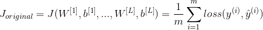
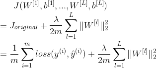
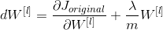
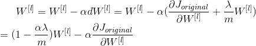

# Improving Deep Neural Networks: Hyperparameter tuning, Regularization and Optimization

* [Improving Deep Neural Networks: Hyperparameter tuning, Regularization and Optimization](#improving-deep-neural-networks-hyperparameter-tuning-regularization-and-optimization)
   * [Practical aspects of Deep Learning](#practical-aspects-of-deep-learning)
      * [Train / Dev / Test sets](#train--dev--test-sets)
      * [Bias vs Variance](#Bias-vs-Variance)
      * [Basic Recipe for Machine Learning](#basic-recipe-for-machine-learning)
      * [Regularization](#regularization)
      * [Why regularization reduces overfitting?](#why-regularization-reduces-overfitting)
      * [Dropout Regularization](#dropout-regularization)
      * [Understanding Dropout](#understanding-dropout)
      * [Other regularization methods](#other-regularization-methods)
      * [Normalizing inputs](#normalizing-inputs)
      * [Vanishing / Exploding gradients](#vanishing--exploding-gradients)
      * [Weight Initialization for Deep Networks](#weight-initialization-for-deep-networks)
      * [Numerical approximation of gradients](#numerical-approximation-of-gradients)
      * [Gradient checking](#gradient-checking)
      * [Gradient checking implementation notes](#gradient-checking-implementation-notes)
   * [Optimization algorithms](#optimization-algorithms)
      * [Mini-batch gradient descent](#mini-batch-gradient-descent)
      * [Understanding mini-batch gradient descent](#understanding-mini-batch-gradient-descent)
      * [Exponentially weighted averages](#exponentially-weighted-averages)
      * [Understanding exponentially weighted averages](#understanding-exponentially-weighted-averages)
      * [Bias correction in exponentially weighted averages](#bias-correction-in-exponentially-weighted-averages)
      * [Gradient descent with momentum](#gradient-descent-with-momentum)
      * [RMSprop](#rmsprop)
      * [Adam optimization algorithm](#adam-optimization-algorithm)
      * [Learning rate decay](#learning-rate-decay)
      * [The problem of local optima](#the-problem-of-local-optima)
   * [Hyperparameter tuning, Batch Normalization and Programming Frameworks](#hyperparameter-tuning-batch-normalization-and-programming-frameworks)
      * [Tuning process](#tuning-process)
      * [Using an appropriate scale to pick hyperparameters](#using-an-appropriate-scale-to-pick-hyperparameters)
      * [Hyperparameters tuning in practice: Pandas vs. Caviar](#hyperparameters-tuning-in-practice-pandas-vs-caviar)
      * [Normalizing activations in a network](#normalizing-activations-in-a-network)
      * [Fitting Batch Normalization into a neural network](#fitting-batch-normalization-into-a-neural-network)
      * [Why does Batch normalization work?](#why-does-batch-normalization-work)
      * [Batch normalization at test time](#batch-normalization-at-test-time)
      * [Softmax Regression](#softmax-regression)
      * [Training a Softmax classifier](#training-a-softmax-classifier)
      * [Deep learning frameworks](#deep-learning-frameworks)
      * [TensorFlow](#tensorflow)

## Practical aspects of Deep Learning

### Train / Dev / Test sets

- Its impossible to get all your hyperparameters right on a new application from the first time.
- So the idea is you go through the loop: Idea ==> Code ==> Experiment.
- You have to go through the loop many times to figure out your hyperparameters.

<div align="center">
  
</div>

- Your data will be split into three parts:
  - **Training set** — Which you run your learning algorithm on.
  - **Dev(Development) set** — Which you use to tune hyperparameters, select features, and make other decisions regarding the learning algorithm. Sometimes also called the **hold-out cross validation set**.
  - **Test set** — which you use to evaluate the performance of the algorithm, but not to make any decisions regarding what learning algorithm or parameters to use.

- so the trend on the ratio of splitting the models:
  - If size of the dataset is 100 to 100,000 ==> 60%/20%/20% or 70%/30%
  - If size of the dataset is 100,000 to INF ==> 98%/1%/1% or 99.5%/0.25%/0.25%

  <div align="center">
    
  </div>

- Make sure the dev and test set are coming from the same distribution.
  - For example if cat training pictures is from the web and the dev/test pictures are from users cell phone they will mismatch. It is better to make sure that dev and test set are from the same distribution.
- Its OK to only have a dev set without a testing set. But a lot of people in this case call the dev set as the test set.

### Bias vs Variance

<div align="center">
  
</div>

- If your model is underfitting (linear regression of non linear data) it has a "high bias"
- If your model is overfitting then it has a "high variance"
- if your model will be alright then you balance the Bias / Variance

<div align="center">
  
</div>


<div align="center">
  
</div>

### Basic Recipe for Machine Learning

- If your algorithm has a high bias:
  - Try to make your NN bigger (size of hidden units, number of layers)
  - Different (advanced) optimization algorithms (Momentum, RMSprop, Adam).
  - Try a different model that is suitable for your data (image recognition - CNN, speech recognition - RNN).
  - Try to run it longer.
- If your algorithm has a high variance:
  - More data.
  - Try regularization (L1 regularization, L2 regularization, Dropout).
  - Try a different model that is suitable for your data (image recognition - CNN, speech recognition - RNN).
- You should try the previous points until you have a low bias and low variance.
- In the older days in machine learning, there was a Bias/Variance Tradeoff. But now you have more options/tools for solving the bias and variance problem its really helpful to use deep learning.
- Training a bigger neural network on a bigger dataset never hurts.

### Regularization

**L1 vector / matrix norm**

<div align="center">
  
</div>

**L2 vector / matrix norm**

<div align="center">
  
</div>

**Regularization for logistic regression**

The normal cost function that we want to minimize is

<div align="center">
  
</div>

The L1 regularization version:

<div align="center">
  
</div>

The L2 regularization version:

<div align="center">
  
</div>

𝜆 here is the **regularization parameter** (hyperparameter)

**Regularization for NN**

- The normal cost function that we want to minimize is:

<div align="center">
  
</div>

- The L2 regularization version:

<div align="center">
  
</div>

- To do back propagation without regularization:

<div align="center">
  
</div>

- To do back propagation with regularization:

<div align="center">
  
</div>

- So plugging it in weight update step, the first term causes the **weight decay** in proportion to its size:

<div align="center">
  
</div>

- In practice this penalizes large weights and effectively limits the freedom in your model.

### Why regularization reduces overfitting?

- From neural network architecture, a lot of W's will be close to zeros which will make the NN simpler. It will just reduce some weights that makes the neural network overfit.

- From activation function, W's will be small (close to zero) - will use the linear part of the activation function, so we will go from non linear activation to roughly linear which would make the NN a roughly linear classifier which will prevent overfitting.

### Dropout Regularization

<div align="center">
  
</div>

- The dropout regularization eliminates some neurons/weights on each iteration based on a probability.
- A most common technique to implement dropout is called **Inverted dropout**.

```python
keep_prob = 0.8   # 0 <= keep_prob <= 1

# the generated number that are less than 0.8 will be dropped. 80% stay, 20% dropped
dl = np.random.rand(a[l].shape[0], a[l].shape[1]) < keep_prob

al = np.multiply(al,dl)   # keep only the values in dl

# increase al to not reduce the expected value of output
# (ensures that the expected value of a3 remains the same) - to solve the scaling problem
al = al / keep_prob
```

- Vector d[l] is used for forward and back propagation and is the same for them, but it is different for each iteration pass.
- At test time we don't use dropout. If you implement dropout at test time - it would add noise to predictions.

### Understanding Dropout

- The intuition was that dropout randomly knocks out units in your network. So it's as if on every iteration you're working with a smaller NN, and so using a smaller NN seems like it should have a regularizing effect.
- Dropout can't rely on any one feature, so have to spread out weights (**shrink weights**). It's possible to show that dropout has a similar effect to L2 regularization (**weights decay**).
- Dropout can have different keep_prob per layer. If you're more worried about some layers overfitting than others, you can set a lower keep_prob for some layers than others. The downside is, this gives you even more hyperparameters to search for using cross-validation. One other alternative might be to have some layers where you apply dropout and some layers where you don't apply dropout and then just have one hyperparameter, which is a keep_prob for the layers for which you do apply dropouts.
- The input layer dropout has to be near 1 or no dropout because you don't want to eliminate a lot of features.
- A lot of researchers are using dropout with Computer Vision because they have a very big input size and almost never have enough data, so overfitting is the usual problem. And dropout is a regularization technique to prevent overfitting.
- A downside of dropout is that the cost function J is not well defined and it will be hard to debug (plot J by iteration). To solve that you'll need to turn off dropout, set all the keep_prob to 1, and then run the code and check that it monotonically decreases J and then turn on the dropouts again.

### Other regularization methods

**Data Augmentation**:


- You can flip all your pictures horizontally this will give you more data instances.
- You could also apply a random position and rotation to an image to get more data.
- In OCR, you can impose random rotations and distortions to digits/letters.
- New data obtained using this technique isn't as good as the real independent data, but still can be used as a regularization technique.

**Early Stopping**:

<div align="center">
  
</div>

- In this technique we plot the training set and the dev set cost together for each iteration. At some iteration the dev set cost will stop decreasing and will start increasing.
- We will pick the point at which the training set error and dev set error are best (lowest training cost with lowest dev cost).
- We will take these parameters as the best parameters.
- Prefers to use L2 regularization instead of early stopping because this technique simultaneously tries to minimize the cost function and not to overfit which contradicts the **orthogonalization approach**.
- But its advantage is that you don't need to search a hyperparameter like in other regularization approaches (like 𝜆 in L2 regularization).

### Normalizing inputs


- If you normalize your inputs this will speed up the training process a lot.
- Normalization are going on these steps:

<div align="center">
  
</div>

- These steps should be applied to training, dev, and testing sets.


- If we don't normalize the inputs, our cost function will be deep and its shape will be inconsistent then optimizing it will take a long time.
- But if we normalize it the opposite will occur. The shape of the cost function will be consistent (look more symmetric like circle in 2D example) - the optimization will be faster.

### Vanishing / Exploding gradients

- To understand the problem, suppose that we have a deep neural network with number of layers L, and all the activation functions are linear and each b = 0, if we have 2 hidden units per layer and x<sub>1</sub> = x<sub>2</sub> = 1, we result in


  - Then:

  <div align="center">
    
  </div>

  - it will be very large, L layer dimension because of different dimensions in the output layer

  <div align="center">
    
  </div>

  - it will be very small, L layer dimension because of different dimensions in the output layer

  <div align="center">
    
  </div>

- The example explains that the activations and similarly derivatives will be decreased/increased exponentially as a function of number of layers. The vanishing / exploding gradients occurs when your derivatives become very small or very big.
- So If W > I (Identity matrix) the activation and gradients will explode. However, it turns out that exploding gradient is not that problematic, because:
  - The problem is easy to notice and diagnose, because the derivative would become NaN very quickly and crash the program.
  - There are some easy hacks that can effectively prevent exploding gradient. One of them is called **gradient clipping**, which simply throttles 𝜃, scale gradient during backprop, and it turns out to work well.

  <div align="center">
    
  </div>

- And If W < I (Identity matrix) the activation and gradients will vanish.
  - There is a partial solution that doesn't completely solve this problem but it helps a lot - careful choice of how you **initialize the weights**.
- Recently Microsoft trained 152 layers (ResNet) which is a really big number. With such a deep neural network, if your activations or gradients increase or decrease exponentially as a function of L, then these values could get really big or really small. And this makes training difficult, especially if your gradients are exponentially small, then gradient descent will take tiny little steps. It will take a long time for gradient descent to learn anything.

### Weight Initialization for Deep Networks

- A partial solution to the vanishing gradients in NN is better or more careful choice of the random initialization of weights
- In a single neuron (Perceptron model): z = w<sub>1</sub>x<sub>1</sub> + w<sub>2</sub>x<sub>2</sub> + ... + w<sub>n</sub>x<sub>n</sub>
- So if n<sub>x</sub> is large we want w to be smaller to not explode the cost.
- So it turns out that we need the variance which equals 1/n<sub>x</sub> to be the range of w
- So lets say when we initialize w like this:
```python
np.random.randn(shape) * np.sqrt(1/n[l-1])
np.random.randn(shape) * np.sqrt(2/n[l-1])          # He Initialization
np.random.randn(shape) * np.sqrt(2/(n[l-1] + n[l])) # Xavier Initialization
```
- This is one of the best way of partially solution to vanishing / exploding gradients (ReLU + Weight Initialization with variance) which will help gradients not to vanish / explode too quickly

### Numerical approximation of gradients

- There is an technique called **gradient checking** which tells you if your implementation of backpropagation is correct.
- There's a numerical way to calculate the derivative:

<div align="center">
  
</div>

<div align="center">
  
</div>

### Gradient checking

- Gradient checking approximates the gradients and is very helpful for finding the errors in your backpropagation implementation but it's slower than gradient descent (so use only for debugging).
- Gradient checking:
  - First take W<sup>[1]</sup>,b<sup>[1]</sup>,...,W<sup>[L]</sup>,b<sup>[L]</sup> and reshape into one big vector (θ)
  - The cost function will be J(θ)
  - Then take dW<sup>[1]</sup>,db<sup>[1]</sup>,...,dW<sup>[L]</sup>,db<sup>[L]</sup> into one big vector (dθ)
```python
eps = 1e-7    # small number
for i in len(theta):
    d_theta_approx[i] = (J(...,theta[i] + eps,...) -  J(...,theta[i] - eps,...)) / 2*eps
```
- Finally we evaluate this formula (||dθ<sub>approx</sub> - dθ||<sub>2</sub>)/(||dθ<sub>approx</sub>||<sub>2</sub>+||dθ||<sub>2</sub>) and check with eps = 10<sup>-7</sup>:
  - if it is < 10<sup>-7</sup> - great, very likely the backpropagation implementation is correct
  - if around 10<sup>-5</sup> - can be OK, but need to inspect if there are no particularly big values in dθ<sub>approx</sub> - dθ vector
  - if it is >= 10^-3 - bad, probably there is a bug in backpropagation implementation

### Gradient checking implementation notes

- Don't use the gradient checking algorithm at training time because it's very slow. Use gradient checking only for debugging.
- If algorithm fails grad check, look at components to try to identify the bug.
- If you are using L2 regularization, remember use corresponding cost function J.
- Gradient checking doesn't work with dropout because J is not consistent. You can first turn off dropout (set keep_prob = 1.0), run gradient checking and then turn on dropout again.
- Run gradient checking at random initialization and train the network for a while maybe there's a bug which can be seen when w and b become larger (further from 0) and can't be seen on the first iteration (when w and b are very small).

## Optimization algorithms

### Mini-batch gradient descent

- Training NN with a large data is slow. So to find an optimization algorithm that runs faster is a good idea.
- Suppose we have m = 50 million. To train this data it will take a huge processing time for one step. because 50 million won't fit in the memory at once we need other processing to make such a thing.
- Suppose we have split m to **mini-batches** of size 1000.
  - X<sup>{1}</sup> = 1    ...  1000
  - X<sup>{2}</sup> = 1001 ...  2000
  - ...
  - X<sup>{num_of_batches}</sup> = ...
- We similarly split X and Y.
- So the definition of mini batches ==> t: X<sup>{t}</sup>, Y<sup>{t}</sup>
- In **batch gradient descent** we run the gradient descent on the whole dataset.
- While in **Mini-Batch gradient descent** we run the gradient descent on the mini-batches datasets.
- Mini-Batch algorithm pseudo code:
```python
# this is called an epoch
for t = 1:num_of_batches
    AL, caches = forward_prop(X{t}, Y{t})
    cost = compute_cost(AL, Y{t})
    grads = backward_prop(AL, caches)
    update_parameters(grads)
```
- The code inside an **epoch** should be vectorized.
- Mini-batch gradient descent works much faster in the large datasets.

<div align="center">
  
</div>

<div align="center">
  
</div>

### Understanding mini-batch gradient descent

- In mini-batch algorithm, the cost won't go down with each step as it does in batch algorithm. It could contain some ups and downs but generally it has to go down (unlike the batch gradient descent where cost function descreases on each iteration).

- Mini-batch size:
  - (mini batch size = m) ==> Batch gradient descent
  - (mini batch size = 1) ==> Stochastic gradient descent (SGD)
  - (mini batch size = between 1 and m) ==> Mini-batch gradient descent
- Batch gradient descent:
  - too long per iteration (epoch)
- Stochastic gradient descent:
  - too noisy regarding cost minimization (can be reduced by using smaller learning rate)
  - won't ever converge (reach the minimum cost)
  - lose speed up from vectorization
- Mini-batch gradient descent:
  - faster learning:
    - you have the vectorization advantage
    - make progress without waiting to process the entire training set
  - doesn't always exactly converge (oscelates in a very small region, but you can reduce learning rate)

<div align="center">
  
</div>

- Guidelines for choosing mini-batch size:
  - If small training set (< 2000 examples) - use batch gradient descent.
  - It has to be a power of 2 (because of the way computer memory is layed out and accessed, sometimes your code runs faster if your mini-batch size is a power of 2): 64, 128, 256, 512, 1024
- Mini-batch size is a hyperparameter.

### Exponentially weighted averages

- There are optimization algorithms that are better than **gradient descent**, but you should first learn about Exponentially weighted averages.
- If we have data like the temperature of day through the year it could be like this:

<div align="center">
  
</div>

- This data is small in winter and big in summer. If we plot this data we will find it some noisy.
- Now lets compute the Exponentially weighted averages:

```python
v(0) = 0
v(1) = 0.9 * v(0) + 0.1 * θ(1) = 4		# 0.9 and 0.1 are hyperparameters
v(2) = 0.9 * v(1) + 0.1 * θ(2) = 8.5
v(3) = 0.9 * v(2) + 0.1 * θ(3) = 12.15
...
v(t) = 0.9 * v(t-1) + 0.1 * θ(t)
```

- General equation

```python
v(t) = β * v(t-1) + (1 - β) * θ(t)
```

- If we plot this it will represent averages over (1 / (1 - β)) entries:
  - β = 0.9 will average last 10 entries
  - β = 0.98 will average last 50 entries

<div align="center">
  
</div>

  - β = 0.5 will average last 2 entries

<div align="center">
  
</div>

- Best β average for our case is between 0.9 and 0.98
- The reason why exponentially weighted averages are useful for further optimizing gradient descent algorithm is that it can give different weights to recent data points (θ) based on value of β. If β is high (around 0.9), it smoothens out the averages of skewed data points (oscillations w.r.t. gradient descent). So this reduces oscillations in gradient descent and hence makes faster and smoother path towerds minima.

### Understanding exponentially weighted averages

<div align="center">
  
</div>

<div align="center">
  
</div>

<div align="center">
  
</div>

- when β = 0.9 ==> 0.9<sup>10</sup> about 1/e
- when β = 0.98 ==> 0.98<sup>50</sup> about 1/e
- We can implement this algorithm with more accurate results using a moving window with average. But the code is more efficient and faster using the exponentially weighted averages algorithm.

```python
v = 0
Repeat
{
	Get theta(t)
	v = beta * v + (1-beta) * theta(t)
}
```

### Bias correction in exponentially weighted averages

<div align="center">
  
</div>

- The bias correction helps make the exponentially weighted averages more accurate.
- Because v(0) = 0, the bias of the weighted averages is shifted and the accuracy suffers at the start.

```python
v(0) = 0
v(1) = 0.9 * v(0) + 0.1 * θ(1) = 0.1 * θ(1)
v(2) = 0.9 * v(1) + 0.1 * θ(2) = 0.09 * θ(1)+ 0.1 * θ(2)
```

- To solve the bias issue we have to use this equation:

```python
v(t) = (beta * v(t-1) + (1-beta) * theta(t)) / (1 - beta^t)
```

```python
v(2) = (0.09 * θ(1)+ 0.1 * θ(2)) / (1 - 0.9^2)
     = (0.09 * θ(1)+ 0.1 * θ(2)) / 0.19
     = 0.473 * θ(1) + 0.526 * θ(2)
```

- As t becomes larger the (1 - β<sup>t</sup>) becomes close to 1.

### Gradient descent with momentum

- The momentum algorithm almost always works faster than standard gradient descent.
- The simple idea is to calculate the exponentially weighted averages for your gradients and then update your weights with the new values.

<div align="center">
  
</div>

- Momentum helps the cost function to go to the minimum point in a more fast and consistent way.
- β is another hyperparameter. β = 0.9 is very common and works very well in most cases.
- In practice people don't bother implementing **bias correction**.

### RMSprop

- Stands for **Root mean square prop**.
- This algorithm speeds up the gradient descent.
```python
sdW = 0, sdb = 0, epsilon = 1e-8
on iteration t:
  # can be mini-batch or batch gradient descent
  compute dw, db on current mini-batch

  sdW = (beta * sdW) + (1 - beta) * dW^2  # squaring is element-wise
  sdb = (beta * sdb) + (1 - beta) * db^2  # squaring is element-wise
  W = W - learning_rate * dW / (sqrt(sdW) + epsilon)
  b = b - learning_rate * db / (sqrt(sdb) + epsilon)
```
- Ensure that not divided by zero, we adding a small value ε to it
- With RMSprop you can increase your learning rate.

### Adam optimization algorithm

- Stands for **Adaptive Moment Estimation**.
- Adam optimization and RMSprop are among the optimization algorithms that worked very well with a lot of NN architectures.
- Adam optimization simply puts RMSprop and momentum together!
```python
vdW = 0, vdW = 0
sdW = 0, sdb = 0
on iteration t:
	# can be mini-batch or batch gradient descent
	compute dw, db on current mini-batch                

	vdW = (beta1 * vdW) + (1 - beta1) * dW     # momentum
	vdb = (beta1 * vdb) + (1 - beta1) * db     # momentum

	sdW = (beta2 * sdW) + (1 - beta2) * dW^2   # RMSprop
	sdb = (beta2 * sdb) + (1 - beta2) * db^2   # RMSprop

	vdW = vdW / (1 - beta1^t)      # fixing bias
	vdb = vdb / (1 - beta1^t)      # fixing bias

	sdW = sdW / (1 - beta2^t)      # fixing bias
	sdb = sdb / (1 - beta2^t)      # fixing bias

	W = W - learning_rate * vdW / (sqrt(sdW) + epsilon)
	b = b - learning_rate * vdb / (sqrt(sdb) + epsilon)
```
- Hyperparameters for Adam:
  - Learning rate: needed to be tuned.
  - β<sub>1</sub>: parameter of the momentum, 0.9 is recommended by default.
  - β<sub>2</sub>: parameter of the RMSprop, 0.999 is recommended by default.
  - ε: 1e-8 is recommended by default.

### Learning rate decay

- Slowly reduce learning rate. As mentioned before mini-batch gradient descent won't reach the optimum point (converge). But by making the learning rate decay with iterations it will be much closer to it because the steps (and possible oscillations) near the optimum are smaller.
  - decay_rate = 0.95
  - learning_rate = (1 / (1 + decay_rate * epoch_num)) * learning_rate
  - learning_rate = decay_rate<sup>epoch_num</sup> * learning_rate
  - learning_rate = (decay_rate / sqrt(epoch_num)) * learning_rate
  - learning_rate = (decay_rate / sqrt(iter_num)) * learning_rate
- perform learning rate decay discretely - repeatedly decrease after some number of epochs.
- making changes to the learning rate manually.
- decay_rate is another hyperparameter.

### The problem of local optima

- The normal local optima is not likely to appear in a deep neural network because data is usually high dimensional. For point to be a local optima it has to be a local optima for each of the dimensions which is highly unlikely.
- It's unlikely to get stuck in a bad local optima in high dimensions, it is much more likely to get to the **saddle point** rather to the local optima, which is not a problem.
- Plateaus can make learning slow:
  - Plateau is a region where the derivative is close to zero for a long time.
  - This is where algorithms like momentum, RMSprop or Adam can help.

<div align="center">
  
</div>

## Hyperparameter tuning, Batch Normalization and Programming Frameworks

### Tuning process

- We need to tune our hyperparameters to get the best out of them.
- Hyperparameters importance are:
  - Learning rate.
  - Momentum beta, Mini-batch size, Number of hidden units.
  - Number of layers, Learning rate decay.
  - Regularization lambda, Activation functions.
  - Adam β<sub>1</sub>, β<sub>2</sub>, ε.
- Its hard to decide which hyperparameter is the most important in a problem. It depends a lot on your problem.
- One of the ways to tune is to sample a grid with `N` hyperparameter settings and then try all settings combinations on your problem.
- Try random values: don't use a grid.
- You can use **coarse to fine sampling scheme**:
  - When you find some hyperparameters values that give you a better performance - zoom into a smaller region around these values and sample more densely within this space.
- These methods can be automated.

<div align="center">
  
</div>

### Using an appropriate scale to pick hyperparameters

- Let's say you have a specific range for a hyperparameter from a to b. It's better to search for the right ones using the **logarithmic scale** rather then in **linear scale**:
  - Calculate: `a_log = log(a)  # e.g. a = 0.0001 then log(a) = -4`
  - Calculate: `b_log = log(b)  # e.g. b = 1  then log(b) = 0`
  - Then:
  ```python
  r = (a_log - b_log) * np.random.rand() + b_log
  # In the example the range would be from [-4, 0] because rand range [0,1)
  result = 10^r
  ```
  - It uniformly samples values in log scale from [a,b].
- If we want to use the last method on exploring on the momentum beta:
  - beta best range is from 0.9 to 0.999.
  - You should search for 1 - beta in range 0.001 to 0.1 (1 - 0.9 and 1 - 0.999) and the use a = 0.001 and b = 0.1. Then:
  ```python
  a_log = -3
  b_log = -1
  r = (a_log - b_log) * np.random.rand() + b_log
  beta = 1 - 10^r   # because 1 - beta = 10^r
  ```

### Hyperparameters tuning in practice: Pandas vs. Caviar

- Intuitions about hyperparameter settings from one application area may or may not transfer to a different one.
- If you don't have much computational resources you can use the **babysitting model**:
  - First you might initialize your parameter as random and then start training.
  - Then you watch your learning curve gradually decrease over the day.
  - And each day you nudge your parameters a little during training.
  - Called panda approach.
- If you have enough computational resources, you can run some models in parallel and at the end of the day(s) you check the results.
  - Called Caviar approach.

### Normalizing activations in a network

- In the rise of deep learning, one of the most important ideas has been an algorithm called **batch normalization**, created by two researchers, Sergey Ioffe and Christian Szegedy.
- Batch Normalization speeds up learning.
- Before we normalized input by subtracting the mean and dividing by variance. This helped a lot for the shape of the cost function and for reaching the minimum point faster.
- The question is: for any hidden layer can we normalize A<sup>[l]</sup> to train W<sup>[l+1]</sup>, b<sup>[l+1]</sup> faster. This is what batch normalization is about.
- There are some debates in the deep learning literature about whether you should normalize values before the activation function Z<sup>[l]</sup> or after applying the activation function A<sup>[l]</sup>. In practice, normalizing Z<sup>[l]</sup> is done much more often.
- Algorithm:

<div align="center">
  
</div>

  - Forcing the inputs to a distribution with zero mean and variance of 1.
  - To make inputs belong to other distribution (with other mean and variance).
  - gamma and beta are learnable parameters of the model.
  - Making the NN learn the distribution of the outputs.
  - if `gamma = sqrt(variance + epsilon)` and `beta = mean` then `Z_tilde[i] = z[i]`

### Fitting Batch Normalization into a neural network

- Using batch norm in 3 hidden layers NN:

- Our NN parameters will be:
  - W<sup>[1]</sup>, b<sup>[1]</sup>, ..., W<sup>[L]</sup>, b<sup>[L]</sup>, β<sup>[1]</sup>, γ<sup>[1]</sup>, ..., β<sup>[L]</sup>, γ<sup>[L]</sup>
  - β<sup>[1]</sup>, γ<sup>[1]</sup>, ..., β<sup>[L]</sup>, γ<sup>[L]</sup> are updated using any optimization algorithms (like SGD, RMSprop, Adam)
- If you are using a deep learning framework, you won't have to implement batch norm yourself:
  - Tensorflow you can add this line: tf.nn.batch-normalization()
- Batch normalization is usually applied with mini-batches.
- If we are using batch normalization parameters b<sup>[1]</sup>, ..., b<sup>[L]</sup> doesn't count because they will be eliminated after mean subtraction step, so:
```python
Z[l] = W[l]A[l-1] + b[l] => Z[l] = W[l]A[l-1]
Z_norm[l] = ...
Z_tilde[l] = gamma[l] * Z_norm[l] + beta[l]
```
- Taking the mean of a constant b<sup>[l]</sup> will eliminate the b<sup>[l]</sup>
- So if you are using batch normalization, you can remove b<sup>[l]</sup> or make it always zero.
- So the parameters will be W<sup>[l]</sup>, β<sup>[l]</sup>, and γ<sup>[l]</sup>.

### Why does Batch normalization work?

- The first reason is the same reason as why we normalize X.
- The second reason is that batch normalization reduces the problem of input values changing (shifting).

<div align="center">
  
</div>

- Batch normalization does some regularization:
  - Each mini batch is scaled by the mean/variance computed on just that mini-batch.
  - This adds some noise to the values Z<sup>[l]</sup> within that mini batch. So similar to dropout it adds some noise to each hidden layer's activations.
  - This has a slight regularization effect.
  - Using bigger size of the mini-batch you are reducing noise and therefore regularization effect.
  - Don't rely on batch normalization as a regularization. It's intended for normalization of hidden units, activations and therefore speeding up learning. For regularization use other regularization techniques (L2 or dropout).

### Batch normalization at test time

- When we train a NN with Batch normalization, we compute the mean and the variance of the mini-batch.
- In testing we might need to process examples one at a time. The mean and the variance of one example won't make sense.
- We have to compute an estimated value of mean and variance to use it in testing time.
- We can use the **exponentially weighted average** across the mini-batches.
- We will use the estimated values of the mean and variance to test.
- This method is also sometimes called **running average**.
- In practice most often you will use a deep learning framework and it will contain some default implementation of doing such a thing.

### Softmax Regression

- softmax regression that is used for multiclass classification/regression.

<div align="center">
  
</div>

<div align="center">
  
</div>

  - To represent a none vector y = [1 0 0 0]
  - To represent a dog vector y = [0 1 0 0]
  - To represent a cat vector y = [0 0 1 0]
  - To represent a baby chick vector y = [0 0 0 1]
- Notations:
  - C = num of classes
  - range of classes is (0, ..., C-1)
- Each of C values in the output layer will contain a probability of the example to belong to each of the classes.
- In the last layer we will have to activate the Softmax activation function instead of the sigmoid activation.

<div align="center">
  
</div>

### Training a Softmax classifier

- There's an activation which is called hard max, which gets 1 for the maximum value and zeros for the others. If you are using numpy, np.max can be used.
- The Softmax name came from softening the values and not harding them like hard max.
- Softmax is a generalization of logistic activation function to C classes. If C = 2 softmax reduces to logistic regression.
- The loss function used with softmax:

<div align="center">
  
</div>

- The cost function used with softmax:

<div align="center">
  
</div>

- Back propagation with softmax:

<div align="center">
  
</div>

### Deep learning frameworks

- It's not practical to implement everything from scratch. Our numpy implementations were to know how NN works.
- There are many good deep learning frameworks.
- Deep learning is now in the phase of doing something with the frameworks and not from scratch to keep on going.
- Programming frameworks can not only shorten your coding time but sometimes also perform
optimizations that speed up your code.

<div align="center">
  
</div>

### TensorFlow

- Lets see how to implement a minimization function:
  - Example function: J(w) = w<sup>2</sup> - 10w + 25
  - The result should be w = 5 as the function is (w-5)<sup>2</sup> = 0

  <div align="center">
    
  </div>

  - we feed the inputs to the algorithm through coefficients:

  <div align="center">
    
  </div>

- In TensorFlow you implement only the forward propagation and TensorFlow will do the backpropagation by itself.
- In TensorFlow a placeholder is a variable you can assign a value to later.
- If you are using a mini-batch training you should change the feed_dict={x: coefficients} to the current mini-batch data.
- Almost all TensorFlow programs use this:

<div align="center">
  
</div>

- In deep learning frameworks there are a lot of things that you can do with one line of code like changing the optimizer.
- Writing and running programs in TensorFlow has the following steps:
  - Create Tensors (variables) that are not yet executed/evaluated.
  - Write operations between those Tensors.
  - Initialize your Tensors.
  - Create a Session.
  - Run the Session. This will run the operations you'd written above.
- Instead of needing to write code to compute the cost function we know, we can use this line in TensorFlow :

```python
tf.nn.sigmoid_cross_entropy_with_logits(logits = ...,  labels = ...)
tf.nn.softmax_cross_entropy_with_logits(logits = ...,  labels = ...)
```

- To initialize weights in NN using TensorFlow use:

```python
W1 = tf.get_variable("W1", [25,12288], initializer = tf.contrib.layers.xavier_initializer(seed = 1))
b1 = tf.get_variable("b1", [25,1], initializer = tf.zeros_initializer())
```

- For 3-layer NN, it is important to note that the forward propagation stops at Z<sup>[3]</sup>. The reason is that in TensorFlow the last linear layer output is given as input to the function computing the loss. Therefore, you don't need A<sup>[3]</sup>
- To reset the graph use `tf.reset_default_graph()`
