# Machine Learning Strategy

* [Why Machine Learning Strategy](#Why-Machine-Learning-Strategy)
* [Scale drives machine learning progress](#Scale-drives-machine-learning-progress)
* [Setting up development and test sets](#Setting-up-development-and-test-sets)
  * [Development and test sets](#Development-and-test-sets)
  * [Dev and test sets should come from the same distribution](#Dev-and-test-sets-should-come-from-the-same-distribution)
  * [How large do the dev/test sets need to be?](#How-large-do-the-dev/test-sets-need-to-be?)
  * [Establish a single-number evaluation metric for your team to optimize](#Establish-a-single-number-evaluation-metric-for-your-team-to-optimize)
  * [Optimizing and satisficing metrics](Optimizing-and-satisficing-metrics)
  * [Having a dev set and metric speeds up iterations](Having-a-dev-set-and-metric-speeds-up-iterations)
  * [When to change dev/test sets and metrics](#when-to-change-dev/test-sets-and-metrics)
* [Basic Error Analysis](#Basic Error Analysis)
  * [Build your first system quickly, then iterate](#Build your first system quickly, then iterate)
  * [Error analysis: Look at dev set examples to evaluate ideas](#Error analysis: Look at dev set examples to evaluate ideas)
  * [Evaluating multiple ideas in parallel during error analysis](#Evaluating multiple ideas in parallel during error analysis)
  * [Cleaning up incorrectly labeled data](#Cleaning up incorrectly labeled data)
  * [If you have a large dev set, split it into two subsets, only one of which you look at](#If you have a large dev set, split it into two subsets, only one of which you look at)
  * [How big should the Eyeball and Blackbox dev sets be?](#How big should the Eyeball and Blackbox dev sets be?)
* [Bias and Variance](#Bias and Variance)
  * [Bias and Variance: The two big sources of error](#Bias and Variance: The two big sources of error)
  * [Examples of Bias and Variance](#Examples of Bias and Variance)
* [Why human-level performance?](#why-human-level-performance)
* [Avoidable bias](#avoidable-bias)
* [Understanding human-level performance](#understanding-human-level-performance)
* [Surpassing human-level performance](#surpassing-human-level-performance)
* [Improving your model performance](#improving-your-model-performance)
* [Carrying out error analysis](#carrying-out-error-analysis)
* [Cleaning up incorrectly labeled data](#cleaning-up-incorrectly-labeled-data)
* [Build your first system quickly, then iterate](#build-your-first-system-quickly-then-iterate)
* [Training and testing on different distributions](#training-and-testing-on-different-distributions)
* [Bias and Variance with mismatched data distributions](#bias-and-variance-with-mismatched-data-distributions)
* [Addressing data mismatch](#addressing-data-mismatch)
* [Transfer learning](#transfer-learning)
* [Multi-task learning](#multi-task-learning)
* [What is end-to-end deep learning?](#what-is-end-to-end-deep-learning)
* [Whether to use end-to-end deep learning](#whether-to-use-end-to-end-deep-learning)
* [Orthogonalization](#orthogonalization)
* [How to read deep learning papers](#how-to-read-deep-learning-papers)
   * [Read research papers](#read-research-papers)
   * [Read one paper multiple passes](#read-one-paper-multiple-passes)
   * [Try to answer question](#try-to-answer-question)
   * [About math code and long-term goals](#about-math-code-and-long-term-goals)

## Why Machine Learning Strategy

Say you’re building a startup that will provide an endless stream of cat pictures to cat lovers.

<div align="center">
  
</div>

You use a neural network to build a computer vision system for detecting cats in pictures.

But tragically, your learning algorithm’s accuracy is not yet good enough. You are under tremendous pressure to improve your cat detector. What do you do?

You and your team have a lot of ideas for how to improve the accuracy of your deep learning system:

  - Get more data: Collect more pictures of cats.
  - Collect a more diverse training set. For example, pictures of cats in unusual positions; cats with unusual coloration; pictures shot with a variety of camera settings;
  - Train the algorithm longer, by running more gradient descent iterations.
  - Try different optimization algorithm (e.g. Momentum, RMSprop, Adam).
  - Try a bigger neural network, with more layers/hidden units/parameters.
  - Try a smaller neural network.
  - Try adding regularization (such as L1/L2 regularization or dropout).
  - Change the neural network architecture (activation function, number of hidden units, etc.)

If you choose well among these possible directions, you’ll build the leading cat picture platform, and lead your company to success. If you choose poorly, you might waste months. How do you proceed?

Machine learning strategy will tell you how. Most machine learning problems leave clues that tell you what’s useful to try, and what’s not useful to try. Learning to read those clues will save you months or years of development time.

## Scale drives machine learning progress

Many of the ideas of deep learning (neural networks) have been around for decades. Why are these ideas taking off now?

Biggest drivers of recent progress have been:

  - Data availability:
    - People are now spending more time on digital devices (laptops, mobile devices). Their digital activities generate huge amounts of data that we can feed to our learning algorithms.
  - Computational scale:
    - We started just a few years ago, techniques (like GPUs/Powerful CPUs/Distributed computing) to be able to train neural networks that are big enough to take advantage of the huge datasets we now have.
  - Algorithm:
    - Creative algorithms has appeared that changed the way NN works. Using RELU function is so much better than using Sigmoid function in training a NN.

In detail, even as you accumulate more data, usually the performance of older learning algorithms, such as logistic regression, “plateaus.” This means its learning curve “flattens out,” and the algorithm stops improving even as you give it more data:

It was as if the older algorithms didn’t know what to do with all the data we now have.

If you train a small neural network (NN) on the same supervised learning task, you might get slightly better performance:

Here, by “Small NN” we mean a neural network with only a small number of hidden units/layers/parameters. Finally, if you train larger and larger neural networks, you can obtain even better performance:

<div align="center">
  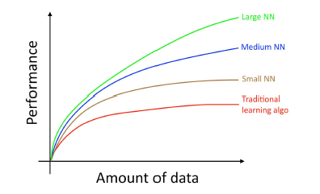
</div>

This diagram shows NNs doing better in the regime of small datasets. This effect is less consistent than the effect of NNs doing well in the regime of huge datasets. In the small data regime, depending on how the features are hand-engineered, traditional algorithms may or may not do better. For example, if you have 20 training examples, it might not matter much whether you use logistic regression or a neural network; the hand-engineering of features will have a bigger effect than the choice of algorithm. But if you have 1 million examples, I would favor the neural network.

Thus, you obtain the best performance when you (i) Train a very large neural network, so that you are on the green curve above; (ii) Have a huge amount of data.

Many other details such as neural network architecture are also important, and there has been much innovation here. But one of the more reliable ways to improve an algorithm’s performance today is still to (i) train a bigger network and (ii) get more data.


## Setting up development and test sets

### Your development and test sets

Let’s return to our earlier cat pictures example: You run a mobile app, and users are uploading pictures of many different things to your app. You want to automatically find the cat pictures.

Your team gets a large training set by downloading pictures of cats (positive examples) and non-cats (negative examples) off of different websites. They split the dataset 70%/30% into training and test sets. Using this data, they build a cat detector that works well on the training and test sets.

But when you deploy this classifier into the mobile app, you find that the performance is really poor!

<div align="center">
  
</div>

What happened?

You figure out that the pictures users are uploading have a different look than the website images that make up your training set: Users are uploading pictures taken with mobile phones, which tend to be lower resolution, blurrier, and poorly lit. Since your training/test sets were made of website images, your algorithm did not generalize well to the actual distribution you care about: mobile phone pictures.

Before the modern era of big data, it was a common rule in machine learning to use a random 70%/30% split to form your training and test sets. This practice can work, but it’s a bad idea in more and more applications where the training distribution (website images in our example above) is different from the distribution you ultimately care about (mobile phone images).

We usually define:

  - **Training set** — Which you run your learning algorithm on.
  - **Dev (development) set** — Which you use to tune parameters, select features, and make other decisions regarding the learning algorithm. Sometimes also called the hold-out cross validation set.
  - **Test set** — which you use to evaluate the performance of the algorithm, but not to make any decisions regarding what learning algorithm or parameters to use.

Once you define a dev set (development set) and test set, your team will try a lot of ideas, such as different learning algorithm parameters, to see what works best. The dev and test sets allow your team to quickly see how well your algorithm is doing.

In other words, **the purpose of the dev and test sets are to direct your team toward the most important changes to make to the machine learning system**.

So, you should do the following: Choose dev and test sets to reflect data you expect to get in the future and want to do well on.

In other words, your test set should not simply be 30% of the available data, especially if you expect your future data (mobile phone images) to be different in nature from your training set (website images).

If you have not yet launched your mobile app, you might not have any users yet, and thus might not be able to get data that accurately reflects what you have to do well on in the future. But you might still try to approximate this. For example, ask your friends to take mobile phone pictures of cats and send them to you. Once your app is launched, you can update your dev/test sets using actual user data.

If you really don’t have any way of getting data that approximates what you expect to get in the future, perhaps you can start by using website images. But you should be aware of the risk of this leading to a system that doesn’t generalize well.

It requires judgment to decide how much to invest in developing great dev and test sets. But don’t assume your training distribution is the same as your test distribution. Try to pick test examples that reflect what you ultimately want to perform well on, rather than whatever data you happen to have for training.

### Your dev and test sets should come from the same distribution

You have your cat app image data segmented into four regions, based on your largest markets: (i) US, (ii) China, (iii) India, and (iv) Other. To come up with a dev set and a test set, say we put US and India in the dev set; China and Other in the test set. In other words, we can randomly assign two of these segments to the dev set, and the other two to the test set, right?

<div align="center">
  
</div>

Once you define the dev and test sets, your team will be focused on improving dev set performance. Thus, the dev set should reflect the task you want to improve on the most: To do well on all four geographies, and not only two.

There is a second problem with having different dev and test set distributions: There is a chance that your team will build something that works well on the dev set, only to find that it does poorly on the test set. I’ve seen this result in much frustration and wasted effort. Avoid letting this happen to you.

As an example, suppose your team develops a system that works well on the dev set but not the test set. If your dev and test sets had come from the same distribution, then you would have a very clear diagnosis of what went wrong: You have overfit the dev set. The obvious cure is to get more dev set data.

But if the dev and test sets come from different distributions, then your options are less clear. Several things could have gone wrong:

  - You had overfit to the dev set.
  - The test set is harder than the dev set. So your algorithm might be doing as well as could be expected, and no further significant improvement is possible.
  - The test set is not necessarily harder, but just different, from the dev set. So what works well on the dev set just does not work well on the test set. In this case, a lot of your work to improve dev set performance might be wasted effort.

Working on machine learning applications is hard enough. Having mismatched dev and test sets introduces additional uncertainty about whether improving on the dev set distribution also improves test set performance. Having mismatched dev and test sets makes it harder to figure out what is and isn’t working, and thus makes it harder to prioritize what to work on.

  - Dev and test sets should come from the same distribution. This may not be the same as your training data’s distribution.
  - Choose dev set and test set to reflect data you expect to get in the future and consider important to do well on.
  - Setting up the dev set, as well as the validation metric is really defining what target you want to aim at.

### How large do the dev/test sets need to be?

The dev set should be large enough to detect differences between algorithms that you are trying out. For example, if classifier A has an accuracy of 90.0% and classifier B has an accuracy of 90.1%, then a dev set of 100 examples would not be able to detect this 0.1% difference. Compared to other machine learning problems I’ve seen, a 100 example dev set is small. Dev sets with sizes from 1,000 to 10,000 examples are common. With 10,000 examples, you will have a good chance of detecting an improvement of 0.1%.

For mature and important applications—for example, advertising, web search, and product recommendations—I have also seen teams that are highly motivated to eke out even a 0.01% improvement, since it has a direct impact on the company’s profits. In this case, the dev set could be much larger than 10,000, in order to detect even smaller improvements.

How about the size of the test set? It should be large enough to give high confidence in the overall performance of your system. One popular heuristic had been to use 30% of your data for your test set. This works well when you have a modest number of examples—say 100 to 10,000 examples. But in the era of big data where we now have machine learning problems with sometimes more than a billion examples, the fraction of data allocated to dev/test sets has been shrinking, even as the absolute number of examples in the dev/test sets has been growing. There is no need to have excessively large dev/test sets beyond what is needed to evaluate the performance of your algorithms.

The traditional way of splitting the data was 70% training, 30% test or 60% training, 20% dev, 20% test. In the modern deep learning if you have a million or more examples a reasonable split would be 98% training, 1% dev, 1% test.

### Establish a single-number evaluation metric for your team to optimize

Its better and faster to set a single number evaluation metric for your project before you start it. Suppose we run the classifier on 10 images which are 5 cats and 5 non-cats. The classifier identifies that there are 4 cats, but it identified 1 wrong cat.

Confusion matrix:

      |                | Predicted cat  | Predicted non-cat |
      | -------------- | -------------- | ----------------- |
      | Actual cat     | 3              | 2                 |
      | Actual non-cat | 1              | 4                 |

- **Precision**: percentage of true cats in the recognized result: P = 3/(3 + 1)
- **Recall**: percentage of true recognition cat of the all cat predictions: R = 3/(3 + 2)
- **Accuracy**: (3+4)/10

The **Precision** of a cat classifier is the fraction of images in the dev (or test) set it labeled as cats that really are cats. Its **Recall** is the percentage of all cat images in the dev (or test) set that it correctly labeled as a cat. There is often a tradeoff between having high precision and high recall.

**Classification accuracy** is an example of a **single-number evaluation metric**: You run your classifier on the dev set (or test set), and get back a single number about what fraction of examples it classified correctly. According to this metric, if classifier A obtains 97% accuracy, and classifier B obtains 90% accuracy, then we judge classifier A to be superior.

In contrast, Precision and Recall is not a single-number evaluation metric: It gives two numbers for assessing your classifier. Having multiple-number evaluation metrics makes it harder to compare algorithms. Suppose your algorithms perform as follows:

<div align="center">
  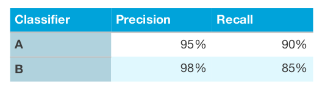
</div>

Here, neither classifier is obviously superior, so it doesn’t immediately guide you toward picking one.

During development, your team will try a lot of ideas about algorithm architecture, model parameters, choice of features, etc. Having a ​ **single-number evaluation metric**​ such as accuracy allows you to sort all your models according to their performance on this metric, and quickly decide what is working best.

If you really care about both Precision and Recall, I recommend using one of the standard ways to combine them into a single number. One could take the average of precision and recall, to end up with a single number. Alternatively, you can compute the **F1 score**, which is a modified way of computing their average, and works better than simply taking the mean. F1 score is the **harmonic mean** between Precision and Recall, and is calculated as 2/((1/Precision)+(1/Recall))

<div align="center">
  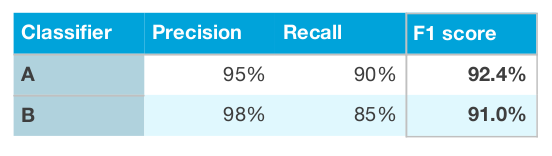
</div>

Having a single-number evaluation metric speeds up your ability to make a decision when you are selecting among a large number of classifiers. It gives a clear preference ranking among all of them, and therefore a clear direction for progress.

As a final example, suppose you are separately tracking the accuracy of your cat classifier in four key markets: (i)US, (ii)China, (iii)India, and (iv)Other. This gives four metrics. By taking an **average** or **weighted average** of these four numbers, you end up with a single number metric. Taking an average or weighted average is one of the most common ways to combine multiple metrics into one.

### Optimizing and satisficing metrics

Here’s another way to combine multiple evaluation metrics.

Suppose you care about both the accuracy and the running time of a learning algorithm. You need to choose from these three classifiers:

<div align="center">
  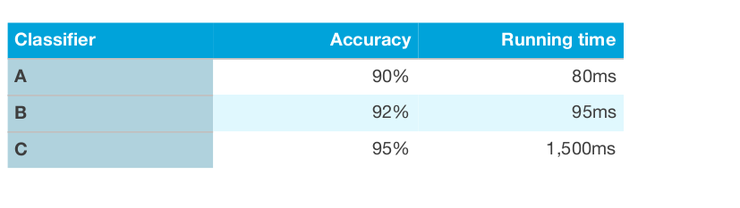
</div>

It seems unnatural to derive a single metric by putting accuracy and running time into a
single formula, such as: Accuracy - 0.5*RunningTime

Here’s what you can do instead: First, define what is an **acceptable** running time. Let’s say anything that runs in 100ms is acceptable. Then, maximize accuracy, subject to your classifier meeting the running time criteria. Here, running time is a **satisficing metric** — your classifier just has to be good enough on this metric, in the sense that it should take at most 100ms. Accuracy is the **optimizing metric**.

If you are trading off N different criteria, such as binary file size of the model (which is important for mobile apps, since users don’t want to download large apps), running time, and accuracy, you might consider setting N-1 of the criteria as **satisficing metrics**. I.e., you simply require that they meet a certain value. Then define the final one as the **optimizing metric**. Setting a threshold for what is acceptable for binary file size and running time, and try to optimize accuracy given those constraints.

As a final example, suppose you are building a hardware device that uses a microphone to listen for the user saying a particular **wakeword**, that then causes the system to wake up. You care about both the **false positive rate** — the frequency with which the system wakes up even when no one said the wakeword — as well as the **false negative rate** — how often it fails to wake up when someone says the wakeword. One reasonable goal for the performance of this system is to minimize the false negative rate (optimizing metric), subject to there being no more than one false positive every 24 hours of operation (satisficing metric).

Once your team is aligned on the evaluation metric to optimize, they will be able to make faster progress.

### Having a dev set and metric speeds up iterations

It is very difficult to know in advance what approach will work best for a new problem. Even experienced machine learning researchers will usually try out dozens of ideas before they discover something satisfactory. When building a machine learning system, I will often:

  - Start off with some ​**idea**​ on how to build the system.
  - Implement the idea in **code**.
  - Carry out an ​**experiment**​ which tells me how well the idea worked. (Usually my first few ideas don’t work!) Based on these learnings, go back to generate more ideas, and keep on iterating.

<div align="center">
  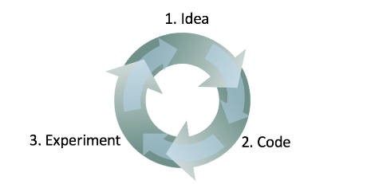
</div>

This is an iterative process. The faster you can go round this loop, the faster you will make progress. This is why having dev/test sets and a metric are important: Each time you try an idea, measuring your idea’s performance on the dev set lets you quickly decide if you’re heading in the right direction.

In contrast, suppose you don’t have a specific dev set and metric. So each time your team develops a new cat classifier, you have to incorporate it into your app, and play with the app for a few hours to get a sense of whether the new classifier is an improvement. This would be incredibly slow! Also, if your team improves the classifier’s accuracy from 95.0% to 95.1%, you might not be able to detect that 0.1% improvement from playing with the app. Yet a lot of progress in your system will be made by gradually accumulating dozens of these 0.1% improvements. Having a dev set and metric allows you to very quickly detect which ideas are successfully giving you small (or large) improvements, and therefore lets you quickly decide what ideas to keep refining, and which ones to discard.

### When to change dev/test sets and metrics

When starting out on a new project, I try to quickly choose dev/test sets, since this gives the team a well-defined target to aim for.

I typically come up with an initial dev/test set and an initial metric in less than one week — rarely longer. It is better to come up with something imperfect and get going quickly, rather than overthink this.

If you later realize that your initial dev/test set or metric missed the mark, then change them quickly. For example, if your dev set + metric ranks classifier A above classifier B, but your team thinks that classifier B is actually superior for your product, then this might be a sign that you need to change your dev/test sets or your evaluation metric.

There are three main possible causes of the dev set/metric incorrectly rating classifier A higher:

**The actual distribution you need to do well on is different from the dev/test sets**

Suppose your initial dev/test set had mainly pictures of adult cats. You ship your cat app, and find that users are uploading a lot more kitten images than expected. So, the dev/test set distribution is not representative of the actual distribution you need to do well on. In this case, update your dev/test sets to be more representative.

<div align="center">
  
</div>

**You have overfit to the dev set**

The process of repeatedly evaluating ideas on the dev set causes your algorithm to gradually “overfit” to the dev set. When you are done developing, you will evaluate your system on the test set. If you find that your dev set performance is much better than your test set performance, it is a sign that you have overfit to the dev set. In this case, get a fresh dev set.

If you need to track your team’s progress, you can also evaluate your system regularly — say once per week or once per month — on the test set. But do not use the test set to make any decisions regarding the algorithm, including whether to roll back to the previous week’s system. If you do so, you will start to overfit to the test set, and can no longer count on it to give a completely unbiased estimate of your system’s performance.

**The metric is measuring something other than what the project needs to optimize**

Suppose that for your cat application, your metric is classification accuracy. This metric currently ranks classifier A as superior to classifier B. But suppose you try out both algorithms, and find classifier A is allowing occasional pornographic images to slip through. Even though classifier A is more accurate, the bad impression left by the occasional pornographic image means its performance is unacceptable. What do you do?

| Metric      | Classification error                                               |
| ----------- | ------------------------------------------------------------------ |
| Algorithm A | 3% error (But a lot of porn images are treated as cat images here) |
| Algorithm B | 5% error                                                           |

Here, the metric is failing to identify the fact that Algorithm B is in fact better than Algorithm A for your product. So, you can no longer trust the metric to pick the best algorithm. It is time to change evaluation metrics. You can change the metric to heavily penalize letting through pornographic images. I would strongly recommend picking a new metric and using the new metric to explicitly define a new goal for the team, rather than proceeding for too long without a trusted metric and reverting to manually choosing among classifiers.

  - `OldMetric = (1/m) * sum(y_pred[i] != y[i] ,m)`
    - Where m is the number of Dev set items.
  - `NewMetric = (1/sum(w[i])) * sum(w[i] * (y_pred[i] != y[i]) ,m)`
    - `w[i] = 1    if x[i] is not porn`
    - `w[i] = 10   if x[i] is porn`

It is quite common to change dev/test sets or evaluation metrics during a project. Having an initial dev/test set and metric helps you iterate quickly. If you ever find that the dev/test sets or metric are no longer pointing your team in the right direction, it’s not a big deal! Just change them and make sure your team knows about the new direction.

## Basic Error Analysis

### Build your first system quickly, then iterate

You want to build a new email anti-spam system. Your team has several ideas:

  - Collect a huge training set of spam email. For example, set up a “honeypot”: deliberately send fake email addresses to known spammers, so that you can automatically harvest the spam messages they send to those addresses.
  - Develop features for understanding the text content of the email.
  - Develop features for understanding the email header features to show what set of internet servers the message went through.
  - and more.

Even though experts who has worked extensively on anti-spam, they would still have a hard time picking one of these directions. It is even harder if you are not an expert in the application area.

So don’t start off trying to design and build the perfect system. Instead, build and train a basic system quickly — perhaps in just a few days. Even if the basic system is far from the “best” system you can build, it is valuable to examine how the basic system functions: you will quickly find clues that show you the most promising directions in which to invest your time.

<div align="center">
  
</div>

### Error analysis: Look at dev set examples to evaluate ideas

<div align="center">
  
</div>

When you play with your cat app, you notice several examples where it mistakes dogs for cats. Some dogs do look like cats!

A team member proposes incorporating 3rd party software that will make the system do better on dog images. These changes will take a month, and the team member is enthusiastic. Should you ask them to go ahead?

Before investing a month on this task, I recommend that you first estimate how much it will actually improve the system’s accuracy. Then you can more rationally decide if this is worth the month of development time, or if you’re better off using that time on other tasks.

In detail, here’s what you can do:

  - Gather a sample of 100 dev set examples that your system ​misclassified. I.e., examples that your system made an error on.
  - Look at these examples manually, and count what fraction of them are dog images.

The process of looking at misclassified examples is called ​**error analysis**. In this example, if you find that only 5% of the misclassified images are dogs, then no matter how much you improve your algorithm’s performance on dog images, you won’t get rid of more than 5% of your errors. In other words, 5% is a “ceiling” (meaning maximum possible amount) for how much the proposed project could help. Thus, if your overall system is currently 90% accurate (10% error), this improvement is likely to result in at best 90.5% accuracy (or 9.5% error, which is 5% less error than the original 10% error).

In contrast, if you find that 50% of the mistakes are dogs, then you can be more confident that the proposed project will have a big impact. It could boost accuracy from 90% to 95% (a 50% relative reduction in error, from 10% down to 5%).

This simple counting procedure of error analysis gives you a quick way to estimate the possible value of incorporating the 3rd party software for dog images. It provides a quantitative basis on which to decide whether to make this investment.

Error analysis can often help you figure out how promising different directions are. I’ve seen many engineers reluctant to carry out error analysis. It often feels more exciting to jump in and implement some idea, rather than question if the idea is worth the time investment. This is a common mistake: It might result in your team spending a month only to realize afterward that it resulted in little benefit.

Manually examining 100 examples does not take long. Even if you take one minute per image, you’d be done in under two hours. These two hours could save you a month of wasted effort.

**Error Analysis​** refers to the process of examining dev set examples that your algorithm misclassified, so that you can understand the underlying causes of the errors. This can help you prioritize projects — as in this example — and inspire new directions.

### Evaluating multiple ideas in parallel during error analysis

Your team has several ideas for improving the cat detector:

  - Fix the problem of your algorithm recognizing​ dogs as cats.
  - Fix the problem of your algorithm recognizing ​great cats ​(lions, panthers, etc.) as house cats (pets).
  - Improve the system’s performance on ​blurry ​images.

You can efficiently evaluate all of these ideas in parallel. I usually create a spreadsheet and fill it out while looking through ~100 misclassified dev set images. I also jot down comments that might help me remember specific examples. To illustrate this process, let’s look at a spreadsheet you might produce with a small dev set of four examples:

<div align="center">
  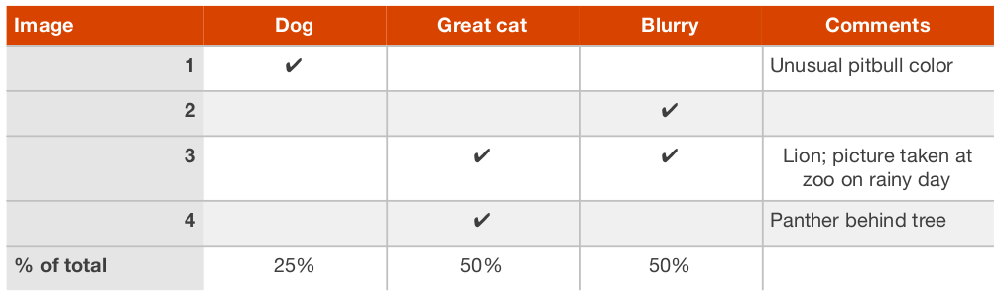
</div>

Image #3 above has both the Great Cat and the Blurry columns checked. Furthermore, because it is possible for one example to be associated with multiple categories, the percentages at the bottom may not add up to 100%.

Although you may first formulate the categories (Dog, Great cat, Blurry) then categorize the examples by hand, in practice, once you start looking through examples, you will probably be inspired to propose new error categories. For example, say you go through a dozen images and realize a lot of mistakes occur with Instagram-filtered pictures. You can go back and add a new “Instagram” column to the spreadsheet. Manually looking at examples that the algorithm misclassified and asking how/whether you as a human could have labeled the picture correctly will often inspire you to come up with new categories of errors and solutions.

The most helpful error categories will be ones that you have an idea for improving. For example, the Instagram category will be most helpful to add if you have an idea to “undo” Instagram filters and recover the original image. But you don’t have to restrict yourself only to error categories you know how to improve; the goal of this process is to build your intuition about the most promising areas to focus on.

Error analysis is an iterative process. Don’t worry if you start off with no categories in mind. After looking at a couple of images, you might come up with a few ideas for error categories. After manually categorizing some images, you might think of new categories and re-examine the images in light of the new categories, and so on.

Suppose you finish carrying out error analysis on 100 misclassified dev set examples and get the following:

<div align="center">
  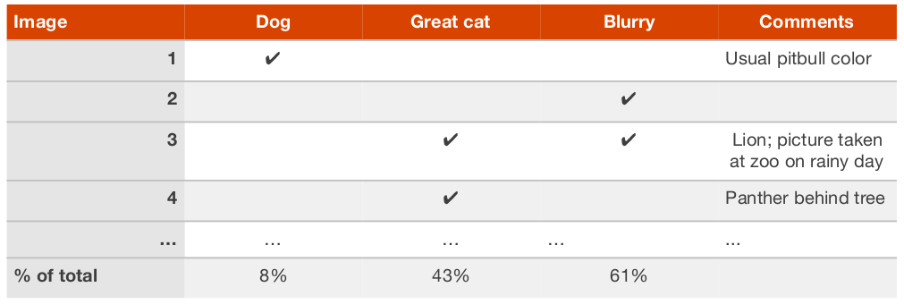
</div>

You now know that working on a project to address the Dog mistakes can eliminate 8% of the errors at most. Working on Great Cat or Blurry image errors could help eliminate more errors. Therefore, you might pick one of the two latter categories to focus on. If your team has enough people to pursue multiple directions in parallel, you can also ask some engineers to work on Great Cats and others to work on Blurry images.

Error analysis does not produce a rigid mathematical formula that tells you what the highest priority task should be. You also have to take into account how much progress you expect to make on different categories and the amount of work needed to tackle each one.

### Cleaning up incorrectly labeled data

During error analysis, you might notice that some examples in your dev set are mislabeled. When I say “mislabeled” here, I mean that the pictures were already mislabeled by a human labeler even before the algorithm encountered it. I.e., the class label in an example ​(x,y) ​ has an incorrect value for y. For example, perhaps some pictures that are not cats are mislabeled as containing a cat, and vice versa. If you suspect the fraction of mislabeled images is significant, add a category to keep track of the fraction of examples mislabeled:

<div align="center">
  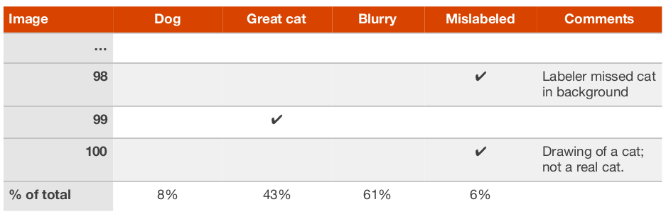
</div>

Should you correct the labels in your dev set? Remember that the goal of the dev set is to help you quickly evaluate algorithms so that you can tell if Algorithm A or B is better. If the fraction of the dev set that is mislabeled impedes your ability to make these judgments, then it is worth spending time to fix the mislabeled dev set labels.

For example, suppose your classifier’s performance is:

  - Overall accuracy on dev set.................... 90% (10% overall error.)
  - Errors due to mislabeled examples........ 0.6% (6% of dev set errors.)
  - Errors due to other causes..................... 9.4% (94% of dev set errors)

Here, the 0.6% inaccuracy due to mislabeling might not be significant enough relative to the 9.4% of errors you could be improving. There is no harm in manually fixing the mislabeled images in the dev set, but it is not crucial to do so: It might be fine not knowing whether your system has 10% or 9.4% overall error.

Suppose you keep improving the cat classifier and reach the following performance:

  - Overall accuracy on dev set.................... 98.0% (2.0% overall error.)
  - Errors due to mislabeled examples........... 0.6% (30% of dev set errors.)
  - Errors due to other causes........................ 1.4% (70% of dev set errors)

30% of your errors are due to the mislabeled dev set images, adding significant error to your estimates of accuracy. It is now worthwhile to improve the quality of the labels in the dev set. Tackling the mislabeled examples will help you figure out if a classifier’s error is closer to 1.4% or 2% — a significant relative difference.

It is not uncommon to start off tolerating some mislabeled dev/test set examples, only later to change your mind as your system improves so that the fraction of mislabeled examples grows relative to the total set of errors.

Whatever process you apply to fixing dev set labels, remember to apply it to the test set labels too so that your dev and test sets continue to be drawn from the same distribution. Fixing your dev and test sets together would prevent the problem where your team optimizes for dev set performance only to realize later that they are being judged on a different criterion based on a different test set.

If you decide to improve the label quality, consider **double-checking** both the labels of examples that your system misclassified as well as labels of examples it correctly classified. It is possible that both the original label and your learning algorithm were wrong on an example. If you have 1,000 dev set examples, and if your classifier has 98.0% accuracy, it is easier to examine the 20 examples it misclassified than to examine all 980 examples classified correctly. If you fix only the labels of examples that your system had misclassified, you might introduce bias into your evaluation.

### If you have a large dev set, split it into two subsets, only one of which you look at

Suppose you have a large dev set of 5,000 examples in which you have a 20% error rate. Thus, your algorithm is misclassifying ~1,000 dev images. It takes a long time to manually examine 1,000 images, so we might decide not to use all of them in the error analysis.

In this case, I would explicitly split the dev set into two subsets, one of which you look at, and one of which you don’t. You will more rapidly overfit the portion that you are manually looking at. You can use the portion you are not manually looking at to tune parameters.

In which the algorithm is misclassifying 1,000 out of 5,000 dev set examples. Suppose we want to manually examine about 100 errors for error analysis (10% of the errors). You should randomly select 10% of the dev set and place that into what we’ll call an ​**Eyeball dev set**​ to remind ourselves that we are looking at it with our eyes. The Eyeball dev set therefore has 500 examples, of which we would expect our algorithm to misclassify about 100.

The second subset of the dev set, called the **Blackbox dev set**, will have the remaining 4500 examples. You can use the Blackbox dev set to evaluate classifiers automatically by measuring their error rates. You can also use it to select among algorithms or tune hyperparameters. However, you should avoid looking at it with your eyes. We use the term “Blackbox” because we will only use this subset of the data to obtain “Blackbox” evaluations of classifiers.

Why do we explicitly separate the dev set into Eyeball and Blackbox dev sets? Since you will gain intuition about the examples in the Eyeball dev set, you will start to overfit the Eyeball dev set faster. If you see the performance on the Eyeball dev set improving much more rapidly than the performance on the Blackbox dev set, you have overfit the Eyeball dev set. In this case, you might need to discard it and find a new Eyeball dev set by moving more examples from the Blackbox dev set into the Eyeball dev set or by acquiring new labeled data.

Explicitly splitting your dev set into Eyeball and Blackbox dev sets allows you to tell when your manual error analysis process is causing you to overfit the Eyeball portion of your data.

### How big should the Eyeball and Blackbox dev sets be?

Your Eyeball dev set should be large enough to give you a sense of your algorithm’s major error categories. Here are some rough guidelines:

  - An eyeball dev set in which your classifier makes 10 mistakes would be considered very small. With just 10 errors, it’s hard to accurately estimate the impact of different error categories. But if you have very little data and cannot afford to put more into the Eyeball dev set, it​’s better than nothing and will help with project prioritization.
  - If your classifier makes ~20 mistakes on eyeball dev examples, you would start to get a rough sense of the major error sources.
  - With ~50 mistakes, you would get a good sense of the major error sources.
  - With ~100 mistakes, you would get a very good sense of the major sources of errors. Sometime people manually analyze even more errors — sometimes as many as 500. There is no harm in this as long as you have enough data.

Say your classifier has a 5% error rate. To make sure you have ~100 mislabeled examples in the Eyeball dev set, the Eyeball dev set would have to have about 2,000 examples (since 0.05*2,000 = 100). The lower your classifier’s error rate, the larger your Eyeball dev set needs to be in order to get a large enough set of errors to analyze.

How about the Blackbox dev set? We previously said that dev sets of around 1,000-10,000
examples are common. To refine that statement, a Blackbox dev set of 1,000-10,000
examples will often give you enough data to tune hyperparameters and select among models,
though there is little harm in having even more data. A Blackbox dev set of 100 would be
small but still useful.

If you have a small dev set, then you might not have enough data to split into Eyeball and Blackbox dev sets that are both large enough to serve their purposes. Instead, your entire dev set might have to be used as the Eyeball dev set — i.e., you would manually examine all the dev set data.

Between the Eyeball and Blackbox dev sets, I consider the Eyeball dev set more important. If you only have an Eyeball dev set, you can perform error analyses, model selection and hyperparameter tuning all on that set. The downside of having only an Eyeball dev set is that the risk of overfitting the dev set is greater.

If you have plentiful access to data, then the size of the Eyeball dev set would be determined mainly by how many examples you have time to manually analyze. Rarely people manually analyze more than 1,000 errors.

## Bias and Variance

### Bias and Variance: The two big sources of error

Suppose your training, dev and test sets all come from the same distribution. Then you should always try to get more training data, since that can only improve performance, right?

Even though having more data can’t hurt, unfortunately it doesn’t always help as much as you might hope. It could be a waste of time to work on getting more data. So, how do you decide when to add data, and when not to bother?

There are two major sources of error in machine learning: bias and variance. Understanding them will help you decide whether adding data, as well as other tactics to improve performance, are a good use of time.

Suppose you hope to build a cat recognizer that has 5% error. Right now, your training set has an error rate of 15%, and your dev set has an error rate of 16%. In this case, adding training data probably won’t help much. You should focus on other changes. Indeed, adding more examples to your training set only makes it harder for your algorithm to do well on the training set.

If your error rate on the training set is 15% (or 85% accuracy), but your target is 5% error (95% accuracy), then the first problem to solve is to improve your algorithm ’ s performance on your training set. Your dev/test set performance is usually worse than your training set performance. So if you are getting 85% accuracy on the examples your algorithm has seen, there’s no way you’re getting 95% accuracy on examples your algorithm hasn’t even seen.

Suppose as above that your algorithm has 16% error (84% accuracy) on the dev set. We break the 16% error into two components:

- The bias is the error rate of your algorithm on your training set. We think of this informally as the algorithm’s **bias**.
- The variance is how much worse you do on the test set compared to the training set in this setting. We think of this informally as the algorithm’s **variance**.

Some changes to a learning algorithm can address the first component of error **bias** and improve its performance on the training set. Some changes address the second component **variance** and help it generalize better from the training set to the dev/test sets. To select the most promising changes, it is incredibly useful to understand which of these two components of error is more pressing to address.

### Examples of Bias and Variance

Consider our cat classification task. An “ideal” classifier (such as a human) might achieve nearly perfect performance in this task.

Suppose your algorithm performs as follows:

  - Training error = 1%
  - Dev error = 11%

What problem does it have? Applying the definitions, we estimate the bias as 1%, and the variance as 10%. Thus, it has **high variance**. The classifier has very low training error, but it is failing to generalize to the dev set. This is also called **overfitting**.

Now consider this:

  - Training error = 15%
  - Dev error = 16%

We estimate the bias as 15%, and variance as 1%. This classifier is fitting the training set poorly with 15% error, but its error on the dev set is barely higher than the training error. This classifier therefore has **high bias**, but low variance. We say that this algorithm is **underfitting**.

Now, consider this:

  - Training error = 15%
  - Dev error = 30%

We estimate the bias as 15%, and variance as 15%. This classifier has **high bias and high variance**: It is doing poorly on the training set, and therefore has high bias, and its performance on the dev set is even worse, so it also has high variance. The overfitting/underfitting terminology is hard to apply here since the classifier is simultaneously overfitting and underfitting.

Finally, consider this:

  - Training error = 0.5%
  - Dev error = 1%

This classifier is doing well, as it has low bias and low variance. Congratulations on achieving this great performance!

### Comparing to the optimal error rate

In our cat recognition example, the “ideal” error rate. That is, one achievable by an “optimal” classifier is nearly 0%. A human looking at a picture would be able to recognize if it contains a cat almost all the time; thus, we can hope for a machine that would do just as well.

Other problems are harder. Suppose that you are building a speech recognition system, and find that 14% of the audio clips have so much background noise or are so unintelligible that even a human cannot recognize what was said. In this case, even the most “optimal” speech recognition system might have error around 14%.

Suppose that on this speech recognition problem, your algorithm achieves:

- Training error = 15%
- Dev error = 30%

The training set performance is already close to the optimal error rate of 14%. Thus, there is not much room for improvement in terms of bias or in terms of training set performance. However, this algorithm is not generalizing well to the dev set; thus there is ample room for improvement in the errors due to variance.

If the optimal error rate is ~0%, then a training error of 15% leaves much room for improvement. This suggests bias-reducing changes might be fruitful. But if the optimal error rate is 14%, then the same training set performance tells us that there’s little room for improvement in the classifier’s bias.

Training error of 15% and dev error of 30%. If the optimal error rate is ~0%, then a training error of 15% leaves much room for improvement. This suggests bias-reducing changes might be fruitful. But if the optimal error rate is 14%, then the same training set performance tells us that there’s little room for improvement in the classifier’s bias.

For problems where the optimal error rate is far from zero, here’s a more detailed breakdown of an algorithm’s error. Continuing with our speech recognition above, the total dev set error of 30% can be broken down as follows (a similar analysis can be applied to the test set error):

- **Optimal error rate (“unavoidable bias”)**: 14%. Suppose we decide that, even with the best possible speech system in the world, we would still suffer 14% error. We can think of this as the “unavoidable” part of a learning algorithm’s bias.
- **Avoidable bias**: 1%. This is calculated as the difference between the training error and the optimal error rate. If this number is negative, you are doing better on the training set than the optimal error rate. This means you are overfitting on the training set, and the algorithm has over-memorized the training set. You should focus on variance reduction methods rather than on further bias reduction methods.
- **Variance**: 15%. The difference between the dev error and the training error.

To relate this to our earlier definitions, Bias and Avoidable Bias are related as follows:

Bias = Optimal error rate (“unavoidable bias”) + Avoidable bias

The “avoidable bias” reflects how much worse your algorithm performs on the training set than the “optimal classifier”.

The concept of variance remains the same as before. In theory, we can always reduce variance to nearly zero by training on a massive training set. Thus, all variance is “avoidable” with a sufficiently large dataset, so there is no such thing as “unavoidable variance”.

Consider one more example, where the optimal error rate is 14%, and we have:

- Training error = 15%
- Dev error = 16%

Now we would say that error from avoidable bias is 1%, and the error from variance is about 1%. Thus, the algorithm is already doing well, with little room for improvement. It is only 2% worse than the optimal error rate.

Knowing the optimal error rate is helpful for guiding our next steps. In statistics, the optimal error rate is also called **Bayes error rate**, or Bayes rate.

How do we know what the optimal error rate is? For tasks that humans are reasonably good at, such as recognizing pictures or transcribing audio clips, you can ask a human to provide labels then measure the accuracy of the human labels relative to your training set. This would give an estimate of the optimal error rate. If you are working on a problem that even humans have a hard time solving (e.g., predicting what movie to recommend, or what ad to show to a user) it can be hard to estimate the optimal error rate.

### Addressing Bias and Variance

Here is the simplest formula for addressing bias and variance issues:

  - If you have high avoidable bias, increase the size of your model (for example, increase the
  size of your neural network by adding layers/neurons).
  - If you have high variance, add data to your training set.

If you are able to increase the neural network size and increase training data without limit, it is possible to do very well on many learning problems.

In practice, increasing the size of your model will eventually cause you to run into computational problems because training very large models is slow. You might also exhaust your ability to acquire more training data.

Different model architectures — Different neural network architectures — will have different amounts of bias/variance for your problem. A lot of recent deep learning research has developed many innovative model architectures. So if you are using neural networks, the academic literature can be a great source of inspiration. There are also many great open-source implementations on github. But the results of trying new architectures are less predictable than the simple formula of increasing the model size and adding data.

Increasing the model size generally reduces bias, but it might also increase variance and the risk of overfitting. However, this overfitting problem usually arises only when you are not using regularization. If you include a well-designed regularization method, then you can usually safely increase the size of the model without increasing overfitting.

Suppose you are applying deep learning, with L2 regularization or dropout, with the regularization parameter that performs best on the dev set. If you increase the model size, usually your performance will stay the same or improve; it is unlikely to worsen significantly. The only reason to avoid using a bigger model is the increased computational cost.

### Bias vs Variance tradeoff

You might have heard of the “Bias vs Variance tradeoff”. Of the changes you could make to most learning algorithms, there are some that reduce bias errors but at the cost of increasing variance, and vice versa. This creates a “trade off” between bias and variance.

Increasing the size of your model — adding neurons/layers in a neural network, or adding input features — generally reduces bias but could increase variance. Alternatively, adding regularization generally increases bias but reduces variance.

In the modern era, we often have access to plentiful data and can use very large neural networks (deep learning). Therefore, there is less of a tradeoff, and there are now more options for reducing bias without hurting variance, and vice versa.

You can usually increase a neural network size and tune the regularization method to reduce bias without noticeably increasing variance. By adding training data, you can also usually reduce variance without affecting bias.

If you select a model architecture that is well suited for your task, you might also reduce bias and variance simultaneously. Selecting such an architecture can be difficult.

### Techniques for reducing avoidable bias

If your learning algorithm suffers from high avoidable bias, you might try the following techniques:

  - **Increase the model size** (such as number of neurons/layers): This technique reduces bias, since it should allow you to fit the training set better. If you find that this increases variance, then use regularization, which will usually eliminat e the increase in variance.

  - **Modify input features based on insights from error analysis​**: Say your error analysis inspires you to create additional features that help the algorithm eliminate a particular category of errors. These new features could help with both bias and variance. In theory, adding more features could increase the variance; but if you find this to be the case, then use regularization, which will usually eliminate the increase in variance.

  - **Reduce or eliminate regularization**​ (L2 regularization, L1 regularization, dropout): This will reduce avoidable bias, but increase variance.

  - **Modify model architecture​** (such as neural network architecture) so that it is more suitable for your problem: This technique can affect both bias and variance.

One method that is not helpful:

  - **Add more training data​**: This technique helps with variance problems, but it usually has no significant effect on bias.

### Error analysis on the training set

Your algorithm must perform well on the training set before you can expect it to perform well on the dev/test sets.

In addition to the techniques described earlier to address high bias, I sometimes also **carry out an error analysis on the ​training data**, following a protocol similar to error analysis on the Eyeball dev set. This can be useful if your algorithm has high bias — i.e., if it is not fitting the training set well.

Suppose you are building a speech recognition system for an app and have collected a training set of audio clips from volunteers. If your system is not doing well on the training set, you might consider listening to a set of ~100 examples that the algorithm is doing poorly on to understand the major categories of training set errors. Similar to the dev set error analysis, you can count the errors in different categories:

<div align="center">
  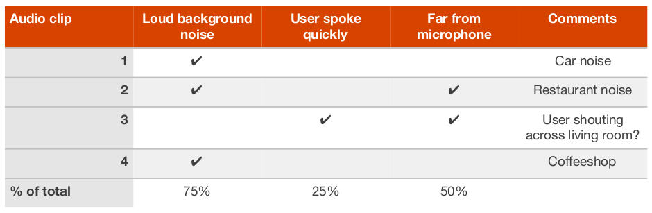
</div>

You might realize that your algorithm is having a particularly hard time with training examples that have a lot of background noise. Thus, you might focus on techniques that allow it to better fit training examples with background noise.

You might also double-check whether it is possible for a person to transcribe these audio clips, given the same input audio as your learning algorithm. If there is so much background noise that it is simply impossible for anyone to make out what was said, then it might be unreasonable to expect any algorithm to correctly recognize such utterances.

### Techniques for reducing variance

If your learning algorithm suffers from high variance, you might try the following techniques:

  - **Add more training data​**: This is the simplest and most reliable way to address variance, so long as you have access to significantly more data and enough computational power to process the data.

  - **Add regularization**​ (L2 regularization, L1 regularization, dropout): This technique reduces variance but increases bias.

  - **Add early stopping**​ (i.e., stop gradient descent early, based on dev set error): This technique reduces variance but increases bias. Early stopping behaves a lot like regularization methods, and some authors call it a regularization technique.

  - **Feature selection to decrease number/type of input features**:​ This technique might help with variance problems, but it might also increase bias. Reducing the number of features slightly (say going from 1,000 features to 900) is unlikely to have a huge effect on bias. Reducing it significantly (say going from 1,000 features to 100—a 10x reduction) is more likely to have a significant effect, so long as you are not excluding too many useful features. In modern deep learning, when data is plentiful, there has been a shift away from feature selection, and we are now more likely to give all the features we have to the algorithm and let the algorithm sort out which ones to use based on the data. But when your training set is small, feature selection can be very useful.

  - **Decrease the model size** ​(such as number of neurons/layers): **Use with caution**. This technique could decrease variance, while possibly increasing bias. However, I don’t recommend this technique for addressing variance. Adding regularization usually gives better classification performance. The advantage of reducing the model size is reducing your computational cost and thus speeding up how quickly you can train models. If speeding up model training is useful, then by all means consider decreasing the model size. But if your goal is to reduce variance, and you are not concerned about the computational cost, consider adding regularization instead.

Here are two additional tactics, repeated from addressing bias:

  - **Modify input features based on insights from error analysis​**: Say your error analysis inspires you to create additional features that help the algorithm to eliminate a particular category of errors. These new features could help with both bias and variance. In theory, adding more features could increase the variance; but if you find this to be the case, then use regularization, which will usually eliminate the increase in variance.

  - **Modify model architecture​** (such as neural network architecture) so that it is more suitable for your problem: This technique can affect both bias and variance.

## Learning curves

### Diagnosing bias and variance: Learning curves

We’ve seen some ways to estimate how much error can be attributed to avoidable bias vs variance. We did so by estimating the optimal error rate and computing the algorithm’s training set and dev set errors. Let’s discuss a technique that is even more informative: plotting a learning curve.

A learning curve plots your dev set error against the number of training examples. To plot it, you would run your algorithm using different training set sizes. For example, if you have 1,000 examples, you might train separate copies of the algorithm on 100, 200, 300, ..., 1000 examples. Then you could plot how dev set error varies with the training set size.

<div align="center">
  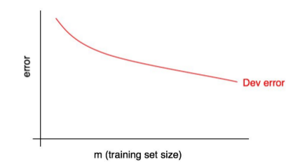
</div>

As the training set size increases, the dev set error should decrease.

We will often have some “desired error rate” that we hope our learning algorithm will eventually achieve. For example:

- If we hope for human-level performance, then the human error rate could be the “desired error rate.”

- If our learning algorithm serves some product (such as delivering cat pictures), we might have an intuition about what level of performance is needed to give users a great experience.

- If you have worked on a important application for a long time, then you might have intuition about how much more progress you can reasonably make in the next quarter/year.

Add the desired level of performance to your learning curve:

<div align="center">
  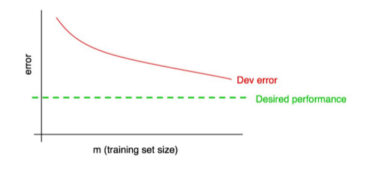
</div>

You can visually extrapolate the red “dev error” curve to guess how much closer you could get to the desired level of performance by adding more data. In the example above, it looks plausible that doubling the training set size might allow you to reach the desired performance.

But if the dev error curve has “plateaued” (i.e. flattened out), then you can immediately tell that adding more data won’t get you to your goal:

<div align="center">
  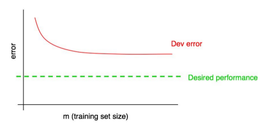
</div>

Looking at the learning curve might therefore help you avoid spending months collecting twice as much training data, only to realize it does not help.

One downside of this process is that if you only look at the dev error curve, it can be hard to extrapolate and predict exactly where the red curve will go if you had more data. There is one additional plot that can help you estimate the impact of adding more data: the training error.

### Plotting training error

Your dev set (and test set) error should decrease as the training set size grows. But your training set error usually ​increases as the training set size grows.

Let’s illustrate this effect with an example. Suppose your training set has only 2 examples: One cat image and one non-cat image. Then it is easy for the learning algorithms to “memorize” both examples in the training set, and get 0% training set error. Even if either or both of the training examples were mislabeled, it is still easy for the algorithm to memorize both labels.

Now suppose your training set has 100 examples. Perhaps even a few examples are mislabeled, or ambiguous - some images are very blurry, so even humans cannot tell if there is a cat. Perhaps the learning algorithm can still “memorize” most or all of the training set, but it is now harder to obtain 100% accuracy. By increasing the training set from 2 to 100 examples, you will find that the training set accuracy will drop slightly.

Finally, suppose your training set has 10,000 examples. In this case, it becomes even harder for the algorithm to perfectly fit all 10,000 examples, especially if some are ambiguous or mislabeled. Thus, your learning algorithm will do even worse on this training set.

Let’s add a plot of training error to our earlier figures:

<div align="center">
  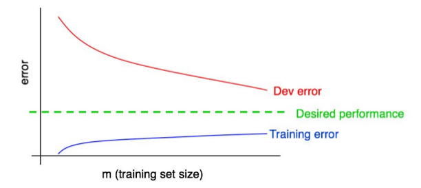
</div>

You can see that the blue “training error” curve increases with the size of the training set. Furthermore, your algorithm usually does better on the training set than on the dev set; thus the red dev error curve usually lies strictly above the blue training error curve.

### Interpreting learning curves: High bias

Suppose your dev error curve looks like this:

<div align="center">
  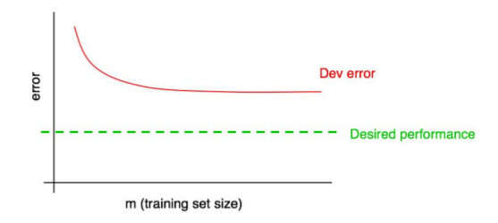
</div>

We previously said that, if your dev error curve plateaus, you are unlikely to achieve the desired performance just by adding data.

But it is hard to know exactly what an extrapolation of the red dev error curve will look like. If the dev set was small, you would be even less certain because the curves could be noisy.

Suppose we add the training error curve to this plot and get the following:

<div align="center">
  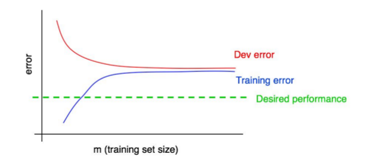
</div>

Now, you can be absolutely sure that adding more data will not, by itself, be sufficient. Why is that?

- As we add more training data, training error can only get worse. Thus, the blue training error curve can only stay the same or go higher, and thus it can only get further away from the (green line) level of desired performance.

- The red dev error curve is usually higher than the blue training error. Thus, there’s almost no way that adding more data would allow the red dev error curve to drop down to the desired level of performance when even the training error is higher than the desired level of performance.

Examining both the dev error curve and the training error curve on the same plot allows us to more confidently extrapolate the dev error curve.

Suppose, for the sake of discussion, that the desired performance is our estimate of the optimal error rate. The figure above is then the standard “textbook” example of what a learning curve with high avoidable bias looks like: At the largest training set size - presumably corresponding to all the training data we have - there is a large gap between the training error and the desired performance, indicating large avoidable bias. Furthermore, the gap between the training and dev curves is small, indicating small variance.

Previously, we were measuring training and dev set error only at the rightmost point of this plot, which corresponds to using all the available training data. Plotting the full learning curve gives us a more comprehensive picture of the algorithms’ performance on different training set sizes.

### Interpreting learning curves: Other cases

Consider this learning curve:

<div align="center">
  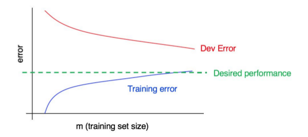
</div>

Does this plot indicate high bias, high variance, or both?

The blue training error curve is relatively low, and the red dev error curve is much higher than the blue training error. Thus, the bias is small, but the variance is large. Adding more training data will probably help close the gap between dev error and training error.

Now, consider this:

<div align="center">
  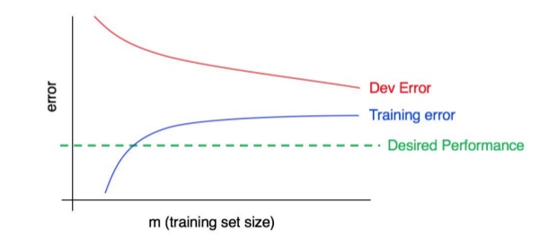
</div>

This time, the training error is large, as it is much higher than the desired level of performance. The dev error is also much larger than the training error. Thus, you have significant bias and significant variance. You will have to find a way to reduce both bias and variance in your algorithm.

### Plotting learning curves

Suppose you have a very small training set of 100 examples. You train your algorithm using a randomly chosen subset of 10 examples, then 20 examples, then 30, up to 100, increasing the number of examples by intervals of ten. You then use these 10 data points to plot your learning curve. You might find that the curve looks slightly noisy (meaning that the values are higher/lower than expected) at the smaller training set sizes.

When training on just 10 randomly chosen examples, you might be unlucky and have a particularly “bad” training set, such as one with many ambiguous/mislabeled examples. Or, you might get lucky and get a particularly “good” training set. Having a small training set means that the dev and training errors may randomly fluctuate.

If your machine learning application is heavily skewed toward one class (such as a cat classification task where the fraction of negative examples is much larger than positive examples), or if it has a huge number of classes (such as recognizing 100 different animal species), then the chance of selecting an especially “unrepresentative” or bad training set is also larger. For example, if 80% of your examples are negative examples (y=0), and only 20% are positive examples (y=1), then there is a chance that a training set of 10 examples contains only negative examples, thus making it very difficult for the algorithm to learn something meaningful.

If the noise in the training curve makes it hard to see the true trends, here are two solutions:

- Instead of training just one model on 10 examples, instead select several (say 3-10) different randomly chosen training sets of 10 examples by sampling with replacement from your original set of 100. Train a different model on each of these, and compute the training and dev set error of each of the resulting models. Compute and plot the average training error and average dev set error.

- Here’s what sampling ​ with replacement ​ means: You would randomly pick 10 different examples out of the 100 to form your first training set. Then to form the second training set, you would again pick 10 examples, but without taking into account what had been chosen in the first training set. Thus, it is possible for one specific example to appear in both the first and second training sets. In contrast, if you were sampling ​ without replacement, the second training set would be chosen from just the 90 examples that had not been chosen the first time around. In practice, sampling with or without replacement shouldn’t make a huge difference, but the former is common practice.

- If your training set is skewed towards one class, or if it has many classes, choose a “balanced” subset instead of 10 training examples at random out of the set of 100. For example, you can make sure that 2/10 of the examples are positive examples, and 8/10 are negative. More generally, you can make sure the fraction of examples from each class is as close as possible to the overall fraction in the original training set.

I would not bother with either of these techniques unless you have already tried plotting learning curves and concluded that the curves are too noisy to see the underlying trends. If your training set is large—say over 10,000 examples—and your class distribution is not very skewed, you probably won’t need these techniques.

Finally, plotting a learning curve may be computationally expensive: For example, you might have to train ten models with 1,000, then 2,000, all the way up to 10,000 examples. Training models with small datasets is much faster than training models with large datasets. Thus, instead of evenly spacing out the training set sizes on a linear scale as above, you might train models with 1,000, 2,000, 4,000, 6,000, and 10,000 examples. This should still give you a clear sense of the trends in the learning curves. Of course, this technique is relevant only if the computational cost of training all the additional models is significant.

### Why we compare to human-level performance

Many machine learning systems aim to automate things that humans do well. Examples include image recognition, speech recognition, and email spam classification. Learning algorithms have also improved so much that we are now surpassing human-level performance on more and more of these tasks.

Further, there are several reasons building an ML system is easier if you are trying to do a task that people can do well:

**Ease of obtaining data from human labelers.**​ For example, since people recognize cat images well, it is straightforward for people to provide high accuracy labels for your learning algorithm.

**Error analysis can draw on human intuition.​** Suppose a speech recognition algorithm is doing worse than human-level recognition. Say it incorrectly transcribes an audio clip as “This recipe calls for a ​ pear ​ of apples,” mistaking “pair” for “pear.” You can draw on human intuition and try to understand what information a person uses to get the correct transcription, and use this knowledge to modify the learning algorithm.

**Use human-level performance to estimate the optimal error rate and also set a “desired error rate”.**​ Suppose your algorithm achieves 10% error on a task, but a person achieves 2% error. Then we know that the optimal error rate is 2% or lower and the avoidable bias is at least 8%. Thus, you should try bias-reducing techniques.

Even though item #3 might not sound important, I find that having a reasonable and achievable target error rate helps accelerate a team’s progress. Knowing your algorithm has high avoidable bias is incredibly valuable and opens up a menu of options to try.

There are some tasks that even humans aren’t good at. For example, picking a book to recommend to you; or picking an ad to show a user on a website; or predicting the stock market. Computers already surpass the performance of m

- **It is harder to obtain labels.**​ For example, it’s hard for human labelers to annotate a database of users with the “optimal” book recommendation. If you operate a website or app that sells books, you can obtain data by showing books to users and seeing what they buy. If you do not operate such a site, you need to find more creative ways to get data.

- **Human intuition is harder to count on.**​ For example, pretty much no one can predict the stock market. So if our stock prediction algorithm does no better than random guessing, it is hard to figure out how to improve it.

- **It is hard to know what the optimal error rate and reasonable desired error rate is.**​ Suppose you already have a book recommendation system that is doing quite well. How do you know how much more it can improve without a human baseline?

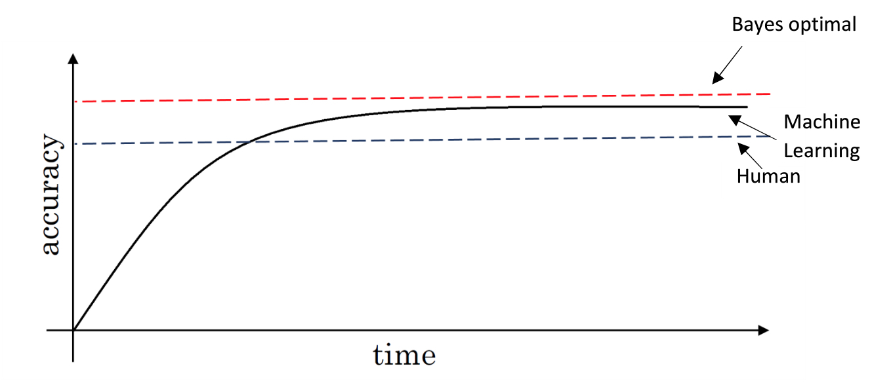

We compare to human-level performance because of two main reasons:

- Because of advances in deep learning, machine learning algorithms are suddenly working much better and so it has become much more feasible in a lot of application areas for machine learning algorithms to actually become competitive with human-level performance.
- It turns out that the workflow of designing and building a machine learning system is much more efficient when you're trying to do something that humans can also do.

After an algorithm reaches the human level performance the progress and accuracy slow down. 01- Why human-level performance

You won't surpass an error that's called "Bayes optimal error".

There isn't much error range between human-level error and Bayes optimal error.

Humans are quite good at a lot of tasks. So as long as Machine learning is worse than humans, you can:

- Get labeled data from humans.
- Gain insight from manual error analysis: why did a person get it right?
- Better analysis of bias/variance.

### How to define human-level performance

Suppose you are working on a medical imaging application that automatically makes diagnoses from x-ray images. A typical person with no previous medical background besides some basic training achieves 15% error on this task. A junior doctor achieves 10% error. An experienced doctor achieves 5% error. And a small team of doctors that discuss and debate each image achieves 2% error. Which one of these error rates defines “human-level performance”?

In this case, I would use 2% as the human-level performance proxy for our optimal error rate. You can also set 2% as the desired performance level because all three reasons from the previous chapter for comparing to human-level performance apply:

- **Ease of obtaining labeled data from human labelers.**​ You can get a team of doctors to provide labels to you with a 2% error rate.

- **Error analysis can draw on human intuition.**​ By discussing images with a team of doctors, you can draw on their intuitions.

- **Use human-level performance to estimate the optimal error rate and also set achievable “desired error rate”.**​ It is reasonable to use 2% error as our estimate of the optimal error rate. The optimal error rate could be even lower than 2%, but it cannot be higher, since it is possible for a team of doctors to achieve 2% error. In contrast, it is not reasonable to use 5% or 10% as an estimate of the optimal error rate, since we know these estimates are necessarily too high.

When it comes to obtaining labeled data, you might not want to discuss every image with an entire team of doctors since their time is expensive. Perhaps you can have a single junior doctor label the vast majority of cases and bring only the harder cases to more experienced doctors or to the team of doctors.

If your system is currently at 40% error, then it doesn’t matter much whether you use a junior doctor (10% error) or an experienced doctor (5% error) to label your data and provide intuitions. But if your system is already at 10% error, then defining the human-level reference as 2% gives you better tools to keep improving your system.

### Understanding human-level performance

- When choosing human-level performance, it has to be chosen in the terms of what you want to achieve with the system.
- You might have multiple human-level performances based on the human experience. Then you choose the human-level performance (proxy for Bayes error) that is more suitable for the system you're trying to build.
- Improving deep learning algorithms is harder once you reach a human-level performance.
- Summary of bias/variance with human-level performance:
  1. training error
     - Calculate `avoidable bias = training error - human-level error`
     - If **avoidable bias** difference is the bigger, then it's *bias* problem and you should use a strategy for **bias** resolving.
  2. dev error
     - Calculate `variance = dev error - training error`
     - If **variance** difference is bigger, then you should use a strategy for **variance** resolving.
- So having an estimate of human-level performance gives you an estimate of Bayes error. And this allows you to more quickly make decisions as to whether you should focus on trying to reduce a bias or trying to reduce the variance of your algorithm.
- These techniques will tend to work well until you surpass human-level performance, whereupon you might no longer have a good estimate of Bayes error that still helps you make this decision really clearly.

### Surpassing human-level performance

You are working on speech recognition and have a dataset of audio clips. Suppose your dataset has many noisy audio clips so that even humans have 10% error. Suppose your system already achieves 8% error. Can you use any of the three techniques described in Chapter 33 to continue making rapid progress?

If you can identify a subset of data in which humans significantly surpass your system, then you can still use those techniques to drive rapid progress. For example, suppose your system is much better than people at recognizing speech in noisy audio, but humans are still better at transcribing very rapidly spoken speech.

For the subset of data with rapidly spoken speech:

- You can still obtain transcripts from humans that are higher quality than your algorithm’s output.
- You can draw on human intuition to understand why they correctly heard a rapidly spoken utterance when your system didn’t.
- You can use human-level performance on rapidly spoken speech as a desired performance target.

More generally, so long as there are dev set examples where humans are right and your algorithm is wrong, then many of the techniques described earlier will apply. This is true even if, averaged over the entire dev/test set, your performance is already surpassing human-level performance.

There are many important machine learning applications where machines surpass human level performance. For example, machines are better at predicting movie ratings, how long it takes for a delivery car to drive somewhere, or whether to approve loan applications. Only a subset of techniques apply once humans have a hard time identifying examples that the algorithm is clearly getting wrong. Consequently, progress is usually slower on problems where machines already surpass human-level performance, while progress is faster when machines are still trying to catch up to humans.

- In some problems, deep learning has surpassed human-level performance. Like:
  - Online advertising.
  - Product recommendation.
  - Loan approval.
- The last examples are not natural perception task, rather learning on structural data. Humans are far better in natural perception tasks like computer vision and speech recognition.
- It's harder for machines to surpass human-level performance in natural perception task. But there are already some systems that achieved it.

### Improving your model performance

  - The two fundamental asssumptions of supervised learning:
    1. You can fit the training set pretty well. This is roughly saying that you can achieve low **avoidable bias**.
    2. The training set performance generalizes pretty well to the dev/test set. This is roughly saying that **variance** is not too bad.
  - To improve your deep learning supervised system follow these guidelines:
    1. Look at the difference between human level error and the training error - **avoidable bias**.
    2. Look at the difference between the dev/test set and training set error - **Variance**.
    3. If **avoidable bias** is large you have these options:
       - Train bigger model.
       - Train longer/better optimization algorithm (like Momentum, RMSprop, Adam).
       - Find better NN architecture/hyperparameters search.
    4. If **variance** is large you have these options:
       - Get more training data (data augmentation).
       - Regularization (L2, Dropout).
       - Find better NN architecture/hyperparameters search.

### Training and testing on different distributions

- A lot of teams are working with deep learning applications that have training sets that are different from the dev/test sets due to the hunger of deep learning to data.
- There are some strategies to follow up when training set distribution differs from dev/test sets distribution.
  - Option (not recommended): shuffle all the data together and extract randomly training and dev/test sets.
    - Advantages: all the sets now come from the same distribution.
    - Disadvantages: the other (real world) distribution that was in the dev/test sets will occur less in the new dev/test sets and that might be not what you want to achieve.
  - Option: take some of the dev/test set examples and add them to the training set.
    - Advantages: the distribution you care about is your target now.
    - Disadvantage: the distributions in training and dev/test sets are now different. But you will get a better performance over a long time.

## Training and testing on different distributions

### When you should train and test on different distributions

Users of your cat pictures app have uploaded 10,000 images, which you have manually labeled as containing cats or not. You also have a larger set of 200,000 images that you downloaded off the internet. How should you define train/dev/test sets?

Since the 10,000 user images closely reflect the actual probability distribution of data you want to do well on, you might use that for your dev and test sets. If you are training a data-hungry deep learning algorithm, you might give it the additional 200,000 internet images for training. Thus, your training and dev/test sets come from different probability distributions. How does this affect your work?

Instead of partitioning our data into train/dev/test sets, we could take all 210,000 images we have, and randomly shuffle them into train/dev/test sets. In this case, all the data comes from the same distribution. But I recommend against this method, because about 205,000/210,000 ≈ 97.6% of your dev/test data would come from internet images, which does not reflect the actual distribution you want to do well on. Remember our recommendation on choosing dev/test sets:

Choose dev and test sets to reflect data you expect to get in the future and want to do well on.

Most of the academic literature on machine learning assumes that the training set, dev set and test set all come from the same distribution. In the early days of machine learning, data was scarce. We usually only had one dataset drawn from some probability distribution. So we would randomly split that data into train/dev/test sets, and the assumption that all the data was coming from the same source was usually satisfied.

There is some academic research on training and testing on different distributions. Examples include “domain adaptation,” “transfer learning” and “multitask learning.” But there is still a huge gap between theory and practice. If you train on dataset A and test on some very different type of data B, luck could have a huge effect on how well your algorithm performs. (Here, “luck” includes the researcher’s hand-designed features for the particular task, as well as other factors that we just don’t understand yet.) This makes the academic study of training and testing on different distributions difficult to carry out in a systematic way.

But in the era of big data, we now have access to huge training sets, such as cat internet images. Even if the training set comes from a different distribution than the dev/test set, we still want to use it for learning since it can provide a lot of information.

For the cat detector example, instead of putting all 10,000 user-uploaded images into the dev/test sets, we might instead put 5,000 into the dev/test sets. We can put the remaining 5,000 user-uploaded examples into the training set. This way, your training set of 205,000 examples contains some data that comes from your dev/test distribution along with the 200,000 internet images. We will discuss in a later chapter why this method is helpful.

Let’s consider a second example. Suppose you are building a speech recognition system to transcribe street addresses for a voice-controlled mobile map/navigation app. You have 20,000 examples of users speaking street addresses. But you also have 500,000 examples of other audio clips with users speaking about other topics. You might take 10,000 examples of street addresses for the dev/test sets, and use the remaining 10,000, plus the additional 500,000 examples, for training.

We will continue to assume that your dev data and your test data come from the same distribution. But it is important to understand that different training and dev/test distributions offer some special challenges.

### How to decide whether to use all your data

### Bias and Variance with mismatched data distributions

- Bias and Variance analysis changes when training and Dev/test set is from the different distribution.
- Example: the cat classification example. Suppose you've worked in the example and reached this
  - Human error: 0%
  - Train error: 1%
  - Dev error: 10%
  - In this example, you'll think that this is a variance problem, but because the distributions aren't the same you can't tell for sure. Because it could be that train set was easy to train on, but the dev set was more difficult.
- To solve this issue we create a new set called train-dev set as a random subset of the training set (so it has the same distribution) and we get:
  - Human error: 0%
  - Train error: 1%
  - Train-dev error: 9%
  - Dev error: 10%
  - Now we are sure that this is a high variance problem.
- Suppose we have a different situation:
  - Human error: 0%
  - Train error: 1%
  - Train-dev error: 1.5%
  - Dev error: 10%
  - In this case we have something called *Data mismatch* problem.
- Conclusions:
  1. Human-level error (proxy for Bayes error)
  2. Train error
     - Calculate `avoidable bias = training error - human level error`
     - If the difference is big then its **Avoidable bias** problem then you should use a strategy for high **bias**.
  3. Train-dev error
     - Calculate `variance = training-dev error - training error`
     - If the difference is big then its high **variance** problem then you should use a strategy for solving it.
  4. Dev error
     - Calculate `data mismatch = dev error - train-dev error`
     - If difference is much bigger then train-dev error its **Data mismatch** problem.
  5. Test error
     - Calculate `degree of overfitting to dev set = test error - dev error`
     - Is the difference is big (positive) then maybe you need to find a bigger dev set (dev set and test set come from the same distribution, so the only way for there to be a huge gap here, for it to do much better on the dev set than the test set, is if you somehow managed to overfit the dev set).
- Unfortunately, there aren't many systematic ways to deal with data mismatch. There are some things to try about this in the next section.

### Addressing data mismatch

- There aren't completely systematic solutions to this, but there some things you could try.
1. Carry out manual error analysis to try to understand the difference between training and dev/test sets.
2. Make training data more similar, or collect more data similar to dev/test sets.
- If your goal is to make the training data more similar to your dev set one of the techniques you can use **Artificial data synthesis** that can help you make more training data.
    - Combine some of your training data with something that can convert it to the dev/test set distribution.
      - Examples:
        1. Combine normal audio with car noise to get audio with car noise example.
        2. Generate cars using 3D graphics in a car classification example.
    - Be cautious and bear in mind whether or not you might be accidentally simulating data only from a tiny subset of the space of all possible examples because your NN might overfit these generated data (like particular car noise or a particular design of 3D graphics cars).

### Transfer learning

- Apply the knowledge you took in a task A and apply it in another task B.
- For example, you have trained a cat classifier with a lot of data, you can use the part of the trained NN it to solve x-ray classification problem.
- To do transfer learning, delete the last layer of NN and it's weights and:
  1. Option: if you have a small data set - keep all the other weights as a fixed weights. Add a new last layer(-s) and initialize the new layer weights and feed the new data to the NN and learn the new weights.
  2. Option: if you have enough data you can retrain all the weights.
- When transfer learning make sense:
  - Task A and B have the same input X (e.g. image, audio).
  - You have a lot of data for the task A you are transferring from and relatively less data for the task B your transferring to.
  - Low level features from task A could be helpful for learning task B.

### Multi-task learning

- Whereas in transfer learning, you have a sequential process where you learn from task A and then transfer that to task B. In multi-task learning, you start off simultaneously, trying to have one neural network do several things at the same time. And then each of these tasks helps hopefully all of the other tasks.
- Example:
  - You want to build an object recognition system that detects pedestrians, cars, stop signs, and traffic lights (image has multiple labels).
  - Then Y shape will be `(4,m)` because we have 4 classes and each one is a binary one.
  - Then   
  `Cost = (1/m) * sum(sum(L(y_hat(i)_j, y(i)_j))), i = 1..m, j = 1..4`, where   
  `L = - y(i)_j * log(y_hat(i)_j) - (1 - y(i)_j) * log(1 - y_hat(i)_j)`
- In the last example you could have trained 4 neural networks separately but if some of the earlier features in neural network can be shared between these different types of objects, then you find that training one neural network to do four things results in better performance than training 4 completely separate neural networks to do the four tasks separately.
- Multi-task learning will also work if y isn't complete for some labels. For example:
  ```
  Y = [1 ? 1 ...]
      [0 0 1 ...]
      [? 1 ? ...]
  ```
  - And in this case it will do good with the missing data, just the loss function will be different:   
    `Loss = (1/m) * sum(sum(L(y_hat(i)_j, y(i)_j) for all j which y(i)_j != ?))`
- Multi-task learning makes sense:
  1. Training on a set of tasks that could benefit from having shared lower-level features.
  2. Usually, amount of data you have for each task is quite similar.
  3. Can train a big enough network to do well on all the tasks.
- If you can train a big enough NN, the performance of the multi-task learning compared to splitting the tasks is better.
- Today transfer learning is used more often than multi-task learning.

### What is end-to-end deep learning?

- Some systems have multiple stages to implement. An end-to-end deep learning system implements all these stages with a single NN.
- Example:
  - Speech recognition system:
    ```
    Audio ---> Features --> Phonemes --> Words --> Transcript    # non-end-to-end system
    Audio ---------------------------------------> Transcript    # end-to-end deep learning system
    ```
  - End-to-end deep learning gives data more freedom, it might not use phonemes when training!
- To build the end-to-end deep learning system that works well, we need a big dataset (more data then in non end-to-end system). If we have a small dataset the ordinary implementation could work just fine.
- Example:
  - Face recognition system:
    ```
    Image ---------------------> Face recognition    # end-to-end deep learning system
    Image --> Face detection --> Face recognition    # deep learning system - best approach for now
    ```
  - In practice, the best approach is the second one for now.
  - In the second implementation, it's a two steps approach where both parts are implemented using deep learning.
  - Its working well because it's harder to get a lot of pictures with people in front of the camera than getting faces of people and compare them.
  - In the second implementation at the last step, the NN takes two faces as an input and outputs if the two faces are the same person or not.
- Example:
  - Machine translation system:
    ```
    English --> Text analysis --> ... --> French    # non-end-to-end system
    English ----------------------------> French    # end-to-end deep learning system - best approach
    ```
  - Here end-to-end deep leaning system works better because we have enough data to build it.
- Example:
  - Estimating child's age from the x-ray picture of a hand:
  ```
  Image --> Bones --> Age    # non-end-to-end system - best approach for now
  Image ------------> Age    # end-to-end system
  ```
  - In this example non-end-to-end system works better because we don't have enough data to train end-to-end system.

### Whether to use end-to-end deep learning

- Pros of end-to-end deep learning:
  - Let the data speak. By having a pure machine learning approach, your NN learning input from X to Y may be more able to capture whatever statistics are in the data, rather than being forced to reflect human preconceptions.
  - Less hand-designing of components needed.
- Cons of end-to-end deep learning:
  - May need a large amount of data.
  - Excludes potentially useful hand-design components (it helps more on the smaller dataset).
- Applying end-to-end deep learning:
  - Key question: Do you have sufficient data to learn a function of the **complexity** needed to map x to y?
  - Use ML/DL to learn some individual components.
  - When applying supervised learning you should carefully choose what types of X to Y mappings you want to learn depending on what task you can get data for.

### Orthogonalization

- Some deep learning developers know exactly what hyperparameter to tune in order to try to achieve one effect. This is a process we call orthogonalization.
- In orthogonalization, you have some controls, but each control does a specific task and doesn't affect other controls.
- For a supervised learning system to do well, you usually need to tune the knobs of your system to make sure that four things hold true - chain of assumptions in machine learning:
  1. You'll have to fit training set well on cost function (near human level performance if possible).
     - If it's not achieved you could try bigger network, another optimization algorithm (like Adam)...
  2. Fit dev set well on cost function.
     - If its not achieved you could try regularization, bigger training set...
  3. Fit test set well on cost function.
     - If its not achieved you could try bigger dev set...
  4. Performs well in real world.
     - If its not achieved you could try change dev set, change cost function...

## How to read deep learning papers

- Read research papers
	- Compile list of papers (medium/blog posts), maybe 5-20(farmiliar) papers or 50-100 papers(master)
	- Skip around list
- Read one paper multiple passes
	- Title + Abstract + Figures
	- Intro + Conclusion + Figures + Skip related work + Skip rest
	- Read the paper but skip maths
	- Read the whole thing but skip the parts that don't make sense
- Try to answer question
	- What did authors try to accomplish ?
	- What weres the key elements of the approach ?
	- What can you use yourself ?
	- What other reference do you want to follow ?
- About math, code and long term goals
	- math: rederive from scratch
	- code: run open source code, reimplement from scratch
	- long term goals: 2 or 3 papers per week (2 or 3 years)
