# Machine Learning Strategy

* [Why Machine Learning Strategy](#Why-Machine-Learning-Strategy)
* [Setting up development and test sets](#Setting-up-development-and-test-sets)
  * [Development and test sets](#Development-and-test-sets)
  * [Dev and test sets should come from the same distribution](#Dev-and-test-sets-should-come-from-the-same-distribution)
  * [How large do the dev/test sets need to be](#How-large-do-the-devtest-sets-need-to-be)
  * [Establish a single-number evaluation metric for your team to optimize](#Establish-a-single-number-evaluation-metric-for-your-team-to-optimize)
  * [Optimizing and satisficing metrics](#Optimizing-and-satisficing-metrics)
  * [Having a dev set and metric speeds up iterations](#Having-a-dev-set-and-metric-speeds-up-iterations)
  * [When to change dev/test sets and metrics](#when-to-change-devtest-sets-and-metrics)
* [Basic Error Analysis](#Basic-Error-Analysis)
  * [Error analysis Look at dev set examples to evaluate ideas](#Error-analysis-Look-at-dev-set-examples-to-evaluate-ideas)
  * [Evaluating multiple ideas in parallel during error analysis](#Evaluating-multiple-ideas-in-parallel-during-error-analysis)
  * [Cleaning up incorrectly labeled data](#Cleaning-up-incorrectly-labeled-data)
  * [Eyeball dev set vs Blackbox dev set](#Eyeball-dev-set-vs-Blackbox-dev-set)
  * [How big should the Eyeball and Blackbox dev sets be](#How-big-should-the-Eyeball-and-Blackbox-dev-sets-be)
* [Bias and Variance](#Bias-and-Variance)
  * [The main sources of error](#The-main-sources-of-error)
  * [Examples of Bias and Variance](#Examples-of-Bias-and-Variance)
  * [Comparing to the optimal error rate](#Comparing-to-the-optimal-error-rate)
  * [Addressing Bias and Variance](#Addressing-Bias-and-Variance)
  * [Bias vs Variance tradeoff](#Bias-vs-Variance-tradeoff)
  * [Techniques for reducing avoidable bias](#Techniques-for-reducing-avoidable-bias)
  * [Error analysis on the training set](#Error-analysis-on-the-training-set)
  * [Techniques for reducing variance](#Techniques-for-reducing-variance)
* [Learning curves](#Learning-curves)
  * [Diagnosing bias and variance Learning curves](#Diagnosing-bias-and-variance-Learning-curves)
  * [Plotting training error](#Plotting-training-error)
  * [Interpreting learning curves High bias](#Interpreting-learning-curves-High-bias)
  * [Interpreting learning curves Other cases](#Interpreting-learning-curves-Other-cases)
  * [Plotting learning curves](#Plotting-learning-curves)
* [Comparing to human-level performance](#Comparing-to-human-level-performance)
  * [Why we compare to human-level performance](#Why-we-compare-to-human-level-performance)
  * [How to define human-level performance](#How-to-define-human-level-performance)
  * [Surpassing human-level performance](#Surpassing-human-level-performance)
* [Training and testing on different distributions](#Training-and-testing-on-different-distributions)
  * [When you should train and test on different distributions](#When-you-should-train-and-test-on-different-distributions)
  * [How to decide whether to use all your data](How-to-decide-whether-to-use-all-your-data)
  * [How to decide whether to include inconsistent data](How-to-decide-whether-to-include-inconsistent-data)
  * [Weighting data](#Weighting-data)
  * [Generalizing from the training set to the dev set](#Generalizing-from-the-training-set-to-the-dev-set)
  * [Identifying Bias-Variance and Data Mismatch Errors](#Identifying-Bias-Variance-and-Data-Mismatch-Errors)
  * [Addressing data mismatch](#Addressing-data-mismatch)
  * [Artificial data synthesis](#Artificial-data-synthesis)
* [End-to-end deep learning](#End-to-end-deep-learning)
  * [The rise of end-to-end learning](#The-rise-of-end-to-end-learning)
  * [More end-to-end learning examples](#More-end-to-end-learning-examples)
  * [Pros and cons of end-to-end learning](#Pros-and-cons-of-end-to-end-learning)
  * [Choosing pipeline components Data availability](#Choosing-pipeline-components-Data-availability)
  * [Choosing pipeline components Task simplicity](#Choosing-pipeline-components-Task-simplicity)
  * [Directly learning rich outputs](#Directly-learning-rich-outputs)
* [Error analysis by parts](#Error-analysis-by-parts)
  * [Error analysis by parts](#Error-analysis-by-parts)
  * [Attributing error to one part](#Attributing-error-to-one-part)
  * [General case of error attribution](#General-case-of-error-attribution)
  * [Error analysis by parts and comparison to human-level performance](#Error-analysis-by-parts-and-comparison-to-human-level-performance)
  * [Spotting a flawed ML pipeline](#Spotting-a-flawed-ML-pipeline)
* [Transfer learning](#transfer-learning)
* [Multi-task learning](#multi-task-learning)
* [Orthogonalization](#orthogonalization)
* [How to read deep learning papers](#how-to-read-deep-learning-papers)

## Why Machine Learning Strategy

Say you’re building a startup that will provide cat pictures to cat lovers.

You use a neural network to build a computer vision system for detecting cats in pictures.

But tragically, your learning algorithm’s accuracy is not yet good enough. You are under tremendous pressure to improve your cat detector. What do you do?

You and your team have a lot of ideas for how to improve the accuracy of your deep learning system:

  - Get more data: Collect more pictures of cats.
  - Collect a more diverse training set. For example, pictures of cats in unusual positions; cats with unusual coloration; pictures shot with a variety of camera settings;
  - Train the algorithm longer, by running more gradient descent iterations.
  - Try different optimization algorithm (e.g. Momentum, RMSprop, Adam).
  - Try a bigger neural network, with more layers/hidden units/parameters.
  - Try a smaller neural network.
  - Try adding regularization (such as L1/L2 regularization or dropout).
  - Change the neural network architecture (activation function, number of hidden units, etc.)

If you choose well among these possible directions, you’ll build the leading cat picture platform, and lead your company to success. If you choose poorly, you might waste months. How do you proceed?

Machine learning strategy will provide general strategies tell you what’s useful to try, and what’s not useful to try. It's will save you months or years of development time.

## Setting up development and test sets

### Development and test sets

You run a mobile app, and users are uploading pictures of many different things to your app. You want to automatically find the cat pictures.

Your team gets a large training set by downloading pictures of cats (positive examples) and non-cats (negative examples) off of different websites. They split the dataset 70%/30% into training and test sets. Using this data, they build a cat detector that works well on the training and test sets.

But when you deploy this classifier into the mobile app, you find that the performance is really poor! What happened?

You figure out that the pictures users are uploading have a different look than the website images that make up your training set: Users are uploading pictures taken with mobile phones, which tend to be lower resolution, blurrier, and poorly light. Since your training/test sets were made of website images, your algorithm did not generalize well to the actual distribution you care about: mobile phone pictures.

It’s a bad idea where the training distribution (website images) is different from the distribution you ultimately care about (mobile phone images).

So, you should do the following: Choose dev and test sets to reflect data you expect to get in the future and want to do well on.

In other words, your test set should not simply be 30% of the available data, especially if you expect your future data (mobile phone images) to be different in nature from your training set (website images).

If you have not yet launched your mobile app, you might not have any users yet, and thus might not be able to get data that accurately reflects what you have to do well on in the future. But you might still try to approximate this. For example, ask your friends to take mobile phone pictures of cats and send them to you. Once your app is launched, you can update your dev/test sets using actual user data. If you really don’t have any way of getting data that approximates what you expect to get in the future, perhaps you can start by using website images. But you should be aware of the risk of this leading to a system that doesn’t generalize well.

Don’t assume your training distribution is the same as your test distribution. Try to pick test examples that reflect what you ultimately want to perform well on, rather than whatever data you happen to have for training.

### Dev and test sets should come from the same distribution

You have your cat app image data segmented into four regions, based on your largest markets: (i) US, (ii) China, (iii) India, and (iv) Other. To come up with a dev set and a test set, say we put US and India in the dev set; China and Other in the test set. In other words, we can randomly assign two of these segments to the dev set, and the other two to the test set, right?

Once you define the dev and test sets, your team will be focused on improving dev set performance. Thus, the dev set should reflect the task you want to improve on the most: To do well on all four geographies, and not only two.

There is also a problem with having different dev and test set distributions: There is a chance that your team will build something that works well on the dev set, only to find that it does poorly on the test set. It's result in much frustration and wasted effort. Avoid letting this happen to you.

Suppose your team develops a system that works well on the dev set but not the test set. If your dev and test sets had come from the same distribution, then you would have a very clear diagnosis of what went wrong: You have overfit the dev set. The obvious cure is to get more dev set data.

But if the dev and test sets come from different distributions, then your options are less clear. Several things could have gone wrong:

  - You had overfit to the dev set.
  - The test set is harder than the dev set. Your algorithm might be doing as well as could be expected, and no further significant improvement is possible.
  - The test set is not necessarily harder, but just different, from the dev set. So what works well on the dev set just does not work well on the test set. In this case, a lot of your work to improve dev set performance might be wasted effort.

Having mismatched dev and test sets introduces additional uncertainty about whether improving on the dev set distribution also improves test set performance. Having mismatched dev and test sets makes it harder to figure out what is and isn’t working, and thus makes it harder to prioritize what to work on.

### How large do the dev/test sets need to be

The dev set should be large enough to detect differences between algorithms that you are trying out. For example, if classifier A has an accuracy of 90.0% and classifier B has an accuracy of 90.1%, then a dev set of 100 examples would not be able to detect this 0.1% difference. Compared to other machine learning problems, a 100 example dev set is small. Dev sets with sizes from 1,000 to 10,000 examples are common. With 10,000 examples, you will have a good chance of detecting an improvement of 0.01%.

For mature and important applications - for example, advertising, web search, and product recommendations - People are highly motivated to eke out even a 0.001% improvement, since it has a direct impact on the company’s profits. In this case, the dev set could be much larger than 100,000, in order to detect even smaller improvements.

How about the size of the test set? It should be large enough to give high confidence in the overall performance of your system. The traditional way of splitting the data (a modest number of examples — say 100 to 10,000 examples) was 70% training, 30% test or 60% training, 20% dev, 20% test. In the modern deep learning if you have a million or more examples a reasonable split would be 98% training, 1% dev, 1% test. There is no need to have excessively large dev/test sets beyond what is needed to evaluate the performance of your algorithms.

### Establish a single-number evaluation metric for your team to optimize

Its better and faster to set a single number evaluation metric for your project before you start it. Suppose we run the classifier on 10 images which are 5 cats and 5 non-cats. The classifier identifies that there are 4 cats, but it identified 1 wrong cat.

Confusion matrix:

      |                | Predicted cat  | Predicted non-cat |
      | -------------- | -------------- | ----------------- |
      | Actual cat     | 3              | 2                 |
      | Actual non-cat | 1              | 4                 |

- **Precision**: percentage of true cats in the recognized result: P = 3/(3 + 1)
- **Recall**: percentage of true recognition cat of the all cat predictions: R = 3/(3 + 2)
- **Accuracy**: (3+4)/10

The **Precision** of a cat classifier is the fraction of images in the dev (or test) set it labeled as cats that really are cats. Its **Recall** is the percentage of all cat images in the dev (or test) set that it correctly labeled as a cat.

**Classification accuracy** is an example of a **single-number evaluation metric**: You run your classifier on the dev set (or test set), and get back a single number about what fraction of examples it classified correctly. According to this metric, if classifier A obtains 97% accuracy, and classifier B obtains 90% accuracy, then we judge classifier A to be superior.

In contrast, Precision and Recall is not a single-number evaluation metric: It gives two numbers for assessing your classifier. Having multiple-number evaluation metrics makes it harder to compare algorithms. Suppose your algorithms perform as follows:

<div align="center">
  
</div>

Here, neither classifier is obviously superior, so it doesn’t immediately guide you toward picking one.

During development, your team will try a lot of ideas about algorithm architecture, model parameters, choice of features, etc. Having a ​**single-number evaluation metric**​ such as accuracy allows you to sort all your models according to their performance on this metric, and quickly decide what is working best.

If you really care about both Precision and Recall, I recommend using one of the standard ways to combine them into a single number. One could take the average of precision and recall, to end up with a single number. Alternatively, you can compute the **F1 score**, which is a modified way of computing their average, and works better than simply taking the mean. F1 score is the **harmonic mean** between Precision and Recall, and is calculated as 2/((1/Precision)+(1/Recall)).

<div align="center">
  
</div>

Having a single-number evaluation metric speeds up your ability to make a decision when you are selecting among a large number of classifiers. It gives a clear preference ranking among all of them, and therefore a clear direction for progress.

As a final example, suppose you are separately tracking the accuracy of your cat classifier in four key markets: (i)US, (ii)China, (iii)India, and (iv)Other. This gives four metrics. By taking an **average** or **weighted average** of these four numbers, you end up with a single number metric. Taking an average or weighted average is one of the most common ways to combine multiple metrics into one.

### Optimizing and satisficing metrics

Here’s another way to combine multiple evaluation metrics.

Suppose you care about both the accuracy and the running time of a learning algorithm. You need to choose from these three classifiers:

<div align="center">
  
</div>

It seems unnatural to derive a single metric by putting accuracy and running time into a single formula, such as: Accuracy - 0.5*RunningTime

Here’s what you can do instead: First, define what is an acceptable running time. Let’s say anything that runs in 100ms is acceptable. Then, maximize accuracy, subject to your classifier meeting the running time criteria. Here, running time is a **satisficing metric** — your classifier just has to be good enough on this metric, in the sense that it should take at most 100ms. Accuracy is the **optimizing metric**.

If you are trading off N different criteria, such as binary file size of the model (which is important for mobile apps, since users don’t want to download large apps), running time, and accuracy, you might consider setting N-1 of the criteria as **satisficing metrics**. I.e., you simply require that they meet a certain value. Then define the final one as the **optimizing metric**. Setting a threshold for what is acceptable for binary file size and running time, and try to optimize accuracy given those constraints.

As a final example, suppose you are building a hardware device that uses a microphone to listen for the user saying a particular **wakeword**, that then causes the system to wake up. You care about both the **false positive rate** — the frequency with which the system wakes up even when no one said the wakeword — as well as the **false negative rate** — how often it fails to wake up when someone says the wakeword. One reasonable goal for the performance of this system is to minimize the false negative rate (optimizing metric), subject to there being no more than one false positive every 24 hours of operation (satisficing metric).

Once your team is aligned on the evaluation metric to optimize, they will be able to make faster progress.

### Having a dev set and metric speeds up iterations

It is very difficult to know in advance what approach will work best for a new problem. Even experienced machine learning researchers will usually try out dozens of ideas before they discover something satisfactory. When building a machine learning system, I will often:

  - Start off with some ​**idea**​ on how to build the system.
  - Implement the idea in **code**.
  - Carry out an ​**experiment**​ which tells me how well the idea worked. (Usually my first few ideas don’t work!) Based on these learnings, go back to generate more ideas, and keep on iterating.

<div align="center">
  
</div>

This is an iterative process. The faster you can go round this loop, the faster you will make progress. This is why having dev/test sets and a metric are important: Each time you try an idea, measuring your idea’s performance on the dev set lets you quickly decide if you’re heading in the right direction.

In contrast, suppose you don’t have a specific dev set and metric. So each time your team develops a new cat classifier, you have to incorporate it into your app, and play with the app for a few hours to get a sense of whether the new classifier is an improvement. This would be incredibly slow! Also, if your team improves the classifier’s accuracy from 95.0% to 95.1%, you might not be able to detect that 0.1% improvement from playing with the app. Yet a lot of progress in your system will be made by gradually accumulating dozens of these 0.1% improvements. Having a dev set and metric allows you to very quickly detect which ideas are successfully giving you small (or large) improvements, and therefore lets you quickly decide what ideas to keep refining, and which ones to discard.

### When to change dev/test sets and metrics

When starting out on a project, I try to quickly choose dev/test sets, since this gives the team a well-defined target to aim for.

I typically come up with an initial dev/test set and an initial metric in less than one week — rarely longer. It is better to come up with something imperfect and get going quickly, rather than overthink this.

If you later realize that your initial dev/test set or metric missed the mark, then change them quickly. For example, if your dev set + metric ranks classifier A above classifier B, but your team thinks that classifier B is actually superior for your product, then this might be a sign that you need to change your dev/test sets or your evaluation metric.

There are three main possible causes of change dev/test sets and metrics:

**The actual distribution you need to do well on is different from the dev/test sets**

Suppose your initial dev/test set had mainly pictures of adult cats. You ship your cat app, and find that users are uploading a lot more kitten images than expected. So, the dev/test set distribution is not representative of the actual distribution you need to do well on. In this case, update your dev/test sets to be more representative.

**You have overfit to the dev set**

The process of repeatedly evaluating ideas on the dev set causes your algorithm to gradually “overfit” to the dev set. When you are done developing, you will evaluate your system on the test set. If you find that your dev set performance is much better than your test set performance, it is a sign that you have overfit to the dev set. In this case, get a fresh dev set.

If you need to track your team’s progress, you can also evaluate your system regularly — say once per week or once per month — on the test set. But do not use the test set to make any decisions regarding the algorithm. If you do so, you will start to overfit to the test set, and can no longer count on it to give a completely unbiased estimate of your system’s performance.

**The metric is measuring something other than what the project needs to optimize**

Suppose that for your cat application, your metric is classification accuracy. This metric currently ranks classifier A as superior to classifier B. But suppose you try out both algorithms, and find classifier A is allowing occasional pornographic images to slip through. Even though classifier A is more accurate, the bad impression left by the occasional pornographic image means its performance is unacceptable. What do you do?

| Metric      | Classification error                                               |
| ----------- | ------------------------------------------------------------------ |
| Algorithm A | 3% error (But a lot of porn images are treated as cat images here) |
| Algorithm B | 5% error                                                           |

Here, the metric is failing to identify the fact that Algorithm B is in fact better than Algorithm A for your product. So, you can no longer trust the metric to pick the best algorithm. It is time to change evaluation metrics. You can change the metric to heavily penalize letting through pornographic images. I would strongly recommend picking a new metric and using the new metric to explicitly define a new goal for the team, rather than proceeding for too long without a trusted metric and reverting to manually choosing among classifiers.

<div align="center">
  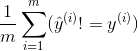
</div>

<div align="center">
  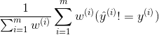
</div>

when x<sup>(i)</sup> is porn w<sup>(i)</sup> = 10, or x<sup>(i)</sup> is not porn w<sup>(i)</sup> = 1

It is quite common to change dev/test sets or evaluation metrics during a project. Having an initial dev/test set and metric helps you iterate quickly. If you ever find that the dev/test sets or metric are no longer pointing your team in the right direction, it’s not a big deal! Just change them and make sure your team knows about the new direction.

## Basic Error Analysis

### Error analysis Look at dev set examples to evaluate ideas

When you play with your cat app, you notice several examples where it mistakes dogs for cats. Some dogs do look like cats!

A team member proposes incorporating 3rd party software that will make the system do better on dog images. These changes will take a month, and the team member is enthusiastic. Should you ask them to go ahead?

Before investing a month on this task, I recommend that you first estimate how much it will actually improve the system’s accuracy. Then you can more rationally decide if this is worth the month of development time, or if you’re using that time on other tasks.

In detail, here’s what you can do:

  - Gather a sample of 100 dev set examples that your system ​misclassified.
  - Look at these examples manually, and count what fraction of them are dog images.

The process of looking at misclassified examples is called ​**error analysis**. In this example, if you find that only 5% of the misclassified images are dogs, then no matter how much you improve your algorithm’s performance on dog images, you won’t get rid of more than 5% of your errors. In other words, 5% is a “ceiling” (meaning maximum possible amount) for how much the proposed project could help. Thus, if your overall system is currently 90% accurate (10% error), this improvement is likely to result in at best 90.5% accuracy (or 9.5% error, which is 5% less error than the original 10% error).

In contrast, if you find that 50% of the mistakes are dogs, then you can be more confident that the proposed project will have a big impact. It could boost accuracy from 90% to 95% (a 50% relative reduction in error, from 10% down to 5%).

This simple counting procedure of error analysis gives you a quick way to estimate the possible value of incorporating the 3rd party software for dog images. It provides a quantitative basis on which to decide whether to make this investment.

Error analysis can often help you figure out how promising different directions are. I’ve seen many engineers reluctant to carry out error analysis. It often feels more exciting to jump in and implement some idea, rather than question if the idea is worth the time investment. This is a common mistake: It might result in your team spending a month only to realize afterward that it resulted in little benefit.

Manually examining 100 examples does not take long. Even if you take one minute per image, you’d be done in under two hours. These two hours could save you a month of wasted effort.

**Error Analysis​** refers to the process of examining dev set examples that your algorithm misclassified, so that you can understand the underlying causes of the errors. This can help you prioritize projects — as in this example — and inspire new directions.

### Evaluating multiple ideas in parallel during error analysis

Your team has several ideas for improving the cat detector:

  - Fix the problem of your algorithm recognizing​ dogs as cats.
  - Fix the problem of your algorithm recognizing ​great cats ​(lions, panthers, etc.) as house cats (pets).
  - Improve the system’s performance on ​blurry ​images.

You can efficiently evaluate all of these ideas in parallel. I usually create a spreadsheet and fill it out while looking through ~100 misclassified dev set images. I also jot down comments that might help me remember specific examples. To illustrate this process, let’s look at a spreadsheet you might produce with a small dev set of four examples:

<div align="center">
  
</div>

Image above has both the Great Cat and the Blurry columns checked. Furthermore, because it is possible for one example to be associated with multiple categories, the percentages at the bottom may not add up to 100%.

Although you may first formulate the categories (Dog, Great cat, Blurry) then categorize the examples by hand, in practice, once you start looking through examples, you will probably be inspired to propose new error categories. For example, say you go through a dozen images and realize a lot of mistakes occur with Instagram-filtered pictures. You can go back and add a new “Instagram” column to the spreadsheet. Manually looking at examples that the algorithm misclassified and asking how/whether you as a human could have labeled the picture correctly will often inspire you to come up with new categories of errors and solutions.

The most helpful error categories will be ones that you have an idea for improving. For example, the Instagram category will be most helpful to add if you have an idea to “undo” Instagram filters and recover the original image. But you don’t have to restrict yourself only to error categories you know how to improve; the goal of this process is to build your intuition about the most promising areas to focus on.

Error analysis is an iterative process. Don’t worry if you start off with no categories in mind. After looking at a couple of images, you might come up with a few ideas for error categories. After manually categorizing some images, you might think of new categories and re-examine the images in light of the new categories, and so on.

Suppose you finish carrying out error analysis on 100 misclassified dev set examples and get the following:

<div align="center">
  
</div>

You now know that working on a project to address the Dog mistakes can eliminate 8% of the errors at most. Working on Great Cat or Blurry image errors could help eliminate more errors. Therefore, you might pick one of the two latter categories to focus on. If your team has enough people to pursue multiple directions in parallel, you can also ask some engineers to work on Great Cats and others to work on Blurry images.

Error analysis does not produce a rigid mathematical formula that tells you what the highest priority task should be. You also have to take into account how much progress you expect to make on different categories and the amount of work needed to tackle each one.

### Cleaning up incorrectly labeled data

During error analysis, you might notice that some examples in your dev set are mislabeled. When I say “mislabeled” here, I mean that the pictures were already mislabeled by a human labeler even before the algorithm encountered it. I.e., the class label in an example ​(x,y) ​ has an incorrect value for y. For example, perhaps some pictures that are not cats are mislabeled as containing a cat, and vice versa. If you suspect the fraction of mislabeled images is significant, add a category to keep track of the fraction of examples mislabeled:

<div align="center">
  
</div>

Should you correct the labels in your dev set? Remember that the goal of the dev set is to help you quickly evaluate algorithms so that you can tell if Algorithm A or B is better. If the fraction of the dev set that is mislabeled impedes your ability to make these judgments, then it is worth spending time to fix the mislabeled dev set labels.

For example, suppose your classifier’s performance is:

  - Overall accuracy on dev set.................... 90% (10% overall error.)
  - Errors due to mislabeled examples........ 0.6% (6% of dev set errors.)
  - Errors due to other causes..................... 9.4% (94% of dev set errors)

Here, the 0.6% inaccuracy due to mislabeling might not be significant enough relative to the 9.4% of errors you could be improving. There is no harm in manually fixing the mislabeled images in the dev set, but it is not crucial to do so: It might be fine not knowing whether your system has 10% or 9.4% overall error.

Suppose you keep improving the cat classifier and reach the following performance:

  - Overall accuracy on dev set.................... 98.0% (2.0% overall error.)
  - Errors due to mislabeled examples........... 0.6% (30% of dev set errors.)
  - Errors due to other causes........................ 1.4% (70% of dev set errors)

30% of your errors are due to the mislabeled dev set images, adding significant error to your estimates of accuracy. It is now worthwhile to improve the quality of the labels in the dev set. Tackling the mislabeled examples will help you figure out if a classifier’s error is closer to 1.4% or 2% — a significant relative difference.

It is not uncommon to start off tolerating some mislabeled dev/test set examples, only later to change your mind as your system improves so that the fraction of mislabeled examples grows relative to the total set of errors.

Whatever process you apply to fixing dev set labels, remember to apply it to the test set labels too so that your dev and test sets continue to be drawn from the same distribution. Fixing your dev and test sets together would prevent the problem where your team optimizes for dev set performance only to realize later that they are being judged on a different criterion based on a different test set.

If you decide to improve the label quality, consider **double-checking** both the labels of examples that your system misclassified as well as labels of examples it correctly classified. It is possible that both the original label and your learning algorithm were wrong on an example. If you fix only the labels of examples that your system had misclassified, you might introduce bias into your evaluation. If you have 1,000 dev set examples, and if your classifier has 98.0% accuracy, it is easier to examine the 20 examples it misclassified than to examine all 980 examples classified correctly. Because it is easier in practice to check only the misclassified examples, bias does creep into some dev sets. This bias is acceptable if you are interested only in developing a product or application, but it would be a problem if you plan to use the result in a completely unbiased measure of test set accuracy.

### Eyeball dev set vs Blackbox dev set

Suppose you have a large dev set of 5,000 examples in which you have a 20% error rate. Thus, your algorithm is misclassifying ~1,000 dev images. It takes a long time to manually examine 1,000 images, so we might decide not to use all of them in the error analysis.

In this case, I would explicitly split the dev set into two subsets, one of which you look at, and one of which you don’t. You will more rapidly overfit the portion that you are manually looking at. You can use the portion you are not manually looking at to tune parameters.

In which the algorithm is misclassifying 1,000 out of 5,000 dev set examples. Suppose we want to manually examine about 100 errors for error analysis (10% of the errors). You should randomly select 10% of the dev set and place that into what we’ll call an ​**Eyeball dev set**​ to remind ourselves that we are looking at it with our eyes. The Eyeball dev set therefore has 500 examples, of which we would expect our algorithm to misclassify about 100.

The second subset of the dev set, called the **Blackbox dev set**, will have the remaining 4500 examples. You can use the Blackbox dev set to evaluate classifiers automatically by measuring their error rates. You can also use it to select among algorithms or tune hyperparameters. However, you should avoid looking at it with your eyes. We use the term “Blackbox” because we will only use this subset of the data to obtain “Blackbox” evaluations of classifiers.

Why do we explicitly separate the dev set into Eyeball and Blackbox dev sets? Since you will gain intuition about the examples in the Eyeball dev set, you will start to overfit the Eyeball dev set faster. If you see the performance on the Eyeball dev set improving much more rapidly than the performance on the Blackbox dev set, you have overfit the Eyeball dev set. In this case, you might need to discard it and find a new Eyeball dev set by moving more examples from the Blackbox dev set into the Eyeball dev set or by acquiring new labeled data.

Explicitly splitting your dev set into Eyeball and Blackbox dev sets allows you to tell when your manual error analysis process is causing you to overfit the Eyeball portion of your data.

### How big should the Eyeball and Blackbox dev sets be?

Your Eyeball dev set should be large enough to give you a sense of your algorithm’s major error categories. Here are some rough guidelines:

  - An eyeball dev set in which your classifier makes 10 mistakes would be considered very small. With just 10 errors, it’s hard to accurately estimate the impact of different error categories. But if you have very little data and cannot afford to put more into the Eyeball dev set, it​’s better than nothing and will help with project prioritization.
  - If your classifier makes ~20 mistakes on eyeball dev examples, you would start to get a rough sense of the major error sources.
  - With ~50 mistakes, you would get a good sense of the major error sources.
  - With ~100 mistakes, you would get a very good sense of the major sources of errors. Sometime people manually analyze even more errors — sometimes as many as 500. There is no harm in this as long as you have enough data.

Say your classifier has a 5% error rate. To make sure you have ~100 mislabeled examples in the Eyeball dev set, the Eyeball dev set would have to have about 2,000 examples (since 0.05*2,000 = 100). The lower your classifier’s error rate, the larger your Eyeball dev set needs to be in order to get a large enough set of errors to analyze.

If you are working on a task that even humans cannot do well, then the exercise of examining an Eyeball dev set will not be as helpful because it is harder to figure out why the algorithm didn’t classify an example correctly. In this case, you might omit having an Eyeball dev set.

How about the Blackbox dev set? We previously said that dev sets of around 1,000-10,000 examples are common. To refine that statement, a Blackbox dev set of 1,000-10,000 examples will often give you enough data to tune hyperparameters and select among models, though there is little harm in having even more data. A Blackbox dev set of 100 would be small but still useful.

If you have a small dev set, then you might not have enough data to split into Eyeball and Blackbox dev sets that are both large enough to serve their purposes. Instead, your entire dev set might have to be used as the Eyeball dev set — i.e., you would manually examine all the dev set data.

Between the Eyeball and Blackbox dev sets, I consider the Eyeball dev set more important. If you only have an Eyeball dev set, you can perform error analyses, model selection and hyperparameter tuning all on that set. The downside of having only an Eyeball dev set is that the risk of overfitting the dev set is greater.

If you have plentiful access to data, then the size of the Eyeball dev set would be determined mainly by how many examples you have time to manually analyze. Rarely people manually analyze more than 1,000 errors.

## Bias and Variance

### The main sources of error

Suppose your training, dev and test sets all come from the same distribution. Then you should always try to get more training data, since that can only improve performance, right?

Even though having more data can’t hurt, unfortunately it doesn’t always help as much as you might hope. It could be a waste of time to work on getting more data. So, how do you decide when to add data, and when not to bother?

There are two major sources of error in machine learning: bias and variance. Understanding them will help you decide whether adding data, as well as other tactics to improve performance, are a good use of time.

Suppose you hope to build a cat recognizer that has 5% error. Right now, your training set has an error rate of 15%, and your dev set has an error rate of 16%. In this case, adding training data probably won’t help much. You should focus on other changes. Indeed, adding more examples to your training set only makes it harder for your algorithm to do well on the training set.

If your error rate on the training set is 15% (or 85% accuracy), but your target is 5% error (95% accuracy), then the first problem to solve is to improve your algorithm performance on your training set. Your dev/test set performance is usually worse than your training set performance. So if you are getting 85% accuracy on the examples your algorithm has seen, there’s no way you’re getting 95% accuracy on examples your algorithm hasn’t even seen.

Suppose as above that your algorithm has 16% error (84% accuracy) on the dev set. We break the 16% error into two components:

- The bias is the error rate of your algorithm on your training set. We think of this informally as the algorithm’s **bias**.
- The variance is how much worse the algorithm does on the dev (or test) set compared to the training set in this setting. We think of this informally as the algorithm’s **variance**.

Some changes to a learning algorithm can address the first component of error **bias** and improve its performance on the training set. Some changes address the second component **variance** and help it generalize better from the training set to the dev/test sets. To select the most promising changes, it is incredibly useful to understand which of these two components of error is more pressing to address. Developing good intuition about Bias and Variance will help you choose effective changes for your algorithm.

### Examples of Bias and Variance

Consider our cat classification task. An “ideal” classifier (such as a human) might achieve nearly perfect performance in this task.

Suppose your algorithm performs as follows:

  - Training error = 1%
  - Dev error = 11%

What problem does it have? Applying the definitions, we estimate the bias as 1%, and the variance as 10%. Thus, it has **high variance**. The classifier has very low training error, but it is failing to generalize to the dev set. This is also called **overfitting**.

Now consider this:

  - Training error = 15%
  - Dev error = 16%

We estimate the bias as 15%, and variance as 1%. This classifier is fitting the training set poorly with 15% error, but its error on the dev set is barely higher than the training error. This classifier therefore has **high bias**, but low variance. We say that this algorithm is **underfitting**.

Now, consider this:

  - Training error = 15%
  - Dev error = 30%

We estimate the bias as 15%, and variance as 15%. This classifier has **high bias and high variance**: It is doing poorly on the training set, and therefore has high bias, and its performance on the dev set is even worse, so it also has high variance. The overfitting/underfitting terminology is hard to apply here since the classifier is simultaneously overfitting and underfitting.

Finally, consider this:

  - Training error = 0.5%
  - Dev error = 1%

This classifier is doing well, as it has low bias and low variance. Congratulations on achieving this great performance!

### Comparing to the optimal error rate

In our cat recognition example, the “ideal” error rate. That is, one achievable by an “optimal” classifier is nearly 0%. A human looking at a picture would be able to recognize if it contains a cat almost all the time; thus, we can hope for a machine that would do just as well.

Other problems are harder. Suppose that you are building a speech recognition system, and find that 14% of the audio clips have so much background noise or are so unintelligible that even a human cannot recognize what was said. In this case, even the most “optimal” speech recognition system might have error around 14%.

Suppose that on this speech recognition problem, your algorithm achieves:

- Training error = 15%
- Dev error = 30%

The training set performance is already close to the optimal error rate of 14%. Thus, there is not much room for improvement in terms of bias or in terms of training set performance. However, this algorithm is not generalizing well to the dev set; thus there is ample room for improvement in the errors due to variance.

If the optimal error rate is ~0%, then a training error of 15% leaves much room for improvement. This suggests bias-reducing changes might be fruitful. But if the optimal error rate is 14%, then the same training set performance tells us that there’s little room for improvement in the classifier’s bias.

For problems where the optimal error rate is far from zero, here’s a more detailed breakdown of an algorithm’s error. Continuing with our speech recognition above, the total dev set error of 30% can be broken down as follows (a similar analysis can be applied to the test set error):

- **Optimal error rate (“unavoidable bias”)**: 14%. Suppose we decide that, even with the best possible speech system in the world, we would still suffer 14% error. We can think of this as the “unavoidable” part of a learning algorithm’s bias.
- **Avoidable bias**: 1%. This is calculated as the difference between the training error and the optimal error rate. If this number is negative, you are doing better on the training set than the optimal error rate. This means you are overfitting on the training set, and the algorithm has over-memorized the training set. You should focus on variance reduction methods rather than on further bias reduction methods.
- **Variance**: 15%. The difference between the dev error and the training error.

To relate this to our earlier definitions, Bias and Avoidable Bias are related as follows:

Bias = Optimal error rate (“unavoidable bias”) + Avoidable bias

The “avoidable bias” reflects how much worse your algorithm performs on the training set than the “optimal classifier”.

The concept of variance remains the same as before. In theory, we can always reduce variance to nearly zero by training on a massive training set. Thus, all variance is “avoidable” with a sufficiently large dataset, so there is no such thing as “unavoidable variance”.

Consider one more example, where the optimal error rate is 14%, and we have:

- Training error = 15%
- Dev error = 16%

Now we would say that error from avoidable bias is 1%, and the error from variance is about 1%. Thus, the algorithm is already doing well, with little room for improvement. It is only 2% worse than the optimal error rate.

Knowing the optimal error rate is helpful for guiding our next steps. In statistics, the optimal error rate is also called **Bayes error rate**.

How do we know what the optimal error rate is? For tasks that humans are reasonably good at, such as recognizing pictures or transcribing audio clips, you can ask a human to provide labels then measure the accuracy of the human labels relative to your training set. This would give an estimate of the optimal error rate. If you are working on a problem that even humans have a hard time solving (e.g., predicting what movie to recommend, or what ad to show to a user) it can be hard to estimate the optimal error rate.

### Addressing Bias and Variance

Here is the simplest formula for addressing bias and variance issues:

  - If you have high avoidable bias, increase the size of your model (layers/neurons).
  - If you have high variance, add data to your training set.

If you are able to increase the neural network size and increase training data without limit, it is possible to do very well on many learning problems.

In practice, increasing the size of your model will eventually cause you to run into computational problems because training very large models is slow. You might also exhaust your ability to acquire more training data.

Different neural network architectures — will have different amounts of bias/variance for your problem. A lot of recent deep learning research has developed many innovative model architectures. So if you are using neural networks, the academic literature can be a great source of inspiration. There are also many great open-source implementations on github. But the results of trying new architectures are less predictable than the simple formula of increasing the model size and adding data.

Increasing the model size generally reduces bias, but it might also increase variance and the risk of overfitting. However, this overfitting problem usually arises only when you are not using regularization. If you include a well-designed regularization method, then you can usually safely increase the size of the model without increasing overfitting.

Suppose you are applying deep learning, with L2 regularization or dropout, with the regularization parameter that performs best on the dev set. If you increase the model size, usually your performance will stay the same or improve; it is unlikely to worsen significantly. The only reason to avoid using a bigger model is the increased computational cost.

### Bias vs Variance tradeoff

You might have heard of the “Bias vs Variance tradeoff” Of the changes you could make to most learning algorithms, there are some that reduce bias errors but at the cost of increasing variance, and vice versa. This creates a “trade off” between bias and variance.

Increasing the size of your model — adding neurons/layers in a neural network — generally reduces bias but could increase variance. Alternatively, adding regularization generally reduces variance but increases bias.

In the modern era, we often have access to plentiful data and can use very large neural networks (deep learning). Therefore, there is less of a tradeoff, and there are now more options for reducing bias without hurting variance, and vice versa.

You can usually increase a neural network size and tune the regularization method to reduce bias without noticeably increasing variance. By adding training data, you can also usually reduce variance without affecting bias.

### Techniques for reducing avoidable bias

If your learning algorithm suffers from high avoidable bias, you might try the following techniques:

  - **Increase the model size** (such as number of neurons/layers): This technique reduces bias, since it should allow you to fit the training set better. If you find that this increases variance, then use regularization, which will usually eliminate the increase in variance.
  - **Modify input features based on insights from error analysis​**: Say your error analysis inspires you to create additional features that help the algorithm eliminate a particular category of errors. These new features could help with both bias and variance. In theory, adding more features could increase the variance; but if you find this to be the case, then use regularization, which will usually eliminate the increase in variance.
  - **Reduce or eliminate regularization**​ (L2 regularization, L1 regularization, dropout): This will reduce avoidable bias, but increase variance.
  - **Modify model architecture​** (such as neural network architecture) so that it is more suitable for your problem: This technique can affect both bias and variance.

One method that is not helpful:

  - **Add more training data​**: This technique helps with variance problems, but it usually has no significant effect on bias.

### Error analysis on the training set

Your algorithm must perform well on the training set before you can expect it to perform well on the dev/test sets.

In addition to the techniques described earlier to address high bias, I sometimes also carry out an error analysis on the ​training data, following a protocol similar to error analysis on the Eyeball dev set. This can be useful if your algorithm has high bias — i.e., if it is not fitting the training set well.

Suppose you are building a speech recognition system for an app and have collected a training set of audio clips from volunteers. If your system is not doing well on the training set, you might consider listening to a set of ~100 examples that the algorithm is doing poorly on to understand the major categories of training set errors. Similar to the dev set error analysis, you can count the errors in different categories:

<div align="center">
  
</div>

You might realize that your algorithm is having a particularly hard time with training examples that have a lot of background noise. Thus, you might focus on techniques that allow it to better fit training examples with background noise.

You might also double-check whether it is possible for a person to transcribe these audio clips, given the same input audio as your learning algorithm. If there is so much background noise that it is simply impossible for anyone to make out what was said, then it might be unreasonable to expect any algorithm to correctly recognize such utterances.

### Techniques for reducing variance

If your learning algorithm suffers from high variance, you might try the following techniques:

  - **Add more training data​**: This is the simplest and most reliable way to address variance, so long as you have access to significantly more data and enough computational power to process the data.
  - **Add regularization**​ (L2 regularization, L1 regularization, dropout): This technique reduces variance but increases bias.
  - **Add early stopping**​ (i.e., stop gradient descent early, based on dev set error): This technique reduces variance but increases bias. Early stopping behaves a lot like regularization methods, and some authors call it a regularization technique.
  - **Feature selection to decrease number of input features**:​ This technique might help with variance problems, but it might also increase bias. Reducing the number of features slightly (say going from 1,000 features to 900) is unlikely to have a huge effect on bias. Reducing it significantly (say going from 1,000 features to 100 — a 10x reduction) is more likely to have a significant effect, so long as you are not excluding too many useful features. In modern deep learning, when data is plentiful, there has been a shift away from feature selection, and we are now more likely to give all the features we have to the algorithm and let the algorithm sort out which ones to use based on the data. But when your training set is small, feature selection can be very useful.
  - **Decrease the model size** ​(such as number of neurons/layers): **Use with caution**. This technique could decrease variance, while possibly increasing bias. However, I don’t recommend this technique for addressing variance. Adding regularization usually gives better classification performance. The advantage of reducing the model size is reducing your computational cost and thus speeding up how quickly you can train models. If speeding up model training is useful, then by all means consider decreasing the model size. But if your goal is to reduce variance, and you are not concerned about the computational cost, consider adding regularization instead.
  - **Modify model architecture​** (such as neural network architecture) so that it is more suitable for your problem: This technique can affect both bias and variance.

## Learning curves

### Diagnosing bias and variance Learning curves

A learning curve plots your dev set error against the number of training examples. To plot it, you would run your algorithm using different training set sizes. For example, if you have 1,000 examples, you might train separate copies of the algorithm on 100, 200, 300, ..., 1000 examples. Then you could plot how dev set error varies with the training set size. As the training set size increases, the dev set error should decrease.

<div align="center">
  
</div>

We will often have some “desired error rate” that we hope our learning algorithm will eventually achieve. If we hope for human-level performance, then the human error rate could be the “desired error rate.” Add the desired level of performance to your learning curve:

<div align="center">
  
</div>

You can visually extrapolate the red “dev error” curve to guess how much closer you could get to the desired level of performance by adding more data. In the above, it looks plausible that doubling the training set size might allow you to reach the desired performance.

But if the dev error curve has “plateaued” (i.e. flattened out), then you can immediately tell that adding more data won’t get you to your goal:

<div align="center">
  
</div>

Looking at the learning curve might therefore help you avoid spending months collecting twice as much training data, only to realize it does not help.

One downside of this process is that if you only look at the dev error curve, it can be hard to extrapolate and predict exactly where the red curve will go if you had more data. There is one additional plot that can help you estimate the impact of adding more data: the training error.

### Plotting training error

Your dev set (and test set) error should decrease as the training set size grows. But your training set error usually ​increases as the training set size grows.

Let’s illustrate this effect with an example. Suppose your training set has only 2 examples: One cat image and one non-cat image. Then it is easy for the learning algorithms to “memorize” both examples in the training set, and get 0% training set error. Even if either or both of the training examples were mislabeled, it is still easy for the algorithm to memorize both labels.

Now suppose your training set has 100 examples. Perhaps even a few examples are mislabeled, or ambiguous - some images are very blurry, so even humans cannot tell if there is a cat. Perhaps the learning algorithm can still “memorize” most or all of the training set, but it is now harder to obtain 100% accuracy. By increasing the training set from 2 to 100 examples, you will find that the training set accuracy will drop slightly.

Finally, suppose your training set has 10,000 examples. In this case, it becomes even harder for the algorithm to perfectly fit all 10,000 examples, especially if some are ambiguous or mislabeled. Thus, your learning algorithm will do even worse on this training set.

Let’s add a plot of training error to our earlier figures:

<div align="center">
  
</div>

You can see that the blue “training error” curve increases with the size of the training set. Furthermore, your algorithm usually does better on the training set than on the dev set; thus the red dev error curve usually lies strictly above the blue training error curve.

### Interpreting learning curves High bias

Suppose your dev error curve looks like this:

<div align="center">
  
</div>

We previously said that, if your dev error curve plateaus, you are unlikely to achieve the desired performance just by adding data. But it is hard to know exactly what an extrapolation of the red dev error curve will look like. If the dev set was small, you would be even less certain because the curves could be noisy.

Suppose we add the training error curve to this plot and get the following:

<div align="center">
  
</div>

Now, you can be absolutely sure that adding more data will not, by itself, be sufficient. Why is that?

- As we add more training data, training error can only get worse. Thus, the blue training error curve can only stay the same or go higher, and thus it can only get further away from the (green line) level of desired performance.
- The red dev error curve is usually higher than the blue training error. Thus, there’s almost no way that adding more data would allow the red dev error curve to drop down to the desired level of performance when even the training error is higher than the desired level of performance.

Examining both the dev error curve and the training error curve on the same plot allows us to more confidently extrapolate the dev error curve.

Suppose, for the sake of discussion, that the desired performance is our estimate of the optimal error rate. The figure above is then the standard “textbook” example of what a learning curve with high avoidable bias looks like: At the largest training set size - presumably corresponding to all the training data we have - there is a large gap between the training error and the desired performance, indicating large avoidable bias. Furthermore, the gap between the training and dev curves is small, indicating small variance.

Previously, we were measuring training and dev set error only at the rightmost point of this plot, which corresponds to using all the available training data. Plotting the full learning curve gives us a more comprehensive picture of the algorithms’ performance on different training set sizes.

### Interpreting learning curves Other cases

Consider this learning curve:

<div align="center">
  
</div>

Does this plot indicate high bias, high variance, or both?

The blue training error curve is relatively low, and the red dev error curve is much higher than the blue training error. Thus, the bias is small, but the variance is large. Adding more training data will probably help close the gap between dev error and training error.

Now, consider this:

<div align="center">
  
</div>

This time, the training error is large, as it is much higher than the desired level of performance. The dev error is also much larger than the training error. Thus, you have significant bias and significant variance. You will have to find a way to reduce both bias and variance in your algorithm.

### Plotting learning curves

Suppose you have a very small training set of 100 examples. You train your algorithm using a randomly chosen subset of 10 examples, then 20 examples, then 30, up to 100, increasing the number of examples by intervals of ten. You then use these 10 data points to plot your learning curve. You might find that the curve looks slightly noisy (meaning that the values are higher/lower than expected) at the smaller training set sizes.

When training on just 10 randomly chosen examples, you might be unlucky and have a particularly “bad” training set, such as one with many ambiguous/mislabeled examples. Or, you might get lucky and get a particularly “good” training set. Having a small training set means that the dev and training errors may randomly fluctuate.

If your machine learning application is heavily skewed toward one class (such as a cat classification task where the fraction of negative examples is much larger than positive examples), or if it has a huge number of classes (such as recognizing 100 different animal species), then the chance of selecting an especially “unrepresentative” or bad training set is also larger. For example, if 80% of your examples are negative examples (y=0), and only 20% are positive examples (y=1), then there is a chance that a training set of 10 examples contains only negative examples, thus making it very difficult for the algorithm to learn something meaningful.

If the noise in the training curve makes it hard to see the true trends, here are two solutions:

- Instead of training just one model on 10 examples, instead select several different randomly chosen training sets of 10 examples by sampling with replacement from your original set of 100. Train a different model on each of these, and compute the training and dev set error of each of the resulting models. Compute and plot the average training error and average dev set error.
- Here’s what sampling with replacement means: You would randomly pick 10 different examples out of the 100 to form your first training set. Then to form the second training set, you would again pick 10 examples, but without taking into account what had been chosen in the first training set. Thus, it is possible for one specific example to appear in both the first and second training sets. In contrast, if you were sampling without replacement, the second training set would be chosen from just the 90 examples that had not been chosen the first time around. In practice, sampling with or without replacement shouldn’t make a huge difference, but the former is common practice.
- If your training set is skewed towards one class, or if it has many classes, choose a “balanced” subset instead of 10 training examples at random out of the set of 100. For example, you can make sure that 2/10 of the examples are positive examples, and 8/10 are negative. More generally, you can make sure the fraction of examples from each class is as close as possible to the overall fraction in the original training set.

I would not bother with either of these techniques unless you have already tried plotting learning curves and concluded that the curves are too noisy to see the underlying trends. If your training set is large—say over 10,000 examples — and your class distribution is not very skewed, you probably won’t need these techniques.

Finally, plotting a learning curve may be computationally expensive: For example, you might have to train ten models with 1,000, then 2,000, all the way up to 10,000 examples. Training models with small datasets is much faster than training models with large datasets. Thus, instead of evenly spacing out the training set sizes on a linear scale as above, you might train models with 1,000, 2,000, 4,000, 6,000, and 10,000 examples. This should still give you a clear sense of the trends in the learning curves. Of course, this technique is relevant only if the computational cost of training all the additional models is significant.

## Comparing to human-level performance

### Why we compare to human-level performance

Many machine learning systems aim to automate things that humans do well. Examples include image recognition, speech recognition, and email spam classification. Learning algorithms have also improved so much that we are now surpassing human-level performance on more and more of these tasks.

Further, there are several reasons building an ML system is easier if you are trying to do a task that people can do well:


**Ease of obtaining data from human labelers**​ Since people recognize cat images well, it is straightforward for people to provide high accuracy labels for your learning algorithm.

**Error analysis can draw on human intuition​** Suppose a speech recognition algorithm is doing worse than human-level recognition. Say it incorrectly transcribes an audio clip as “This recipe calls for a pear of apples”, mistaking “pair” for “pear.” You can draw on human intuition and try to understand what information a person uses to get the correct transcription, and use this knowledge to modify the learning algorithm.

**Use human-level performance to estimate the optimal error rate and also set a “desired error rate”** Suppose your algorithm achieves 10% error on a task, but a person achieves 2% error. Then we know that the optimal error rate is 2% or lower and the avoidable bias is at least 8%. Thus, you should try bias-reducing techniques.

I find that having a reasonable and achievable target error rate helps accelerate a team’s progress. Knowing your algorithm has high avoidable bias is incredibly valuable and opens up a menu of options to try.

### How to define human-level performance

Suppose you are working on a medical imaging application that automatically makes diagnoses from x-ray images. A typical person with no previous medical background besides some basic training achieves 15% error on this task. A junior doctor achieves 10% error. An experienced doctor achieves 5% error. And a small team of doctors that discuss and debate each image achieves 2% error. Which one of these error rates defines “human-level performance”?

In this case, I would use 2% as the human-level performance proxy for our optimal error rate. You can also set 2% as the desired performance level.

- **Ease of obtaining labeled data from human labelers.**​ You can get a team of doctors to provide labels to you with a 2% error rate.
- **Error analysis can draw on human intuition.**​ By discussing images with a team of doctors, you can draw on their intuitions.
- **Use human-level performance to estimate the optimal error rate and also set achievable “desired error rate”.**​ It is reasonable to use 2% error as our estimate of the optimal error rate. The optimal error rate could be even lower than 2%, but it cannot be higher, since it is possible for a team of doctors to achieve 2% error. In contrast, it is not reasonable to use 5% or 10% as an estimate of the optimal error rate, since we know these estimates are necessarily too high.

When it comes to obtaining labeled data, you might not want to discuss every image with an entire team of doctors since their time is expensive. Perhaps you can have a single junior doctor label the vast majority of cases and bring only the harder cases to more experienced doctors or to the team of doctors.

If your system is currently at 40% error, then it doesn’t matter much whether you use a junior doctor (10% error) or an experienced doctor (5% error) to label your data and provide intuitions. But if your system is already at 10% error, then defining the human-level reference as 2% gives you better tools to keep improving your system.

### Surpassing human-level performance

You are working on speech recognition and have a dataset of audio clips. Suppose your dataset has many noisy audio clips so that even humans have 10% error. Suppose your system already achieves 8% error. Can you use any of the techniques to continue making rapid progress?

If you can identify a subset of data in which humans significantly surpass your system, then you can still use those techniques to drive rapid progress. For example, suppose your system is much better than people at recognizing speech in noisy audio, but humans are still better at transcribing very rapidly spoken speech.

For the subset of data with rapidly spoken speech:

- You can still obtain transcripts from humans that are higher quality than your algorithm’s output.
- You can draw on human intuition to understand why they correctly heard a rapidly spoken utterance when your system didn’t.
- You can use human-level performance on rapidly spoken speech as a desired performance target.

More generally, so long as there are dev set examples where humans are right and your algorithm is wrong, then many of the techniques described will apply. This is true even if, averaged over the entire dev/test set, your performance is already surpassing human-level performance.

There are many important machine learning applications where machines surpass human level performance. For example, machines are better at predicting movie ratings, how long it takes for a delivery car to drive somewhere, or whether to approve loan applications. Only a subset of techniques apply once humans have a hard time identifying examples that the algorithm is clearly getting wrong. Consequently, progress is usually slower on problems where machines already surpass human-level performance, while progress is faster when machines are still trying to catch up to humans.

## Training and testing on different distributions

### When you should train and test on different distributions

Users of your cat pictures app have uploaded 10,000 images, which you have manually labeled as containing cats or not. You also have a larger set of 200,000 images that you downloaded off the internet. How should you define train/dev/test sets?

Since the 10,000 user images closely reflect the actual probability distribution of data you want to do well on, you might use that for your dev and test sets. If you are training a data-hungry deep learning algorithm, you might give it the additional 200,000 internet images for training. Thus, your training and dev/test sets come from different probability distributions. How does this affect your work?

Instead of partitioning our data into train/dev/test sets, we could take all 210,000 images we have, and randomly shuffle them into train/dev/test sets. In this case, all the data comes from the same distribution. But I recommend against this method, because about 205,000/210,000 ≈ 97.6% of your dev/test data would come from internet images, which does not reflect the actual distribution you want to do well on. Remember our recommendation on choosing dev/test sets:

Choose dev and test sets to reflect data you expect to get in the future and want to do well on.

Most of the academic literature on machine learning assumes that the training set, dev set and test set all come from the same distribution. In the early days of machine learning, data was scarce. We usually only had one dataset drawn from some probability distribution. So we would randomly split that data into train/dev/test sets, and the assumption that all the data was coming from the same source was usually satisfied.

In the era of big data, we now have access to huge training sets, such as cat internet images. Even if the training set comes from a different distribution than the dev/test set, we still want to use it for learning since it can provide a lot of information. There is some academic research on training and testing on different distributions called **transfer learning**.

For the cat detector example, instead of putting all 10,000 user-uploaded images into the dev/test sets, we might instead put 5,000 into the dev/test sets. We can put the remaining 5,000 user-uploaded examples into the training set. This way, your training set of 205,000 examples contains some data that comes from your dev/test distribution along with the 200,000 internet images.

Let’s consider a second example. Suppose you are building a speech recognition system to transcribe street addresses for a voice-controlled mobile map/navigation app. You have 20,000 examples of users speaking street addresses. But you also have 500,000 examples of other audio clips with users speaking about other topics. You might take 10,000 examples of street addresses for the dev/test sets, and use the remaining 10,000, plus the additional 500,000 examples, for training.

We will continue to assume that your dev data and your test data come from the same distribution. But it is important to understand that different training and dev/test distributions offer some special challenges.

### How to decide whether to use all your data

Suppose your cat detector’s training set includes 10,000 user-uploaded images. This data comes from the same distribution as a separate dev/test set, and represents the distribution you care about doing well on. You also have an additional 20,000 images downloaded from the internet. Should you provide all 20,000+10,000=30,000 images to your learning algorithm as its training set, or discard the 20,000 internet images for fear of it biasing your learning algorithm?

When using earlier generations of learning algorithms (such as hand-designed computer vision features, followed by a simple linear classifier) there was a real risk that merging both types of data would cause you to perform worse. Thus, some engineers will warn you against including the 20,000 internet images.

But in the modern era of powerful, flexible learning algorithms — such as large neural networks — this risk has greatly diminished. If you can afford to build a neural network with a large enough number of hidden units/layers, you can safely add the 20,000 images to your training set. Adding the images is more likely to increase your performance.

This observation relies on the fact that there is some x —> y mapping that works well for both types of data. In other words, there exists some system that inputs either an internet image or a mobile app image and reliably predicts the label, even without knowing the source of the image.

Adding the additional 20,000 images has the following effects:

- It gives your neural network more examples of what cats do/do not look like. This is helpful, since internet images and user-uploaded mobile app images do share some similarities. Your neural network can apply some of the knowledge acquired from internet images to mobile app images.
- It forces the neural network to expend some of its capacity to learn about properties that are specific to internet images (such as higher resolution, different distributions of how the images are framed, etc.) If these properties differ greatly from mobile app images, it will “use up” some of the representational capacity of the neural network. Thus there is less capacity for recognizing data drawn from the distribution of mobile app images, which is what you really care about. Theoretically, this could hurt your algorithms’ performance.

Fortunately, if you have the computational capacity needed to build a big enough neural network, then this is not a serious concern. You have enough capacity to learn from both internet and from mobile app images, without the two types of data competing for capacity. Your algorithm is big enough that you don’t have to worry about running out of space.

But if you do not have a big enough neural network (or another highly flexible learning algorithm), then you should pay more attention to your training data matching your dev/test set distribution.

If you think you have data that has no benefit, you should just leave out that data for computational reasons. For example, suppose your dev/test sets contain mainly casual pictures of people, places, landmarks, animals. Suppose you also have a large collection of scanned historical documents.

These documents don’t contain anything resembling a cat. They also look completely unlike your dev/test distribution. There is no point including this data as negative examples, because the benefit from the data is negligible — there is almost nothing your neural network can learn from this data that it can apply to your dev/test set distribution. Including them would waste computation resources and representation capacity of the neural network.

### How to decide whether to include inconsistent data

Suppose you want to learn to predict housing prices in New York City. Given the size of a house (input feature x), you want to predict the price (target label y).

Housing prices in New York City are very high. Suppose you have a second dataset of housing prices in Detroit, Michigan, where housing prices are much lower. Should you include this data in your training set?

Given the same size x, the price of a house y is very different depending on whether it is in New York City or in Detroit. If you only care about predicting New York City housing prices, putting the two datasets together will hurt your performance. In this case, it would be better to leave out the inconsistent Detroit data.

How is this New York City vs Detroit example different from the mobile app vs internet cat images example?

The cat image example is different because, given an input picture x, one can reliably predict the label y indicating whether there is a cat, even without knowing if the image is an internet image or a mobile app image. I.e., there is a function f(x) that reliably maps from the input x to the target output y, even without knowing the origin of x. Thus, the task of recognition from internet images is “consistent” with the task of recognition from mobile app images. This means there was little downside (other than computational cost) to including all the data, and some possible significant upside. In contrast, New York City and Detroit, Michigan data are not consistent. Given the same x (size of house), the price is very different depending on where the house is.

### Weighting data

Suppose you have 200,000 images from the internet and 5,000 images from your mobile app users. There is a 40:1 ratio between the size of these datasets. In theory, so long as you build a huge neural network and train it long enough on all 205,000 images, there is no harm in trying to make the algorithm do well on both internet images and mobile images.

But in practice, having 40x as many internet images as mobile app images might mean you need to spend 40x (or more) as much computational resources to model both, compared to if you trained on only the 5,000 images.

If you don’t have huge computational resources, you could give the internet images a much lower weight as a compromise.

For example, suppose your optimization objective is squared error. Thus, our learning algorithm tries to optimize:

<div align="center">
  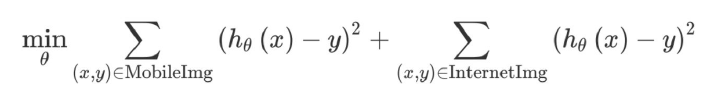
</div>

The first sum above is over the 5,000 mobile images, and the second sum is over the 200,000 internet images. You can instead optimize with an additional parameter 𝛽:

<div align="center">
  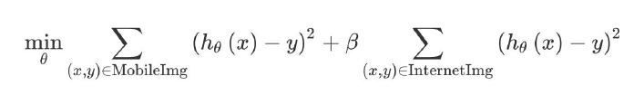
</div>

If you set 𝛽=1/40, the algorithm would give equal weight to the 5,000 mobile images and the 200,000 internet images. You can also set the parameter 𝛽 to other values, perhaps by tuning to the dev set.

By weighting the additional Internet images less, you don’t have to build as massive a neural network to make sure the algorithm does well on both types of tasks. This type of re-weighting is needed only when you suspect the additional data (Internet Images) has a very different distribution than the dev/test set, or if the additional data is much larger than the data that came from the same distribution as the dev/test set (mobile images).

### Generalizing from the training set to the dev set

Suppose you are applying ML in a setting where the training and the dev/test distributions are different. Say, the training set contains Internet images + Mobile images, and the dev/test sets contain only Mobile images. However, the algorithm is not working well: It has a much higher dev/test set error than you would like. Here are some possibilities of what might be wrong:

- It does not do well on the training set. This is the problem of high (avoidable) bias on the training set distribution.
- It does well on the training set, but does not generalize well to previously unseen data drawn from the same distribution as the training set. This is high variance.
- It generalizes well to new data drawn from the same distribution as the training set, but not to data drawn from the dev/test set distribution. We call this problem **data mismatch**, since it is because the training set data is a poor match for the dev/test set data.

For example, suppose that humans achieve near perfect performance on the cat recognition task. Your algorithm achieves this:

- 1% error on the training set
- 1.5% error on data drawn from the same distribution as the training set that the algorithm has not seen
- 10% error on the dev set

In this case, you clearly have a data mismatch problem. To address this, you might try to make the training data more similar to the dev/test data.

In order to diagnose to what extent an algorithm suffers from each of the problems 1-3 above, it will be useful to have another dataset. Specifically, rather than giving the algorithm all the available training data, you can split it into two subsets: The actual training set which the algorithm will train on, and a separate set, which we will call the **Training dev** set, that we will not train on.

You now have four subsets of data:

- Training set. This is the data that the algorithm will learn from (e.g., Internet images + Mobile images). This does not have to be drawn from the same distribution as what we really care about (the dev/test set distribution).
- Training dev set: This data is drawn from the same distribution as the training set (e.g., Internet images + Mobile images). This is usually smaller than the training set; it only needs to be large enough to evaluate and track the progress of our learning algorithm.
- Dev set: This is drawn from the same distribution as the test set, and it reflects the distribution of data that we ultimately care about doing well on. (E.g., mobile images.)
- Test set: This is drawn from the same distribution as the dev set. (E.g., mobile images.)

Armed with these four separate datasets, you can now evaluate:

- Training error, by evaluating on the training set.
- The algorithm’s ability to generalize to new data drawn from the training set distribution, by evaluating on the training dev set.
- The algorithm’s performance on the task you care about, by evaluating on the dev and/or test sets.

### Identifying Bias-Variance and Data Mismatch Errors

Suppose humans achieve almost perfect performance (≈0% error) on the cat detection task, and thus the optimal error rate is about 0%. Suppose you have:

- 1% error on the training set.
- 5% error on training dev set.
- 5% error on the dev set.

What does this tell you? Here, you know that you have high variance. The variance reduction techniques described earlier should allow you to make progress.

Now, suppose your algorithm achieves:

- 10% error on the training set.
- 11% error on training dev set.
- 12% error on the dev set.

This tells you that you have high avoidable bias on the training set. I.e., the algorithm is doing poorly on the training set. Bias reduction techniques should help.

In the examples above, the algorithm suffered from only high avoidable bias or high variance. It is possible for an algorithm to suffer from any subset of high avoidable bias, high variance, and data mismatch. For example:

- 10% error on the training set.
- 11% error on training dev set.
- 20% error on the dev set.

This algorithm suffers from high avoidable bias and from data mismatch. It does not, however, suffer from high variance on the training set distribution.

It might be easier to understand how the different types of errors relate to each other by drawing them as entries in a table:

<div align="center">
  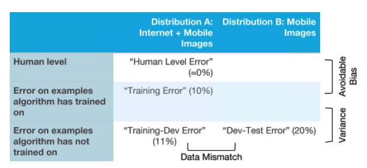
</div>

Continuing with the example of the cat image detector, you can see that there are two different distributions of data on the x-axis. On the y-axis, we have three types of error: human level error, error on examples the algorithm has trained on, and error on examples the algorithm has not trained on.

If you wish, you can also fill in the remaining two boxes in this table: You can fill in the upper-right box (Human level performance on Mobile Images) by asking some humans to label your mobile cat images data and measure their error. You can fill in the next box by taking the mobile cat images (Distribution B) and putting a small fraction of into the training set so that the neural network learns on it too. Then you measure the learned model’s error on that subset of data. Filling in these two additional entries may sometimes give additional insight about what the algorithm is doing on the two different distributions (Distribution A and B) of data.

By understanding which types of error the algorithm suffers from the most, you will be better positioned to decide whether to focus on reducing bias, reducing variance, or reducing data mismatch.

### Addressing data mismatch

Suppose you have developed a speech recognition system that does very well on the training set and on the training dev set. However, it does poorly on your dev set: You have a data mismatch problem. What can you do?

I recommend that you: (i) Try to understand what properties of the data differ between the training and the dev set distributions. (ii) Try to find more training data that better matches the dev set examples that your algorithm has trouble with.

For example, suppose you carry out an error analysis on the speech recognition dev set: You manually go through 100 examples, and try to understand where the algorithm is making mistakes. You find that your system does poorly because most of the audio clips in the dev set are taken within a car, whereas most of the training examples were recorded against a quiet background. The engine and road noise dramatically worsen the performance of your speech system. In this case, you might try to acquire more training data comprising audio clips that were taken in a car. The purpose of the error analysis is to understand the significant differences between the training and the dev set, which is what leads to the data mismatch.

If your training and training dev sets include audio recorded within a car, you should also double-check your system’s performance on this subset of data. If it is doing well on the car data in the training set but not on car data in the training dev set, then this further validates the hypothesis that getting more car data would help. This is why we discussed the possibility of including in your training set some data drawn from the same distribution as your dev/test set. Doing so allows you to compare your performance on the car data in the training set vs. the dev/test set.

Unfortunately, there are no guarantees in this process. For example, if you don't have any way to get more training data that better match the dev set data, you might not have a clear path towards improving performance.

### Artificial data synthesis

Your speech system needs more data that sounds as if it were taken from within a car. Rather than collecting a lot of data while driving around, there might be an easier way to get this data: By artificially synthesizing it.

Suppose you obtain a large quantity of car/road noise audio clips. You can download this data from several websites. Suppose you also have a large training set of people speaking in a quiet room. If you take an audio clip of a person speaking and “add” to that to an audio clip of car/road noise, you will obtain an audio clip that sounds as if that person was speaking in a noisy car. Using this process, you can “synthesize” huge amounts of data that sound as if it were collected inside a car.

More generally, there are several circumstances where artificial data synthesis allows you to create a huge dataset that reasonably matches the dev set. Let’s use the cat image detector as a second example. You notice that dev set images have much more motion blur because they tend to come from cellphone users who are moving their phone slightly while taking the picture. You can take non-blurry images from the training set of internet images, and add simulated motion blur to them, thus making them more similar to the dev set.

Keep in mind that artificial data synthesis has its challenges: it is sometimes easier to create synthetic data that appears realistic to a person than it is to create data that appears realistic to a computer. For example, suppose you have 1,000 hours of speech training data, but only 1 hour of car noise. If you repeatedly use the same 1 hour of car noise with different portions from the original 1,000 hours of training data, you will end up with a synthetic dataset where the same car noise is repeated over and over. While a person listening to this audio probably would not be able to tell—all car noise sounds the same to most of us—it is possible that a learning algorithm would “overfit” to the 1 hour of car noise. Thus, it could generalize poorly to a new audio clip where the car noise happens to sound different.

Alternatively, suppose you have 1,000 unique hours of car noise, but all of it was taken from just 10 different cars. In this case, it is possible for an algorithm to “overfit” to these 10 cars and perform poorly if tested on audio from a different car. Unfortunately, these problems can be hard to spot.

To take one more example, suppose you are building a computer vision system to recognize cars. Suppose you partner with a video gaming company, which has computer graphics models of several cars. To train your algorithm, you use the models to generate synthetic images of cars. Even if the synthesized images look very realistic, this approach (which has been independently proposed by many people) will probably not work well. The video game might have ~20 car designs in the entire video game. It is very expensive to build a 3D car model of a car; if you were playing the game, you probably wouldn’t notice that you’re seeing the same cars over and over, perhaps only painted differently. I.e., this data looks very realistic to you. But compared to the set of all cars out on roads—and therefore what you’re likely to see in the dev/test sets—this set of 20 synthesized cars captures only a minuscule fraction of the world’s distribution of cars. Thus if your 100,000 training examples all come from these 20 cars, your system will “overfit” to these 20 specific car designs, and it will fail to generalize well to dev/test sets that include other car designs.

When synthesizing data, put some thought into whether you’re really synthesizing a representative set of examples. Try to avoid giving the synthesized data properties that makes it possible for a learning algorithm to distinguish synthesized from non-synthesized examples - such as if all the synthesized data comes from one of 20 car designs, or all the synthesized audio comes from only 1 hour of car noise. This advice can be hard to follow.

When working on data synthesis, sometimes taken weeks before we produced data with details that are close enough to the actual distribution for the synthesized data to have a significant effect. But if you are able to get the details right, you can suddenly access a far larger training set than before.

## End-to-end deep learning

### The rise of end-to-end learning

Suppose you want to build a system to examine online product reviews and automatically tell you if the writer liked or disliked that product. For example, you hope to recognize the following review as highly positive:

- This is a great mop!

and the following as highly negative:

- This mop is low quality -- I regret buying it.

The problem of recognizing positive vs. negative opinions is called “sentiment classification”. To build this system, you might build a “pipeline” of two components:

- Parser: A system that annotates the text with information identifying the most important words. (A parser gives a much richer annotation of the text than this, but this simplified description will suffice for explaining end-to-end deep learning.) For example, you might use the parser to label all the adjectives and nouns. You would therefore get the following annotated text
  - This is a great<sub>Adjective</sub> mop<sub>Noun</sub>!
- Sentiment classifier: A learning algorithm that takes as input the annotated text and predicts the overall sentiment. The parser’s annotation could help this learning algorithm greatly: By giving adjectives a higher weight, your algorithm will be able to quickly hone in on the important words such as “great”, and ignore less important words such as “this”.

We can visualize your “pipeline” of two components as follows:

<div align="center">
  
</div>

There has been a recent trend toward replacing pipeline systems with a single learning algorithm. An **end-to-end learning algorithm** for this task would simply take as input the raw, original text “This is a great mop!”, and try to directly recognize the sentiment:

<div align="center">
  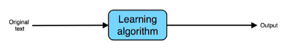
</div>

Neural networks are commonly used in end-to-end learning systems. The term “end-to-end” refers to the fact that we are asking the learning algorithm to go directly from the input to the desired output. I.e., the learning algorithm directly connects the “input end” of the system to the “output end”.

In problems where data is abundant, end-to-end systems have been remarkably successful. But they are not always a good choice.

### More end-to-end learning examples

Suppose you want to build a speech recognition system. You might build a system with three components:

<div align="center">
  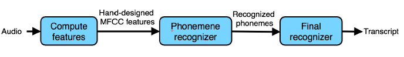
</div>

The components work as follows:

- Compute features: Extract hand-designed features, such as MFCC (Mel-frequency cepstrum coefficients) features, which try to capture the content of an utterance while disregarding less relevant properties, such as the speaker’s pitch.
- Phoneme recognizer: Some linguists believe that there are basic units of sound called “phonemes.” For example, the initial “k” sound in “keep” is the same phoneme as the “c” sound in “cake.” This system tries to recognize the phonemes in the audio clip.
- Final recognizer: Take the sequence of recognized phonemes, and try to string them together into an output transcript.

In contrast, an end-to-end system might input an audio clip, and try to directly output the transcript:

<div align="center">
  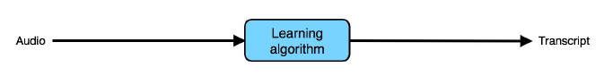
</div>

So far, we have only described machine learning “pipelines” that are completely linear: the output is sequentially passed from one staged to the next. Pipelines can be more complex. Here is a simple architecture for an autonomous car

<div align="center">
  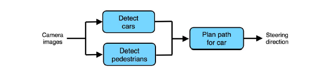
</div>

It has three components: One detects other cars using the camera images; one detects pedestrians; then a final component plans a path for our own car that avoids the cars and pedestrians.

Not every component in a pipeline has to be learned. For example, the literature on “robot motion planning” has numerous algorithms for the final path planning step for the car. Many of these algorithms do not involve learning.

In contrast, and end-to-end approach might try to take in the sensor inputs and directly output the steering direction:

<div align="center">
  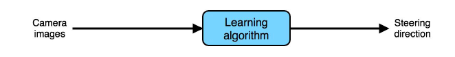
</div>

Even though end-to-end learning has seen many successes, it is not always the best approach. For example, end-to-end speech recognition works well. But I’m skeptical about end-to-end learning for autonomous driving.

### Pros and cons of end-to-end learning

Consider the same speech pipeline from our earlier example:

<div align="center">
  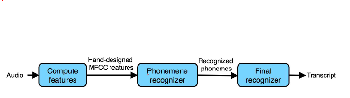
</div>

Many parts of this pipeline were “hand-engineered”:

- MFCCs are a set of hand-designed audio features. Although they provide a reasonable summary of the audio input, they also simplify the input signal by throwing some information away.
- Phonemes are an invention of linguists. They are an imperfect representation of speech sounds. To the extent that phonemes are a poor approximation of reality, forcing an algorithm to use a phoneme representation will limit the speech system’s performance.

These hand-engineered components limit the potential performance of the speech system. However, allowing hand-engineered components also has some advantages:

- The MFCC features are robust to some properties of speech that do not affect the content, such as speaker pitch. Thus, they help simplify the problem for the learning algorithm.
- To the extent that phonemes are a reasonable representation of speech, they can also help the learning algorithm understand basic sound components and therefore improve its performance.

Having more hand-engineered components generally allows a speech system to learn with less data. The hand-engineered knowledge captured by MFCCs and phonemes “supplements” the knowledge our algorithm acquires from data. When we don’t have much data, this knowledge is useful.

Now, consider the end-to-end system:

<div align="center">
  
</div>

This system lacks the hand-engineered knowledge. Thus, when the training set is small, it might do worse than the hand-engineered pipeline.

However, when the training set is large, then it is not hampered by the limitations of an MFCC or phoneme-based representation. If the learning algorithm is a large-enough neural network and if it is trained with enough training data, it has the potential to do very well, and perhaps even approach the optimal error rate.

End-to-end learning systems tend to do well when there is a lot of labeled data for “both ends” — the input end and the output end. In this example, we require a large dataset of (audio, transcript) pairs. When this type of data is not available, approach end-to-end learning with great caution.

If you are working on a machine learning problem where the training set is very small, most of your algorithm’s knowledge will have to come from your human insight. I.e., from your “hand engineering” components.

If you choose not to use an end-to-end system, you will have to decide what are the steps in your pipeline, and how they should plug together.

### Choosing pipeline components Data availability

When building a non-end-to-end pipeline system, what are good candidates for the components of the pipeline? How you design the pipeline will greatly impact the overall system’s performance. One important factor is whether you can easily collect data to train each of the components.

For example, consider this autonomous driving architecture:

<div align="center">
  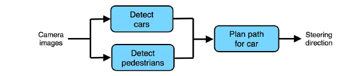
</div>

You can use machine learning to detect cars and pedestrians. Further, it is not hard to obtain data for these: There are numerous computer vision datasets with large numbers of labeled cars and pedestrians. You can also use crowdsourcing (such as Amazon Mechanical Turk) to obtain even larger datasets. It is thus relatively easy to obtain training data to build a car detector and a pedestrian detector.

In contrast, consider a pure end-to-end approach:

<div align="center">
  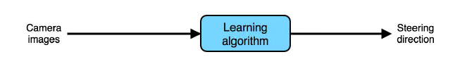
</div>

To train this system, we would need a large dataset of (Image, Steering Direction) pairs. It is very time-consuming and expensive to have people drive cars around and record their steering direction to collect such data. You need a fleet of specially-instrumented cars, and a huge amount of driving to cover a wide range of possible scenarios. This makes an end-to-end system difficult to train. It is much easier to obtain a large dataset of labeled car or pedestrian images.

More generally, if there is a lot of data available for training “intermediate modules” of a pipeline (such as a car detector or a pedestrian detector), then you might consider using a pipeline with multiple stages. This structure could be superior because you could use all that available data to train the intermediate modules.

Until more end-to-end data becomes available, I believe the non-end-to-end approach is significantly more promising for autonomous driving: Its architecture better matches the availability of data.

### Choosing pipeline components Task simplicity

Other than data availability, you should also consider a second factor when picking components of a pipeline: How simple are the tasks solved by the individual components? You should try to choose pipeline components that are individually easy to build or learn. But what does it mean for a component to be “easy” to learn?

<div align="center">
  
</div>

Consider these machine learning tasks, listed in order of increasing difficulty:

- Classifying whether an image is overexposed (like the example above)
- Classifying whether an image was taken indoor or outdoor
- Classifying whether an image contains a cat
- Classifying whether an image contains a cat with both black and white fur
- Classifying whether an image contains a Siamese cat (a particular breed of cat)

Each of these is a binary image classification task: You have to input an image, and output either 0 or 1. But the tasks earlier in the list seem much “easier” for a neural network to learn. You will be able to learn the easier tasks with fewer training examples.

Machine learning does not yet have a good formal definition of what makes a task easy or hard. With the rise of deep learning and multi-layered neural networks, we sometimes say a task is “easy” if it can be carried out with fewer computation steps (corresponding to a shallow neural network), and “hard” if it requires more computation steps (requiring a deeper neural network). But these are informal definitions.

If you are able to take a complex task, and break it down into simpler sub-tasks, then by coding in the steps of the sub-tasks explicitly, you are giving the algorithm prior knowledge that can help it learn a task more efficiently.

<div align="center">
  
</div>

Suppose you are building a Siamese cat detector. This is the pure end-to-end architecture:

<div align="center">
  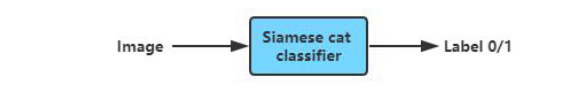
</div>

In contrast, you can alternatively use a pipeline with two steps:

<div align="center">
  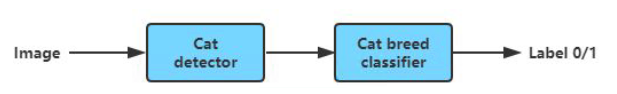
</div>

The first step (cat detector) detects all the cats in the image.

<div align="center">
  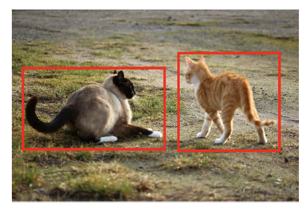
</div>

The second step then passes cropped images of each of the detected cats (one at a time) to a cat species classifier, and finally outputs 1 if any of the cats detected is a Siamese cat.

<div align="center">
  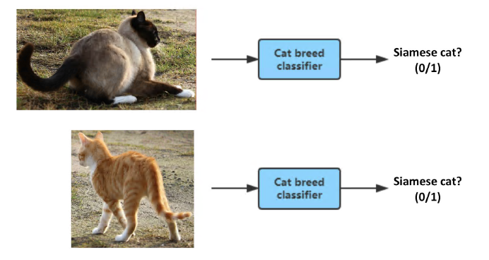
</div>

Compared to training a purely end-to-end classifier using just labels 0/1, each of the two components in the pipeline--the cat detector and the cat breed classifier--seem much easier to learn and will require significantly less data.

As one final example, let’s revisit the autonomous driving pipeline.

<div align="center">
  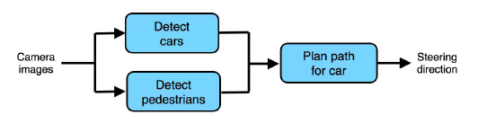
</div>

By using this pipeline, you are telling the algorithm that there are 3 key steps to driving: (1) Detect other cars, (2) Detect pedestrians, and (3) Plan a path for your car. Further, each of these is a relatively simpler function--and can thus be learned with less data--than the purely end-to-end approach.

In summary, when deciding what should be the components of a pipeline, try to build a pipeline where each component is a relatively “simple” function that can therefore be learned from only a modest amount of data.

### Directly learning rich outputs

An image classification algorithm will input an image x , and output an integer indicating the object category. Can an algorithm instead output an entire sentence describing the image?

<div align="center">
  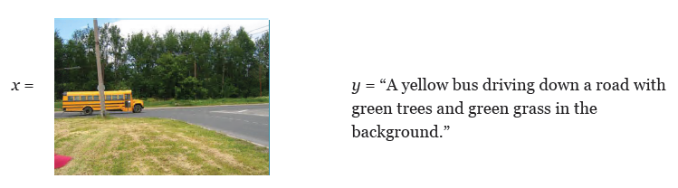
</div>

Traditional applications of supervised learning learned a function h : X → Y , where the output y was usually an integer or a real number. For example:

<div align="center">
  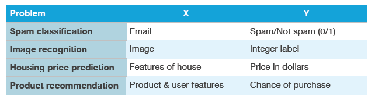
</div>

One of the most exciting developments in end-to-end deep learning is that it is letting us directly learn y that are much more complex than a number. In the image-captioning example above, you can have a neural network input an image (x) and directly output a caption (y).

Here are more examples:

<div align="center">
  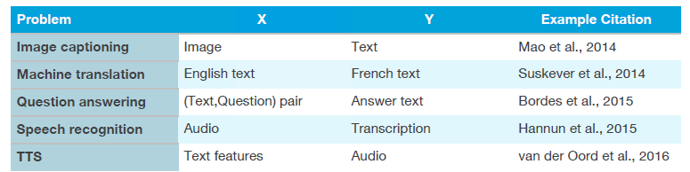
</div>

This is an accelerating trend in deep learning: When you have the right (input,output) labeled pairs, you can sometimes learn end-to-end even when the output is a sentence, an image, audio, or other outputs that are richer than a single number.

## Error analysis by parts

### Error analysis by parts

Suppose your system is built using a complex machine learning pipeline, and you would like to improve the system’s performance. Which part of the pipeline should you work on improving? By attributing errors to specific parts of the pipeline, you can decide how to prioritize your work.

Let’s use our Siamese cat classifier example:

<div align="center">
  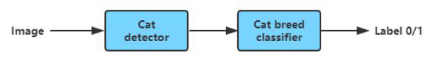
</div>

The first part, the cat detector, detects cats and crops them out of the image. The second part, the cat breed classifier, decides if it is a Siamese cat. It is possible to spend years working on improving either of these two pipeline components. How do you decide which component(s) to focus on?

By carrying out **error analysis by parts**, you can try to attribute each mistake the algorithm makes to one (or sometimes both) of the two parts of the pipeline. For example, the algorithm misclassifies this image as not containing a Siamese cat (y=0) even though the correct label is y=1.

<div align="center">
  
</div>

Let’s manually examine what the two steps of the algorithm did. Suppose the Siamese cat detector had detected a cat as follows:

<div align="center">
  
</div>

This means that the cat breed classifier is given the following image:

<div align="center">
  
</div>

The cat breed classifier then correctly classifies this image as not containing a Siamese cat. Thus, the cat breed classifier is blameless: It was given of a pile of rocks and outputted a very reasonable label y=0. Indeed, a human classifying the cropped image above would also have predicted y=0. Thus, you can clearly attribute this error to the cat detector.

If, on the other hand, the cat detector had outputted the following bounding box:

<div align="center">
  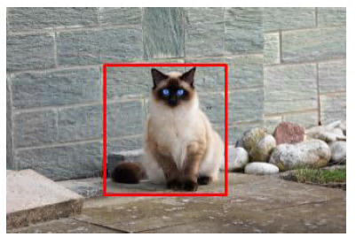
</div>

then you would conclude that the cat detector had done its job, and that it was the cat breed classifier that is at fault.

Say you go through 100 misclassified dev set images and find that 90 of the errors are attributable to the cat detector, and only 10 errors are attributable to the cat breed classifier. You can safely conclude that you should focus more attention on improving the cat detector.

Further, you have now also conveniently found 90 examples where the cat detector outputted incorrect bounding boxes. You can use these 90 examples to carry out a deeper level of error analysis on the cat detector to see how to improve that.

Our description of how you attribute error to one part of the pipeline has been informal so far: you look at the output of each of the parts and see if you can decide which one made a mistake. This informal method could be all you need.

### Attributing error to one part

Let’s continue to use this example:

<div align="center">
  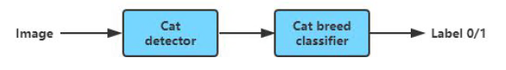
</div>

Suppose the cat detector outputted this bounding box:

<div align="center">
  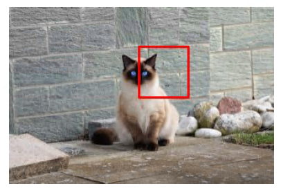
</div>

The cat breed classifier is thus given this cropped image, whereupon it incorrectly outputs y=0, or that there is no cat in the picture.

<div align="center">
  
</div>

The cat detector did its job poorly. However, a highly skilled human could arguably still recognize the Siamese cat from the poorly cropped image. So do we attribute this error to the cat detector, or the cat breed classifier, or both? It is ambiguous.

If the number of ambiguous cases like these is small, you can make whatever decision you want and get a similar result. But here is a more formal test that lets you more definitively attribute the error to exactly one part:

- Replace the cat detector output with a hand-labeled bounding box.

<div align="center">
  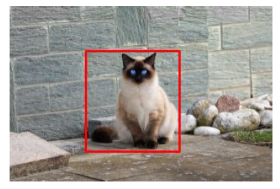
</div>

- Run the corresponding cropped image through the cat breed classifier. If the cat breed classifier still misclassifies it, attribute the error to the cat breed classifier. Otherwise, attribute the error to the cat detector.

In other words, run an experiment in which you give the cat breed classifier a “perfect” input. There are two cases:

- Even given a “perfect” bounding box, the cat breed classifier still incorrectly outputs y=0. In this case, clearly the cat breed classifier is at fault.
- Given a “perfect” bounding box, the breed classifier now correctly outputs y=1. This shows that if only the cat detector had given a more perfect bounding box, then the overall system’s output would have been correct. Thus, attribute the error to the cat detector.

By carrying out this analysis on the misclassified dev set images, you can now unambiguously attribute each error to one component. This allows you to estimate the fraction of errors due to each component of the pipeline, and therefore decide where to focus your attention.

### General case of error attribution

Here are the general steps for error attribution. Suppose the pipeline has three steps A, B and C, where A feeds directly into B, and B feeds directly into C.

<div align="center">
  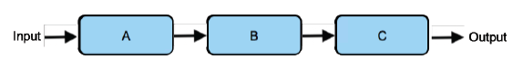
</div>

For each mistake the system makes on the dev set:

- Try manually modifying A’s output to be a “perfect” output (e.g., the “perfect” bounding box for the cat), and run the rest of the pipeline B, C on this output. If the algorithm now gives a correct output, then this shows that, if only A had given a better output, the overall algorithm’s output would have been correct; thus, you can attribute this error to component A. Otherwise, go on to next.
- Try manually modifying B’s output to be the “perfect” output for B. If the algorithm now gives a correct output, then attribute the error to component B. Otherwise, go on to next.
- Attribute the error to component C.

Let’s look at a more complex example:

<div align="center">
  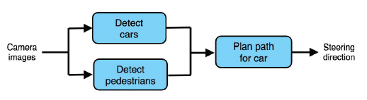
</div>

Your self-driving car uses this pipeline. How do you use error analysis by parts to decide which component(s) to focus on?

You can map the three components to A, B, C as follows:

- A: Detect cars
- B: Detect pedestrians
- C: Plan path for car

Following the procedure described above, suppose you test out your car on a closed track and find a case where the car chooses a more jarring steering direction than a skilled driver would. You would then:

- Try manually modifying A (detecting cars)’s output to be a “perfect” output (e.g., manually go in and tell it where the other cars are). Run the rest of the pipeline B, C as before, but allow C (plan path) to use A’s now perfect output. If the algorithm now plans a much better path for the car, then this shows that, if only A had given a better output, the overall algorithm’s output would have been better; Thus, you can attribute this error to component A. Otherwise, go on to next.
- Try manually modifying B (detect pedestrian)’s output to be the “perfect” output for B. If the algorithm now gives a correct output, then attribute the error to component B. Otherwise, go on to next.
- Attribute the error to component C.

The components of an ML pipeline should be ordered according to a Directed Acyclic Graph (DAG), meaning that you should be able to compute them in some fixed left-to-right order, and later components should depend only on earlier components’ outputs. So long as the mapping of the components to the A->B->C order follows the DAG ordering, then the error analysis will be fine. You might get slightly different results if you swap A and B:

- A: Detect pedestrians (was previously Detect cars )
- B: Detect cars (was previously Detect pedestrians )
- C: Plan path for car

But the results of this analysis would still be valid and give good guidance for where to focus your attention.

### Error analysis by parts and comparison to human-level performance

Let’s return to the self-driving application, where a car detection algorithm outputs the location (and perhaps velocity) of the nearby cars, a pedestrian detection algorithm outputs the location of the nearby pedestrians, and these two outputs are finally used to plan a path for the car.

<div align="center">
  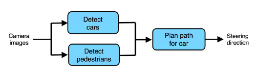
</div>

To debug this pipeline, rather than rigorously following the procedure you could more informally ask:

- How far is the Detect cars component from human-level performance at detecting cars?
- How far is the Detect pedestrians component from human-level performance?
- How far is the overall system’s performance from human-level performance? Here, human-level performance assumes the human has to plan a path for the car given only the outputs from the previous two pipeline components (rather than access to the camera images). In other words, how does the Plan path component’s performance compare to that of a human’s, when the human is given only the same input?

If you find that one of the components is far from human-level performance, you now have a good case to focus on improving the performance of that component.

Many error analysis processes work best when we are trying to automate something humans can do and can thus benchmark against human-level performance. Most of our preceding examples had this implicit assumption.

This is another advantage of working on problems that humans can solve--you have more powerful error analysis tools, and thus you can prioritize your team’s work more efficiently.

### Spotting a flawed ML pipeline

What if each individual component of your ML pipeline is performing at human-level performance or near-human-level performance, but the overall pipeline falls far short of human-level? This usually means that the pipeline is flawed and needs to be redesigned. Error analysis can also help you understand if you need to redesign your pipeline.

<div align="center">
  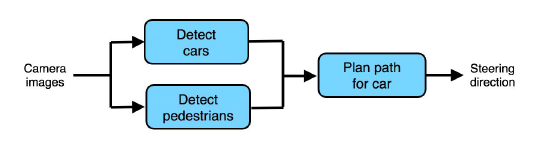
</div>

We posed the question of whether each of the three components’ performance is at human level. Suppose the answer to all three questions is yes. That is:

- The Detect cars component is at (roughly) human-level performance for detecting cars from the camera images.
- The Detect pedestrians component is at (roughly) human-level performance for detecting cars from the camera images.
- Compared to a human that has to plan a path for the car given only the outputs from the previous two pipeline components (rather than access to the camera images), the Plan path component’s performance is at a similar level.

However, your overall self-driving car is performing significantly below human-level performance. I.e., humans given access to the camera images can plan significantly better paths for the car. What conclusion can you draw?

The only possible conclusion is that the ML pipeline is flawed. In this case, the Plan path component is doing as well as it can given its inputs , but the inputs do not contain enough information. You should ask yourself what other information, other than the outputs from the earlier pipeline components, is needed to plan paths very well for a car to drive. In other words, what other information does a skilled human driver need?

For example, suppose you realize that a human driver also needs to know the location of the lane markings. This suggests that you should redesign the pipeline as follows:

In the self-driving example above, in theory one could solve this problem by also feeding the raw camera image into the planning component. However, this would violate the design principle of “Task simplicity”, because the path planning module now needs to input a raw image and has a very complex task to solve. That’s why adding a Detect lane markings component is a better choice - it helps get the important and previously missing information about lane markings to the path planning module, but you avoid making any particular module overly complex to build/train.

<div align="center">
  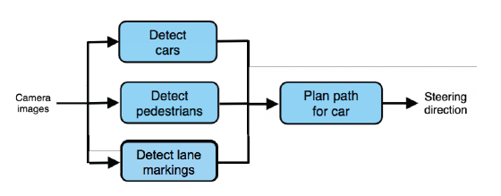
</div>

Ultimately, if you don’t think your pipeline as a whole will achieve human-level performance, even if every individual component has human-level performance (remember that you are comparing to a human who is given the same input as the component), then the pipeline is flawed and should be redesigned.

## Transfer learning

- Apply the knowledge you took in a task A and apply it in another task B.
- For example, you have trained a cat classifier with a lot of data, you can use the part of the trained NN it to solve x-ray classification problem.
- To do transfer learning, delete the last layer of NN and it's weights and:
  - Option: if you have a small data set - keep all the other weights as a fixed weights. Add a new last layers and initialize the new layer weights and feed the new data to the NN and learn the new weights.
  - Option: if you have enough data you can retrain all the weights.
- When transfer learning make sense:
  - Task A and B have the same input X (e.g. image, audio).
  - You have a lot of data for the task A you are transferring from and relatively less data for the task B your transferring to.
  - Low level features from task A could be helpful for learning task B.

## Multi-task learning

- Whereas in transfer learning, you have a sequential process where you learn from task A and then transfer that to task B. In multi-task learning, you start off simultaneously, trying to have one neural network do several things at the same time. And then each of these tasks helps hopefully all of the other tasks.
  - You want to build an object recognition system that detects pedestrians, cars, stop signs, and traffic lights (image has multiple labels).
  - Y shape will be `(4,m)` because we have 4 classes and each one is a binary one.
  - Then
  <div align="center">
    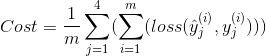
  </div>
  <div align="center">
    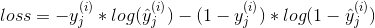
  </div>
- In the last example you could have trained 4 neural networks separately but if some of the earlier features in neural network can be shared between these different types of objects, then you find that training one neural network to do four things results in better performance than training 4 completely separate neural networks to do the four tasks separately.
- Multi-task learning will also work if y isn't complete for some labels. For example:
  ```
  Y = [1 ? 1 ...]
      [0 0 1 ...]
      [? 1 ? ...]
  ```
  - And in this case it will do good with the missing data, just the loss function will be different:   
  <div align="center">
    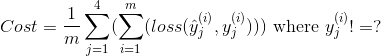
  </div>
- Multi-task learning makes sense:
  - Training on a set of tasks that could benefit from having shared lower-level features.
  - Usually amount of data you have for each task is quite similar.
  - Can train a big enough network to do well on all the tasks.
- If you can train a big enough NN, the performance of the multi-task learning compared to splitting the tasks is better.
- Transfer learning is used more often than multi-task learning.

## Orthogonalization

- Some deep learning developers know exactly what hyperparameter to tune in order to try to achieve one effect. This is a process we call orthogonalization.
- In orthogonalization, you have some controls, but each control does a specific task and doesn't affect other controls.
- For a supervised learning system to do well, you usually need to tune the knobs of your system to make sure the following things hold true - chain of assumptions in machine learning:
  - You'll have to fit training set well on cost function (near human level performance if possible).
    - If it's not achieved you could try bigger network, another optimization algorithm (like Adam)...
  - Fit dev set well on cost function.
    - If its not achieved you could try regularization, bigger training set...
  - Fit test set well on cost function.
    - If its not achieved you could try bigger dev set...
  - Performs well in real world.
    - If its not achieved you could try change dev/test set, change cost function...

## How to read deep learning papers

- Read research papers
	- Compile list of papers (medium/blog posts), maybe 5-20(farmiliar) papers or 50-100 papers(master)
	- Skip around list
- Read one paper multiple passes
	- Title + Abstract + Figures
	- Intro + Conclusion + Figures + Skip related work + Skip rest
	- Read the paper but skip maths
	- Read the whole thing but skip the parts that don't make sense
- Try to answer question
	- What did authors try to accomplish ?
	- What weres the key elements of the approach ?
	- What can you use yourself ?
	- What other reference do you want to follow ?
- About math, code and long term goals
	- math: rederive from scratch
	- code: run open source code, reimplement from scratch
	- long term goals: 2 or 3 papers per week (2 or 3 years)
