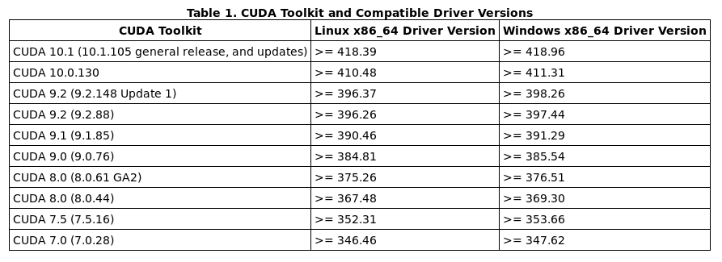
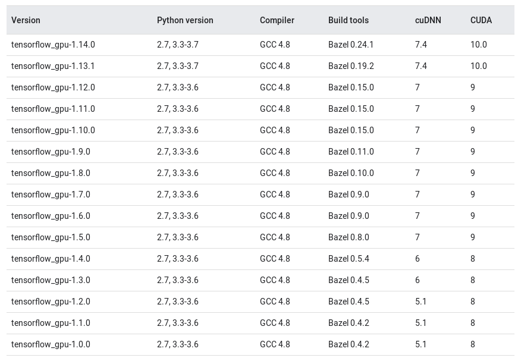

# Deep Learning

**Nvidia Driver Download**

[https://www.nvidia.com/Download/index.aspx?lang=en-us](https://www.nvidia.com/Download/index.aspx?lang=en-us)

**Nvidia Driver Install**

After you have downloaded the file NVIDIA-Linux-x86_64-410.48.run, change to the directory containing the downloaded file, and as the root user run the executable:

```shell
sh NVIDIA-Linux-x86_64-440.36.run
```

```
nvidia-smi
+-----------------------------------------------------------------------------+
| NVIDIA-SMI 410.48                 Driver Version: 410.48                    |
|-------------------------------+----------------------+----------------------+
| GPU  Name        Persistence-M| Bus-Id        Disp.A | Volatile Uncorr. ECC |
| Fan  Temp  Perf  Pwr:Usage/Cap|         Memory-Usage | GPU-Util  Compute M. |
|===============================+======================+======================|
|   0  GeForce GTX 106...  Off  | 00000000:01:00.0  On |                  N/A |
|  0%   40C    P8     9W / 200W |    446MiB /  6075MiB |      0%      Default |
+-------------------------------+----------------------+----------------------+

+-----------------------------------------------------------------------------+
| Processes:                                                       GPU Memory |
|  GPU       PID   Type   Process name                             Usage      |
|=============================================================================|
|    0      1075      G   /usr/lib/xorg/Xorg                           221MiB |
|    0      2627      G   compiz                                       156MiB |
|    0     10596      G   ...-token=4AD5E8ABBEA9107836793E952997583E    66MiB |
+-----------------------------------------------------------------------------+
```

**Nvidia Driver Cuda Version Match**



[https://docs.nvidia.com/cuda/cuda-toolkit-release-notes/](https://docs.nvidia.com/cuda/cuda-toolkit-release-notes/)

**CUDA Download**

[https://developer.nvidia.com/cuda-toolkit-archive](https://developer.nvidia.com/cuda-toolkit-archive)

**CUDA Install**

[https://docs.nvidia.com/cuda/cuda-installation-guide-linux/index.html](https://docs.nvidia.com/cuda/cuda-installation-guide-linux/index.html)

**cuDNN Download**

[https://developer.nvidia.com/rdp/cudnn-archive](https://developer.nvidia.com/rdp/cudnn-archive)

**cuDNN Install**

[https://docs.nvidia.com/deeplearning/sdk/cudnn-install/index.html](https://docs.nvidia.com/deeplearning/sdk/cudnn-install/index.html)

**tensorflow cuda cudnn version**



[https://www.tensorflow.org/install/source](https://www.tensorflow.org/install/source)

# Readings

https://stats.stackexchange.com/questions/211436/why-normalize-images-by-subtracting-datasets-image-mean-instead-of-the-current

http://www.wildml.com/2015/09/implementing-a-neural-network-from-scratch/

http://scs.ryerson.ca/~aharley/neural-networks/

http://cs231n.github.io/neural-networks-case-study/

http://stackoverflow.com/questions/1907993/autoreload-of-modules-in-ipython

http://mccormickml.com/2018/06/15/applying-word2vec-to-recommenders-and-advertising/

# Papers

Adam Paper : https://arxiv.org/pdf/1412.6980.pdf

[Srivastava et al] Dropout: A Simple Way to Prevent Neural Networks from Overfitting

[Xavier et al] Understanding the difficulty of training deep feedforward neural networks
